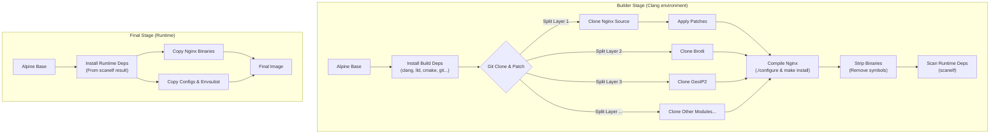

# Nginx QUIC (HTTP/3) Docker Image

[](https://hub.docker.com/)
[](https://nginx.org/en/download.html)
[](https://clang.llvm.org/)

这是一个经过**极致精简**与**深度优化**的 Nginx HTTP/3 (QUIC) Docker 镜像。基于 Alpine Linux 构建，采用 Clang 编译器与 LLD 链接器，集成了最新的 QUIC 协议支持及常用高性能模块。

## 🚀 核心特性

- **HTTP/3 & QUIC**: 基于 Nginx Mainline 版本构建，集成官方 QUIC 支持及关键补丁（PR #689）。
- **Clang + LLD 构建**: 摒弃 GCC，全链路切换至 Clang 编译器与 LLVM Linker (LLD)，启用 **ThinLTO** (Link Time Optimization) 与 **PGO** 级优化参数 (`-funroll-loops`, `-flto=thin`)，显著提升运行时性能与并发处理能力。
- **安全加固**: 启用 `-fstack-protector-strong`、`-fstack-clash-protection` 等安全编译选项。
- **极致轻量**: 采用多阶段分层构建 (Multi-stage Build)，剥离所有构建工具，仅保留运行时必须的库文件。
- **模块分阶缓存**: 优化的 Dockerfile 结构，支持按模块粒度缓存构建层，极大加速二次构建与调试。
- **丰富的扩展**: 内置 Brotli, Zstd, GeoIP2 等现代化 Web 必备模块。

## 📦 组件与版本概览

| 组件 | 版本 | 说明 |
| :--- | :--- | :--- |
| **Nginx** | `1.29.4` (Mainline) | 核心程序 |
| **Compiler** | `Clang + LLD` | 编译器与链接器 |
| **OS** | `Alpine Linux 3.x` | 基础镜像 |

### 内置模块 (Modules)

| 模块名称 | 版本 | 仓库链接 | 功能描述 |
| :--- | :--- | :--- | :--- |
| `ngx_brotli` | `master` | [google/ngx_brotli](https://github.com/google/ngx_brotli) | Brotli 压缩算法支持 |
| `ngx_http_zstd_module` | `0.1.1` | [tokers/zstd-nginx-module](https://github.com/tokers/zstd-nginx-module) | Zstd 压缩算法支持 |
| `ngx_http_geoip2_module` | `3.4` | [leev/ngx_http_geoip2_module](https://github.com/leev/ngx_http_geoip2_module) | GeoIP2 IP 地理位置查询 |
| `headers-more-nginx-module` | `v0.39` | [openresty/headers-more-nginx-module](https://github.com/openresty/headers-more-nginx-module) | 增强的 HTTP 头控制 |
| `ngx-fancyindex` | `v0.5.2` | [aperezdc/ngx-fancyindex](https://github.com/aperezdc/ngx-fancyindex) | 美化的目录索引列表 |
| `nginx-module-vts` | `v0.2.5` | [vozlt/nginx-module-vts](https://github.com/vozlt/nginx-module-vts) | 虚拟主机流量状态监控 |
| `nginx-ntlm-module` | `v1.19.3` | [gabihodoroaga/nginx-ntlm-module](https://github.com/gabihodoroaga/nginx-ntlm-module) | NTLM 认证支持 |
| `ngx_devel_kit` | `v0.3.4` | [vision5/ngx_devel_kit](https://github.com/vision5/ngx_devel_kit) | Nginx 模块开发套件 (NDK) |

### 关键补丁 (Patches)

1.  **Dynamic TLS Records**: 优化 TLS Record 大小，减少首字节延迟 (TTFB)。
2.  **Resolver Conf Parsing**: 修复 DNS 解析器配置解析问题 (From OpenResty)。
3.  **Pull #689 (QUIC)**: Nginx 官方仓库未合并的重要 QUIC 修复补丁。

## 🛠️ 构建流程解析

本镜像采用高度优化的构建流程：



## ⚙️ 编译参数详解

为了追求极致性能，我们使用了以下 Clang 专属的高级优化参数：

```bash
# 编译器 (CC/CXX)
clang / clang++

# 核心优化
-O2                     # 标准高优化等级
-flto=thin             # ThinLTO (Link Time Optimization)，跨模块优化，大幅提升性能
-funroll-loops         # 循环展开，减少循环开销
-ffunction-sections    # 将函数放入独立段，配合 --gc-sections 移除无用代码
-fdata-sections        # 将数据放入独立段

# 安全加固
-fstack-protector-strong # 强栈保护，防止缓冲区溢出
-fstack-clash-protection # 防止栈冲突攻击
-D_FORTIFY_SOURCE=3      # 源代码级安全检查 (Level 3)
-Werror=format-security  # 格式化字符串漏洞检查

# 链接器 (LD)
-fuse-ld=lld            # 使用 LLVM Linker，比 ld.bfd/gold 更快且支持 LTO
-Wl,--gc-sections       # 垃圾回收，丢弃未使用的代码段
-Wl,-s                  # Strip，移除符号表减小体积
```

## �️ 构建指南 (Build)

本镜像支持多架构构建 (AMD64 & ARM64)。

```bash
# 构建并推送
docker build \
  --platform linux/amd64,linux/arm64 \
  --tag currycan/nginx:1.29.4 \
  --push .
```

## �🏃 使用说明

### 启动容器

```bash
docker run -d \
  --name nginx-quic \
  -p 80:80 -p 443:443/top -p 443:443/udp \
  -v /path/to/nginx.conf:/etc/nginx/nginx.conf \
  currycan/nginx:1.29.4
```

> **注意**: HTTP/3 (QUIC) 需要 UDP 443 端口。

### 环境变量替换 (`envsubst`)

本镜像保留了 `/usr/bin/envsubst`，虽然没有内置自动替换脚本，但你可以手动在启动时使用：

```bash
# 示例：手动替换配置模板
docker run --rm -v ./nginx.conf.template:/etc/nginx/nginx.conf.template \
  -e DOMAIN=example.com \
  currycan/nginx:1.29.4 \
  /bin/sh -c "envsubst < /etc/nginx/nginx.conf.template > /etc/nginx/nginx.conf && nginx -g 'daemon off;'"
```

## 🔗 参考与致谢

本项目参考了以下优秀的开源项目：

- [ZoeyVid/nginx-quic](https://github.com/ZoeyVid/nginx-quic): 提供了非常先进的 Nginx QUIC 构建思路和补丁。
- [macbre/docker-nginx-http3](https://github.com/macbre/docker-nginx-http3): 提供了关于 HTTP/3 Docker 镜像的构建实践和补丁参考。
