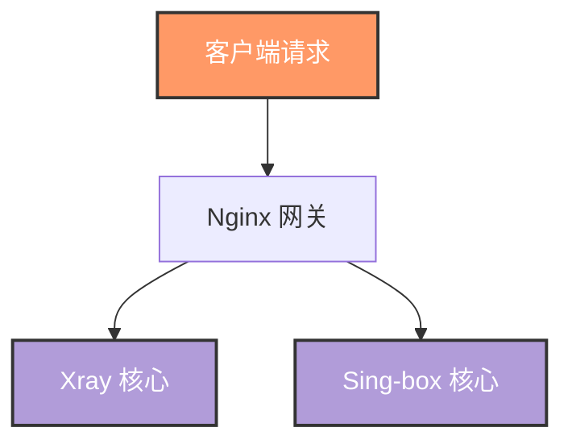

# 文档维护规范

## 文档结构

项目文档位于 `docs/` 目录，按主题分为 5 篇：

| 文件 | 主题 | 内容 |
|:---|:---|:---|
| `01-architecture-and-traffic.md` | 架构与流量 | 系统架构、流量路径、双核引擎协同、进程管理 |
| `02-protocols-and-security.md` | 协议与安全 | 代理协议栈、TLS/证书、加密配置、安全机制 |
| `03-routing-and-clients.md` | 路由与客户端 | 智能路由决策、客户端模板、提供商配置 |
| `04-ops-and-troubleshooting.md` | 运维与排障 | 部署、监控、日志、常见问题排查 |
| `05-build-release.md` | 构建与发布 | Dockerfile、build.sh、release.sh、版本管理 |

### 文档间关联

文档之间使用相对链接互相引用，保持知识的连贯性。

---

## 写作风格

### 语言

- 使用**简体中文**撰写所有文档内容
- 技术术语保留英文原文（如 Reality、Hysteria2、WebSocket）
- 首次出现的缩写需给出全称

### 格式规范

- 每篇文档以一级标题 `#` 开头
- 使用二级/三级标题组织章节
- 重要信息使用 GitHub 风格的引用框：
  ```markdown
  > **说明**: 解释性信息
  > **注意**: 需要关注的事项
  > **警告**: 潜在风险
  ```
- 配置示例使用带语言标记的代码块
- 表格用于结构化信息（环境变量、端口映射、组件清单等）

### 内容原则

1. **准确性优先**: 文档必须与代码实际行为一致
2. **代码同步**: 修改脚本或模板后，需同步更新相关文档
3. **具体示例**: 提供可直接使用的配置示例而非抽象描述
4. **避免冗余**: 不同文档的内容互补而非重复

---

## 敏感词规范

> **重要**: 文档中必须避免使用以下敏感词汇和直白描述。

### 禁止使用

| 禁止词汇 | 替代用语 |
|:---|:---|
| 翻墙 | 网络调度 / 智能路由 |
| 科学上网 | 网络优化 / 安全网关 |
| 梯子 | 代理节点 / 网络通道 |
| VPN (作为翻墙含义时) | 代理服务 / 安全网关 |
| GFW / 防火长城 | 网络限制 / 区域限制 |
| 墙 (网络审查含义) | 网络环境限制 |
| 机场 | 代理服务提供商 |

### 推荐表述

- "专业级全栈网络调度与代理安全网关"
- "企业级高性能网络安全枢纽"
- "智能双核引擎驱动的代理平台"
- "业务级智能路由分发"

---

## Mermaid 图表规范

### 基本规则

1. 使用标准 Mermaid 语法，确保 GitHub 和 VS Code 均可渲染
2. 节点标签包含特殊字符（括号、中文标点）时必须用引号包裹
3. 避免在标签中使用 HTML 标签
4. 使用 `classDef` 定义样式类，保持图表风格统一

### 推荐写法

```markdown


### 常见错误

```markdown
# 错误：特殊字符未加引号
A[客户端(Client)] --> B

# 正确：用引号包裹
A["客户端(Client)"] --> B
```

---

## 全量文档更新工作流

> **重要**: 当代码发生变更后，必须按照以下完整工作流逐步更新所有相关文档，确保文档与代码始终保持同步。

### 触发条件

以下任一情况发生时，应执行文档更新（至少检查映射表对应章节）：

- `scripts/entrypoint.sh` 或其他核心脚本发生修改
- `templates/` 目录下任何模板文件发生变更
- `Dockerfile`、`build.sh`、`release.sh` 发生变更
- `docker-compose.yml` 配置变更
- `sources/hack/rename.js` 节点重命名脚本发生修改
- 新增或移除组件

### 第一步：全局变更扫描

1. 确定变更涉及的源文件列表
2. 使用 `git diff` 或逐文件查看确认变更内容
3. 分类标记变更类型：新增功能、修改行为、删除功能、配置调整

### 第二步：逐文件逐行分析

对每个变更文件进行深度分析：

1. **理解变更意图**：明确此次修改的目的和预期效果
2. **追踪影响链**：沿函数调用链追踪变更的辐射范围（如修改 `ensure_var()` 可能影响所有依赖该变量的模板）
3. **关联配置项**：将代码变更映射到具体的环境变量 / 端口 / 路径等配置项
4. **对比前后行为**：明确变更前后系统行为的差异

### 第三步：按文档依赖顺序更新

按照以下顺序依次更新文档，避免上游文档的修改使下游文档不一致：

```text
01-architecture-and-traffic.md   ← 架构 / 组件 / 流量路径变更
        ↓
02-protocols-and-security.md     ← 协议 / 加密 / 安全机制变更
        ↓
03-routing-and-clients.md        ← 路由逻辑 / 客户端模板变更
        ↓
04-ops-and-troubleshooting.md    ← 运维命令 / 排障流程变更
        ↓
05-build-release.md              ← 构建流程 / 版本管理变更
        ↓
readme.md                        ← 汇总配置参考 / 部署示例变更
```

### 第四步：交叉验证

1. 检查文档间的交叉引用链接是否仍然有效
2. 确认所有 Mermaid 图表能正确渲染
3. 全文搜索敏感词，确保无违规用语
4. 核对环境变量表、端口表、组件表等结构化数据与代码一致

---

## 代码-文档映射参照表

| 源文件 / 目录 | 对应文档 | 关注内容 |
|:---|:---|:---|
| `scripts/entrypoint.sh` 扇区一 (全局能力层) | `04-ops-and-troubleshooting.md` | `ensure_var()`、日志系统、环境变量缓存 |
| `scripts/entrypoint.sh` 扇区二 (网络探测) | `03-routing-and-clients.md` | IP 检测、流媒体/AI 解锁、路由策略决策 |
| `scripts/entrypoint.sh` 扇区三 (证书管理) | `02-protocols-and-security.md` | ACME 证书申请/续期流程 |
| `scripts/entrypoint.sh` 扇区四 (配置生成) | `01-architecture-and-traffic.md` | `apply_tpl()` 渲染引擎、模板调用链 |
| `scripts/entrypoint.sh` 扇区五 (客户端输出) | `03-routing-and-clients.md` | ISP 测速评估、客户端配置生成 |
| `sources/hack/rename.js` | `03-routing-and-clients.md` § 3 | 清洗流水线架构（3.1）、核心清洗动作（3.2）、处理效果对比（3.3）、扩展维护（3.5）|
| `sources/hack/rename.js` — `RegionMap` | `03-routing-and-clients.md` § 3.2 | 新增地区支持时同步更新地名归化说明 |
| `sources/hack/rename.js` — `CleaningRules` | `03-routing-and-clients.md` § 3.2 | 新增/修改清洗规则时同步更新"核心清洗动作"表 |
| `templates/xray/` | `02-protocols-and-security.md` | Reality / XHTTP / VMess-WS 协议配置 |
| `templates/sing-box/` | `02-protocols-and-security.md` | Hysteria2 / TUIC / AnyTLS 协议配置 |
| `templates/nginx/` | `01-architecture-and-traffic.md` | 反向代理、TLS 终结、路径分发 |
| `templates/client_template/` | `03-routing-and-clients.md` | 客户端订阅模板 (OneSmartPro/FallBackPro/surge) |
| `templates/providers/` | `03-routing-and-clients.md` | Proxy Provider 配置 |
| `Dockerfile` | `05-build-release.md` | 四阶段构建、组件版本 ARG、运行时依赖 |
| `build.sh` | `05-build-release.md` | 版本获取逻辑、构建参数、推送策略 |
| `release.sh` | `05-build-release.md` | Git 标签、GitHub Release 自动化 |
| `docker-compose.yml` | `readme.md` + `04-ops-and-troubleshooting.md` | 部署配置、环境变量示例、端口映射 |
| `scripts/check_ip_type.sh` | `03-routing-and-clients.md` | IP 质量体检详细流程 |
| `scripts/show-config.sh` | `03-routing-and-clients.md` + `04-ops-and-troubleshooting.md` | 订阅链接生成、配置展示 |

---

## 配置项分析方法论

每个配置项在文档中的说明必须包含以下维度：

### 必须说明的维度

| 维度 | 说明 | 示例 |
|:---|:---|:---|
| **作用** | 该配置项控制什么行为 | "控制 Hysteria2 协议监听端口" |
| **默认值** | Dockerfile 中 ENV 声明的默认值 | `443` |
| **取值范围** | 可接受的值及约束 | "1-65535 的整数，不可与其他端口冲突" |
| **使用示例** | docker-compose.yml 中的实际配置 | `LISTENING_PORT=8443` |
| **影响范围** | 修改后会影响哪些组件 / 模板 | "影响 Nginx、Xray、Sing-box 的监听配置" |

### 理论引用规范

涉及协议原理或加密算法的说明，须标注参考文献：

- **协议标准**: 引用 RFC 编号，如 `RFC 9000 (QUIC)`, `RFC 8446 (TLS 1.3)`
- **项目文档**: 引用官方仓库文档链接，如 `https://xtls.github.io/` (Xray)
- **加密算法**: 引用标准出处，如 `ML-KEM (FIPS 203)`, `X25519 (RFC 7748)`

格式示例：

```markdown
> **参考**: Reality 协议基于 TLS 1.3 (RFC 8446) 的扩展实现，
> 详见 [XTLS/Xray-core Wiki](https://github.com/XTLS/Xray-core/wiki/REALITY)。
```

### 环境变量同步规则

- 文档中所有环境变量的默认值必须与 `Dockerfile` 中的 `ENV` 声明保持一致
- 新增变量须同步更新 `readme.md` 配置参考表和相关文档章节
- 变量被废弃时须在文档中标注弃用说明并注明替代方案

---

## 商业产品级质量标准

### 内容完整性

- 不遗漏任何配置项、环境变量或功能特性
- 每个组件都有完整的功能说明和配置指南
- 构建文档 (`05-build-release.md`) 须包含：环境准备、依赖安装、构建命令、逐步骤说明和 FAQ

### 逻辑严谨性

- 流程图须覆盖所有关键决策分支（如路由策略中的 IP 类型判定、流媒体解锁检测等）
- 配置项之间的依赖关系须明确标注
- 避免使用"可能"、"大概"等模糊表述，用具体数据和代码引用支撑结论

### 可读性与吸引力

- 使用**场景化叙述**引入功能说明（如 "当容器首次启动时..." 而非 "此函数会..."）
- 关键流程配合 Mermaid 流程图或序列图，直观展示决策路径
- 复杂配置提供"快速开始"和"深度定制"两种阅读路径
- 每篇文档开头提供内容摘要，帮助读者快速定位

### 构建文档特别要求

`05-build-release.md` 须包含以下章节：

1. **环境准备**: 所需工具版本、系统依赖
2. **构建步骤详解**: 每个阶段的输入 / 输出 / 关键操作
3. **版本管理**: 如何更新组件版本、回退策略
4. **常见问题 FAQ**: 构建失败原因、网络问题、平台兼容性等
5. **发布流程**: 从构建到推送到创建 Release 的完整链路

---

## 安全操作约束

> **警告**: 以下约束在文档更新过程中必须严格遵守。

1. **先审后改**: 文档变更方案须经确认后再执行修改
2. **禁止先斩后奏**: 在文档内容未经审核确认前，**禁止**执行以下操作：
   - 删除任何现有文档文件
   - 发布 / 推送文档变更到远程仓库
   - 覆盖尚未备份的文档内容
3. **增量更新**: 优先以增量方式修改文档，避免整文件重写导致内容丢失
4. **变更可追溯**: 重大修改应在 commit 消息中说明变更原因和影响范围

---

## 核心参考文件索引

更新文档时，以下文件是核心参照源，需结合代码逻辑深入分析：

| 参考领域 | 文件路径 | 关注重点 |
|:---|:---|:---|
| 配置生成逻辑 | `scripts/entrypoint.sh` | 五大扇区架构、`ensure_var()` 缓存体系、`apply_tpl()` 渲染引擎、`main_init()` 启动流水线 |
| 服务端 Xray 配置 | `templates/xray/` | Reality / XHTTP / VMess-WS 入站模板，主配置文件路由与出站结构 |
| 服务端 Sing-box 配置 | `templates/sing-box/` | Hysteria2 / TUIC / AnyTLS 入站模板，主配置文件路由与 DNS 结构 |
| 客户端模板 | `templates/client_template/` | OneSmartPro / FallBackPro / surge 订阅模板，变量占位符格式 |
| 代理节点输出 | `templates/proxies/` | all / clash / stash / surge 格式的节点输出模板 |
| Nginx 配置 | `templates/nginx/` | 反向代理规则、TLS 终结、路径分发、Stream 端口转发 |
| 构建流程 | `Dockerfile`, `build.sh`, `release.sh` | 四阶段构建、版本获取 API、UPX 压缩、镜像标签策略 |
| 部署配置 | `docker-compose.yml` | 环境变量声明、端口映射、卷挂载 |
| IP 质量检测 | `scripts/check_ip_type.sh` | ASN 识别、流媒体解锁检测、速度测试 |
| 配置展示 | `scripts/show-config.sh` | 订阅链接生成、客户端模板渲染 |

---

## 更新检查清单

修改代码后，对照以下清单检查是否需要更新文档：

- [ ] 新增/修改环境变量 → 更新 `readme.md` 的配置参考表和相关文档
- [ ] 新增/修改代理协议 → 更新 `02-protocols-and-security.md`
- [ ] 修改路由逻辑 → 更新 `03-routing-and-clients.md`
- [ ] 修改客户端模板 → 更新 `03-routing-and-clients.md` 的模板说明
- [ ] 修改 `rename.js` 清洗流水线 → 更新 `03-routing-and-clients.md` § 3（架构图/动作表/示例表）
- [ ] 修改 `rename.js` — `RegionMap` 新增地区 → 更新 § 3.2 地名归化说明
- [ ] 修改 `rename.js` — `CleaningRules` 新增规则 → 更新 § 3.2 核心清洗动作表
- [ ] 修改构建流程 → 更新 `05-build-release.md`
- [ ] 新增组件 → 更新 `01-architecture-and-traffic.md` 的架构图
- [ ] 修改运维命令 → 更新 `04-ops-and-troubleshooting.md`
- [ ] 修改 docker-compose.yml → 同步更新 `readme.md` 中的示例
