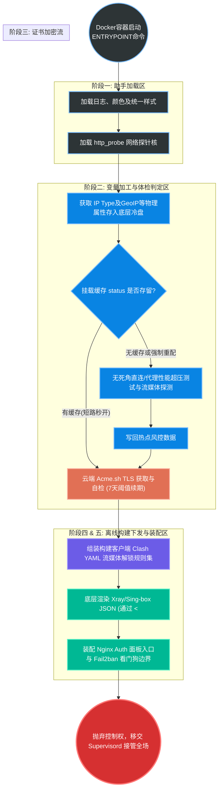
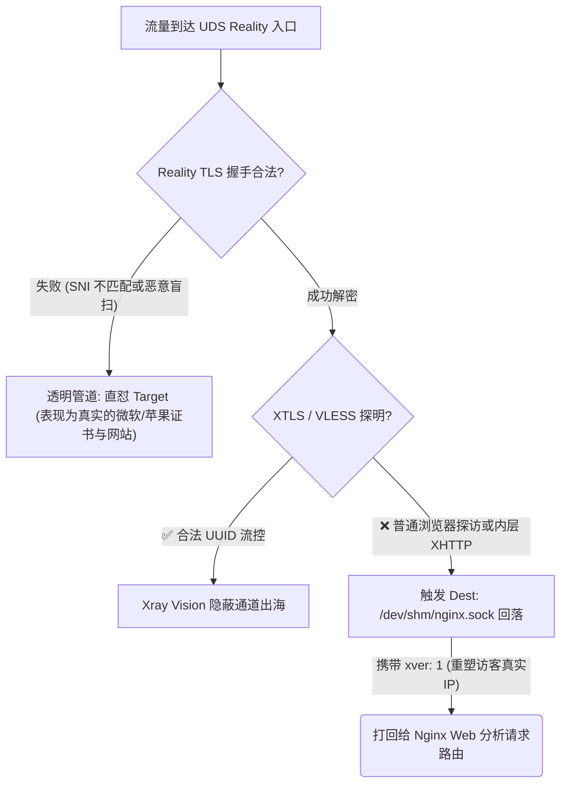
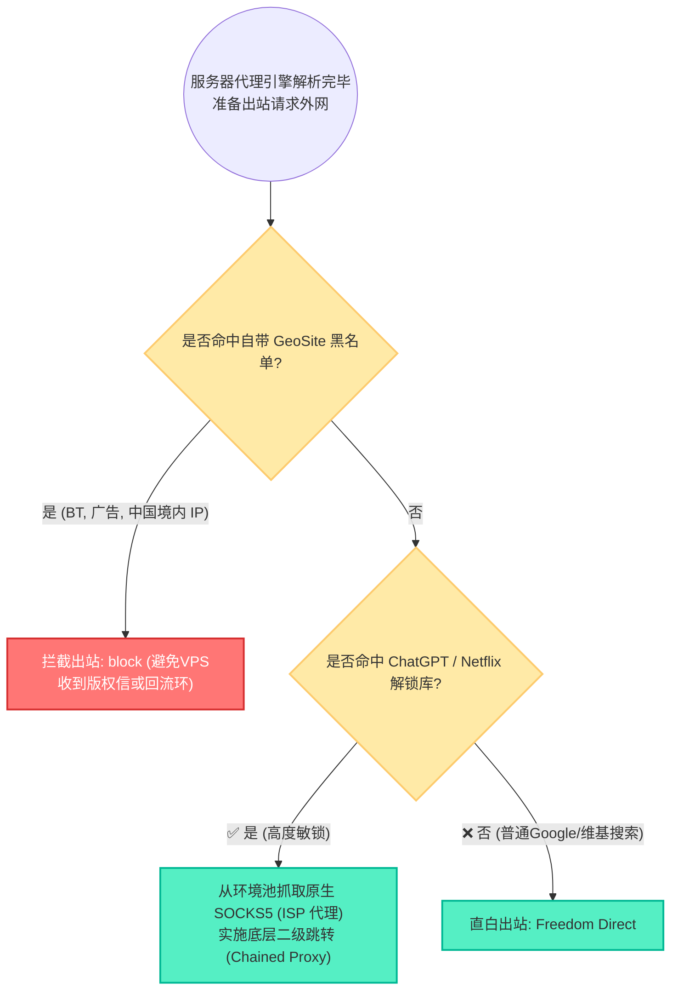

# 01. 服务端架构设计与全流量链路引擎

本文档深入剖析 SB-Xray 项目的服务端核心架构设计。从容器微内核（Entrypoint）的启动，到 Nginx 边界网关的流量拦截与分发，再到底层基于后量子算法的加密引擎，以及针对流媒体解锁的多 ISP 出站路由，进行全景式解读。

---

## 🔲 一、 系统架构微内核思想 (Entrypoint)

整个服务端应用通过 `entrypoint.sh` 实行严格的**“五大生命周期扇区” (Five-Sector Lifecycle)** 结构，避免了杂乱的并发竞态崩溃。

---

## 🌐 二、 流量流向深度拆解 (Traffic Distribution)

为了实现强隐蔽与多业务共存，系统坚决选用 **Nginx 前置多业务网关** 架构，利用 `uds` (Unix Domain Socket) 保障内存级高速交换。

### 1. 入站与 Nginx 流控打更 (Edge Gateway)
外部请求进入服务器物理端口后，被精细切分：
*   **TCP 443** (Nginx Stream)：Nginx 第一时间嗅探 SNI，如果是大厂伪装域名，通过 `udsreality.sock` 无损盲抛给 Xray。
*   **UDP 443** (Nginx/HTTP3)：承接 CDN HTTPS 的核心入口。
*   **高位随机端口** (Sing-box)：诸如 Hysteria2 等抗丢包 UDP 协议跳过 Nginx，实现独立暴力竞速。

### 2. Reality 微路由与 Fallback 无感回落
如果在 Xray Reality 阶段未能通过 VLESS 解密（例如遭受 GFW 的 Active Probing），系统触发“借刀杀人”级的极限防御：

> *注：上述回落至 Nginx Web 后，Nginx 将根据 URI 进行最后分发——命中 `/xui` 去面板，命中 `/myfiles` 去网盘，其他则抛出高度拟真的 404 页面糊弄审查员。*

---

## 🛡️ 三、 后端通道基建安全：MLKEM 后量子加密

在 Xhttp 等多级跳跃、过境 CDN 的隧道配置内，强制激活了 **MLKEM768 (后量子密码学) 双向端到端加密体系**。

**核心意义**：
*   **阻击“先存储，后破解”量子威胁**：混合 `ML-KEM-768` (NIST FIPS 203 标准) 与传统 `X25519`，要求必须同时攻破两套体系。
*   **保卫 CDN 与中间劫持**：Reality 只能保护到 Nginx 边界，但内层的 MLKEM 让甚至连 Cloudflare 等 CDN 中继节点都只能看到一团绝对乱码，保护私密 UUID 及底层 SNI 不被审查机构截获。
*   **前向安全 (PFS) 票据机制**：首次连接发起 1-RTT 密钥交换，随后自动利用 Ticket 进行 0-RTT 极速复用，10 分钟轮换防重放攻击。

---

## ⛓️ 四、 出站分流与多 ISP 住宅落地链路

为解决 VPS 机房 IP 无法观看 Netflix、Disney+ 等痛点的困境，后端引擎配置了针对流媒体与海外 AI (ChatGPT/Gemini) 的全自动链式跳板引擎。

*(环境配置提示：通过在 `docker-compose.yml` 中填入诸如 `US_ISP_IP` 与 `US_ISP_PORT` 的变量，容器即可在启动扇区 S2 进行自检打流，判断该落地是否有效，继而动态写死进 `xr.json` 的智能路由表。)*
