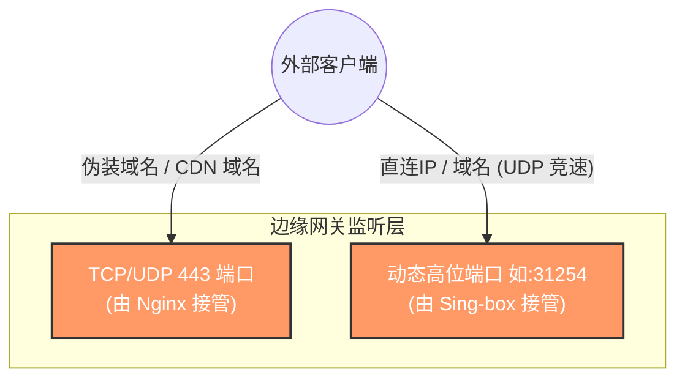
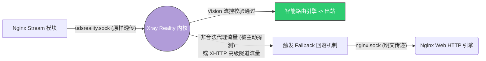
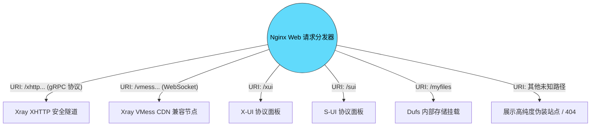
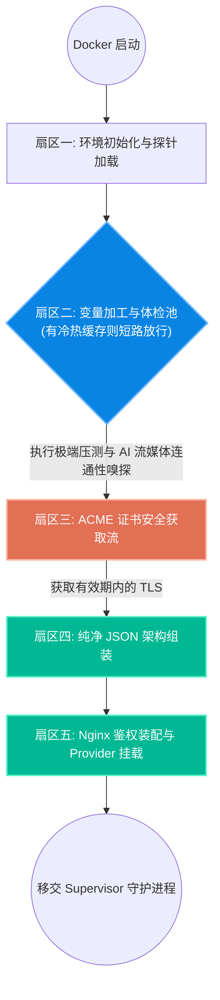

# 01. 系统架构与网络流量链路详解

本文档深入剖析 SB-Xray 项目的核心架构设计，通过详尽的图表阐述流量从客户端发出、经过 Nginx 边界网关、被内部双引擎分流并最终安全出站的完整生命周期。同时，我们也将揭开容器内部 `entrypoint.sh` 守护程序的启动原理。

---

## 1. 核心架构理论：Nginx 前置 vs Xray 前置

在代理圈中，关于 443 端口的接管权一直存在两种主流路线。为了实现复杂的业务级功能，本项目坚定选用了 **Nginx 前置多业务网关** 架构。

> **文献参考**: 本架构设计深度融合并扩展了 XTLS 社区关于端口共存的讨论 [XTLS/Xray-core#4118](https://github.com/XTLS/Xray-core/discussions/4118)。

### 为什么选择 Nginx 作为守门人？

如果由 Xray 独占 443 端口（Xray 前置），虽然配置极简，但其只能作为单一的 Reality 代理服务器。一旦你需要同时运行 **多个可视化 Web 面板 (X-UI/S-UI)**、提供 **文件网盘 (Dufs)**，或是处理来自 **Cloudflare 的 CDN 备用流量**，Xray 简单的 `fallbacks` 机制将捉襟见肘。

**SB-Xray 的 Nginx 前置优势：**
1. **TCP 层的 SNI 嗅探**：Nginx `stream` 模块可以在不解密 TLS 的情况下，直接查看客户端请求的 SNI（Server Name Indication）。
2. **零损耗透传**：一旦发现 SNI 是我们设定的“伪装大厂域名”，Nginx 直接将原始的 TLS 握手数据包通过内部的高速通道（Unix Socket）扔给 Xray Reality 处理，**性能损耗肉眼不可见**。
3. **强大的 Web 路由能力**：如果是通过 CDN 域名进来的普通 HTTPS 请求，Nginx 则大显身手，执行解密并根据 URL 路径精确分发给对应的微服务。

---

## 2. 流量流向深度拆解 (Traffic Flow)

我们把复杂的宏观架构拆分为三个微观视角，以便您透彻理解。

### 视角一：边缘网关入口层 (Edge Gateway)

外部流量如何进入服务器的物理端口。

* **解释**：Sing-box 运行的 Hysteria2 等协议是基于纯 UDP 的，它们拥有极强的抗丢包特性，因此直接绕过 Nginx，监听独立的随机高位端口，实现暴力竞速。

### 视角二：Xray 核心鉴权与回落 (Reality Micro-Routing)

当流量通过 443 端口进入系统后，Xray Reality 是如何处理它的。

### 视角三：业务层的内部路由 (Web Applications)

对于走 CDN 通道或触发回落的流量，Nginx HTTP 引擎是如何进行业务分发的。

### 🧠 揭秘内部幽灵通道：Unix Domain Socket (.sock)

在上述图表中，您会频繁看到形如 `udsreality.sock`, `nginx.sock` 的词汇。
* **为什么不用内部 IP (127.0.0.1:8080)？**
* 因为内部网络端口依然要走操作系统的完整 TCP/IP 协议栈。而 `.sock`（Unix 域套接字）是直接在**系统内存中进行进程间数据交换**。它不占用任何系统端口资源，延迟极低，并且无法被外部网络探针扫描，极大提升了并发吞吐量与系统安全性。

---

## 3. Entrypoint.sh 守护进程生命周期 (Lifecycle)

容器在每次启动（或执行 `docker compose restart`）时，并不会直接盲目拉起核心，而是由 `scripts/entrypoint.sh` 执行一套极为严密的“五大生命周期扇区”。

### 核心亮点：冷热数据分离与启动短路截断
为了避免容器每次重启都去调用海外 API 测速（导致重启极慢且易被 API 封禁），`entrypoint.sh` 实现了一套智能的冷热分离机制：
1. **冷盘持久化 (`/.env/sb-xray`)**：保存不会轻易改变的硬件属性（如机器地理位置 GEOIP、IP ASN 类型）与随机生成的 UUID 私钥。**仅在全新部署时生成一次**。
2. **热盘动态挂载 (`/.env/status`)**：保存网络测速的最优落地 `ISP_TAG` 以及 ChatGPT/Netflix 的连通性探针结果。
3. **极速重启**：如果检测到热盘存在有效的探针成绩记录，系统直接触发**短路截断 (Circuit Breaker)**，抛弃耗时的并发跑分，0.5秒内完成组件渲染并极速上线。
