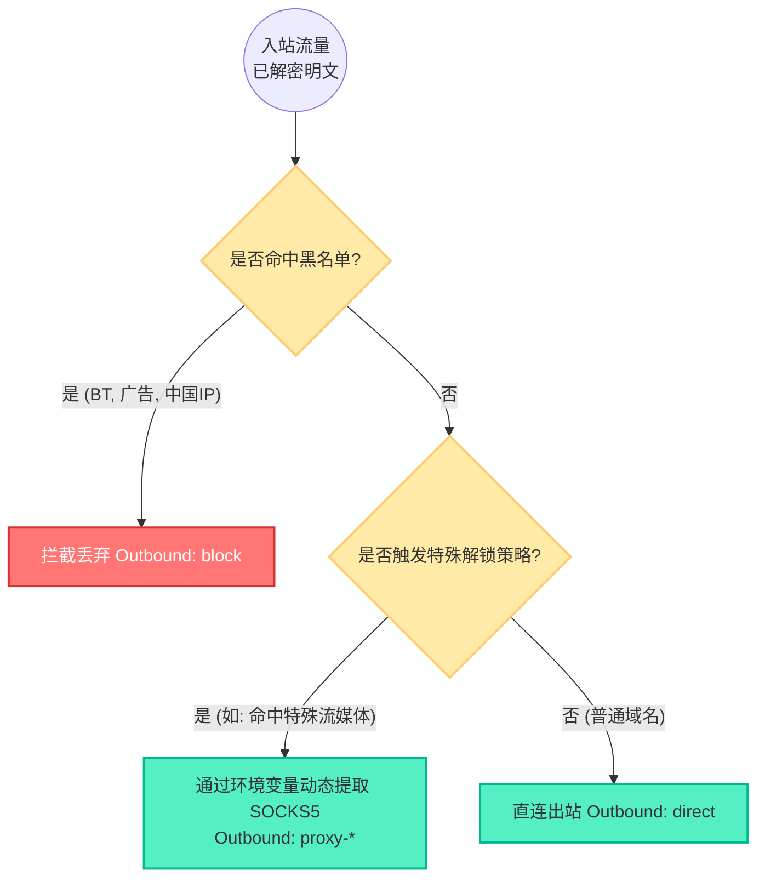
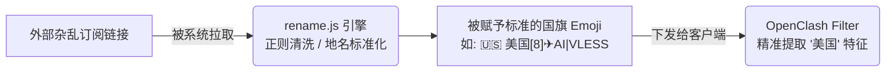

# 03. 智能路由策略与全平台客户端接入指南

网络环境异常复杂，单台服务器的数据中心 IP 往往无法解锁目标地区的流媒体或特定服务。本项目内建了一套从**服务端链式代理**到**客户端策略组调度**的完整智能路由方案。

---

## 1. 🧠 服务端智能路由与多 ISP 落地策略 (SOCKS5 Chaining)

**核心痛点**：由于 VPS 的 IP 通常被标记为 Hosting (机房)，它往往受阻于特定的网络检测。通过服务端底层动态挂载 ISP（家庭宽带）或原生 SOCKS5 节点，我们可以让用户在手机/电脑上实现完全**“无感绕过”**。

### 路由决策工作原理图
在 Xray (`xr.json`) 和 Sing-box (`sb.json`) 的底层核心中，我们配置了高度一致的路由决策引擎：



### 多 ISP 环境注入实操
在您的 `docker-compose.yml` 文件中，按以下规则配置环境变量：

```yaml
environment:
  # ISP 1: 洛杉矶原生家宽 (变量名必须以 _ISP_IP 结尾)
  - LA_ISP_IP=1.2.3.4
  - LA_ISP_PORT=2000
  - LA_ISP_USER=alice
  - LA_ISP_SECRET=pwd123

  # ISP 2: 韩国原生家宽
  - KR_ISP_IP=5.6.7.8
  - KR_ISP_PORT=3000
  - KR_ISP_USER=bob
  - KR_ISP_SECRET=pwd456

  # 默认的全局兜底落地出口
  - DEFAULT_ISP=LA
```
配置完成后，`entrypoint.sh` 的 `process_single_isp` 脚本会自动将其渲染为底层内核支持的 JSON 节点格式。所有的解锁动作都在服务器端默默完成，客户端无需任何繁琐的前置 (Dialer) 设置。

---

## 2. 🧹 Sub-Store 节点深层清洗与重命名

对于将外部节点引入本系统的用户，环境节点命名往往杂乱无章。SB-Xray 利用内嵌的 Sub-Store 与强大的正则表达式字典进行了全自动清洗。

### 自动化流转过程



**清洗动作解析 (`rename.js`)**：
1. **去重与过滤**：彻底拦截名字中包含 `距离|套餐|到期|剩余` 等无关信息的无效节点。
2. **地名统一归化**：将诸如 `Hong Kong, HK, 深港` 等词汇强制统一翻译为 `香港`。
3. **视觉美化**：自动在名称前挂载对应国家的 Emoji 国旗，并在同地区节点后加上序列号（如 `[1]`, `[2]`），极大地治愈强迫症。

---

## 3. 🎯 客户端智能调度优选策略 (Client Policies)

洗净后的节点，最终需要依靠强大的客户端策略组（Policy Group）进行指挥调配。

我们在 `templates/client_template/` 下为您预置了极具专业水准的 Mihomo (Clash Meta) 模板，涵盖了 `OneSmartPro` (智能完整版) 等多种选择。

> **开源策略参考**：模板中的分流思想深度借鉴了社区中广受好评的 [Mihomo 官方规则](https://github.com/MetaCubeX/meta-rules-dat) 以及 [666OS/YYDS](https://github.com/666OS/YYDS) 复合规则库。

### OpenClash 策略分离哲学
要驾驭成百上千的节点并让它们在不同的需求场景中发挥出最佳实力，我们的模板坚持了**“筛选与定级相分离”**的核心设计。

*   **Filter (初筛划定池)**：通过正则表达式严格匹配节点名。例如，特定流媒体策略组只抓取名称中带有 `✈super` (代表高质量落地) 的节点。
*   **Policy-Priority (打分定级)**：对池子里的候选节点进行多维度的“选拔”。同等延迟下，带有 `Reality` 标识的节点加分，拥有独立高位端口的节点加分，从而确保随时选出最优线路。

### 各平台客户端接入方式

一旦容器正常运行，您可以访问 `https://您的CDN域名/sb-xray/` 调出专属面板，获取包含您的**独立防泄漏 Token** 的订阅链接。

*   **Windows / Android**：推荐使用 v2rayN。直接复制单条链接进行剪贴板导入；或复制 `/sb-xray/all?token=xxx` 作为订阅源拉取。
*   **macOS / iOS**：推荐使用 ClashX Pro / Shadowrocket。直接复制针对性的 YAML 模板链接，在客户端中选择“从 URL 下载配置”。
