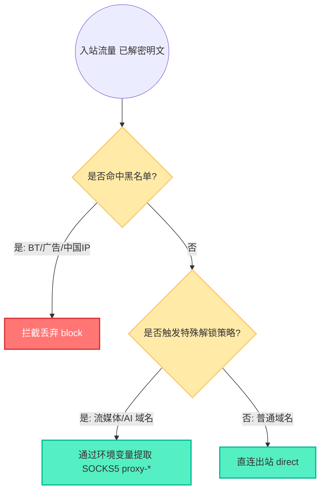
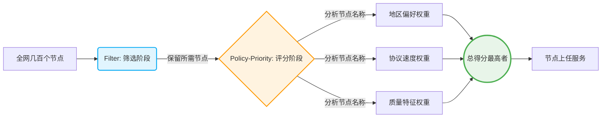
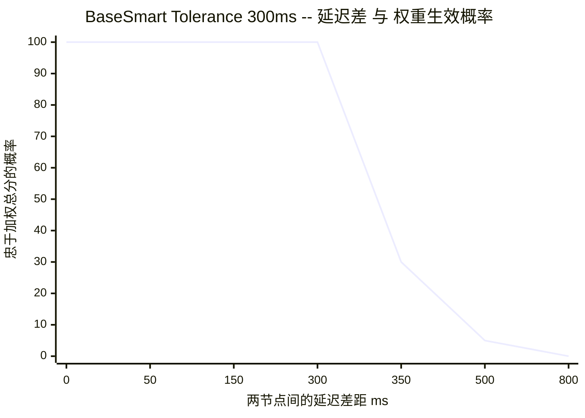
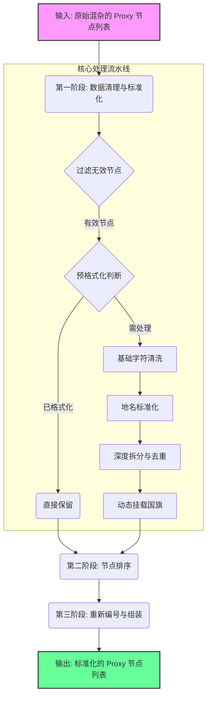

# 03. 智能路由策略与全平台客户端接入指南

> 本文档覆盖从**服务端链式代理多 ISP 落地**，到**客户端 OpenClash 智能调度优选**，再到 **Sub-Store 节点深层清洗**的完整路由方案。

---

## 目录

1. [服务端智能路由与多 ISP 落地策略](#1-服务端智能路由与多-isp-落地策略)
2. [OpenClash Policy-Priority 智能调度](#2-openclash-policy-priority-智能调度)
3. [Sub-Store 节点深层清洗与重命名](#3-sub-store-节点深层清洗与重命名)
4. [客户端模板对比与接入方式](#4-客户端模板对比与接入方式)
5. [参考文献](#5-参考文献)

---

## 1. 服务端智能路由与多 ISP 落地策略

### 1.1 核心痛点

VPS 的 IP 通常被标记为 Hosting（机房），受阻于 Netflix、ChatGPT 等服务的 IP 检测。通过服务端底层动态挂载 ISP（家庭宽带）或原生 SOCKS5 节点，可以让用户在手机/电脑上实现完全**"无感绕过"**。

### 1.2 路由决策工作原理

在 Xray (`xr.json`) 和 Sing-box (`sb.json`) 的底层核心中，配置了高度一致的路由决策引擎：



### 1.3 多 ISP 环境注入实操

在 `docker-compose.yml` 文件中，按以下规则配置环境变量：

```yaml
environment:
  # ISP 1: 洛杉矶原生家宽（变量名必须以 _ISP_IP 结尾）
  - LA_ISP_IP=1.2.3.4
  - LA_ISP_PORT=2000
  - LA_ISP_USER=alice
  - LA_ISP_SECRET=pwd123

  # ISP 2: 韩国原生家宽
  - KR_ISP_IP=5.6.7.8
  - KR_ISP_PORT=3000
  - KR_ISP_USER=bob
  - KR_ISP_SECRET=pwd456

  # 默认全局兜底落地出口
  - DEFAULT_ISP=LA
```

配置完成后，`entrypoint.sh` 的 `process_single_isp` 函数会自动将其渲染为底层内核支持的 JSON 节点格式。所有的解锁动作在服务器端默默完成，客户端无需任何繁琐的前置设置。

---

## 2. OpenClash Policy-Priority 智能调度

本章深入解析在 OpenClash（Mihomo 内核）的 Smart 模式下，如何通过精密的 `filter`（筛选）和 `policy-priority`（排序）配合 `tolerance`（容忍度）机制，实现真正的**多场景智能路由**。

> [!IMPORTANT]
> 以下所有权重数据均与 `templates/client_template/OneSmartPro.yaml` 配置文件严格同步。

### 2.1 核心设计理念：职责分离

要驾驭成百上千的节点，必须坚持**职责分离**的配置原则：

* **Filter（初筛）**：只负责划定候选节点的范围。例如，只选支持流媒体的，过滤掉香港的。
* **Policy-Priority（定级）**：只负责给范围内的候选者进行「多维打分」。例如，同等条件下，优质节点加分，Reality 协议加分。



### 2.2 节点命名架构与特征提取

节点能够智能化打分的前提是其名字中附带了标签属性。标准格式：

```text
[${NODE_NAME}] ${REGION_INFO}|${PROTOCOL}|${SUFFIX}
```

| 维度类别 | 提取示例 | 在系统中的用途 |
|:---|:---|:---|
| **地区标识** | `🇭🇰HK`, `🇺🇸US`, `🇯🇵JP` | 定点分流，如 AI 节点强行加权美国区 |
| **特性标签** | `super`, `good`, `高速` | 业务定速，识别具有极佳体验的专线 |
| **协议类型** | `Reality`, `Hysteria2`, `VMess` | 降延迟与抗封锁，新一代协议天然高分 |
| **质量后缀** | `super`, `good` | 区分节点池的头等舱和经济舱 |

### 2.3 多维度打分与权重叠加法则

所有的评分是**累加**的！OpenClash 将累积节点名上所有匹配到的关键词权重，谁总分高谁当主力。

> [!TIP]
> **叠加公式：节点最终星级 = Σ(关键字命中得分)**

#### 评分标准对照表（与 `OneSmartPro.yaml` 严格同步）

| 考核维度 | 关键字命中匹配 | 权重 (分值) | 机制说明 |
|:---|:---|:---:|:---|
| **质量标签** | `super` | +30 | 住宅流畅标识，最高质量节点 |
| | `good` / `高速` | +10 | 代理流畅/高速标识 |
| **协议性能** | `Reality` | +20 | 第一梯队隐蔽协议 |
| | `vless` | +10 | 核心轻量协议 |
| | `Hysteria2` / `hysteria2` | +8 | 优秀的 UDP 低阻力协议 |
| | `TUIC` / `tuic` | +6 | 第二代 QUIC 协议 |
| | `Vmess` / `vmess` | +3 | 常见老牌协议，保底分数 |
| | `anytls` | +1 | 传统握手协议，仅留底分 |
| **地区偏好** | *因策略而异* | *见下方各策略模板* | 不同场景有不同地区权重 |

### 2.4 Filter 筛选器详解

以下是 `OneSmartPro.yaml` 中实际使用的 Filter 定义：

| Filter 名称 | 匹配逻辑 | 适用策略组 |
|:---|:---|:---|
| **FilterISP** | 匹配含 `住宅`、`isp`、`ISP`、`AllOne` 的节点 | 家宽-智选 |
| **FilterMedia** | 匹配含 `流媒体`、`AllOne` 的节点 | 媒体-智选 |
| **FilterAI** | 匹配含 `AI`、`AllOne` 的节点 | AI-智选 |
| **FilterFAST** | 匹配含 `高速` 的节点 | 高速-智选 |
| **FilterDialer** | 匹配含 `🇭🇰`、`🇹🇼`、`🇨🇳` 且排除 `-dialer` 的节点 | 链式前置 |
| **FilterHK/TW/JP/SG/KR/US** | 按各自地区正则匹配 | 各地区-智选 |
| **FilterOT** | 排除以上所有已知地区的剩余节点 | 其他-智选 |

> [!NOTE]
> `AllOne` 是一个特殊标识，用于让某些节点同时出现在家宽、流媒体和 AI 策略组中。

### 2.5 容忍度 (Tolerance) —— 延迟对抗权重的破局点

除了权重外，智能模式还引入「**延迟对抗制衡** (Tolerance Mechanism)」。`tolerance` 是衡量**允许在多少 ms 延迟劣势之内，继续尊重权重得分的"忠诚区间"**。



*图解：当节点延迟差距小于 300ms 时，系统绝对服从高权重分数（100% 忠诚）；一旦差距超过阈值，权重分数迅速崩盘，转而妥协于低延迟节点。*

### 2.6 三套智选模板

| 模板 | 容忍度 | 适用场景 | 设计理念 |
|:---|:---:|:---|:---|
| ⚖️ **BaseSmart** | 300ms | 高速-智选、各地区普通优选 | 速度与规矩并重，防止选上卡顿但高权重的节点 |
| 🛡️ **StableSmart** | 800ms | AI-智选（ChatGPT、Claude） | AI 对 IP 变动极敏感，高容忍度防止频繁换区 |
| 🎬 **MediaSmart** | 1000ms | 家宽-智选、媒体-智选 | IP 纯净度是**唯一标准**，几乎"只看权重，无视延迟" |

### 2.7 六套 Policy-Priority 策略模板

以下是 `OneSmartPro.yaml` 中定义的完整策略模板（基础权重 + 地区偏好）：

#### PolicyDefault（默认策略，无地区偏置）

```yaml
"高速:10;Reality:20;vless:10;Hysteria2:8;hysteria2:8;TUIC:6;tuic:6;Vmess:3;vmess:3;anytls:1;super:30;good:10"
```

#### PolicyISP（家宽策略）

```yaml
# 地区偏好: 🇺🇸:20 > 🇰🇷:10 > 🇯🇵:6 > 🇸🇬:4 > 🇹🇼:2
"高速:10;Reality:20;vless:10;Hysteria2:8;hysteria2:8;TUIC:6;tuic:6;Vmess:3;vmess:3;anytls:1;super:30;good:10;🇺🇸:20;🇰🇷:10;🇯🇵:6;🇸🇬:4;🇹🇼:2"
```

#### PolicyMedia（流媒体策略）

```yaml
# 地区偏好: 🇺🇸:15 > 🇰🇷:8 > 🇯🇵:6 > 🇸🇬:4 > 🇹🇼:2
"高速:10;Reality:20;vless:10;Hysteria2:8;hysteria2:8;TUIC:6;tuic:6;Vmess:3;vmess:3;anytls:1;super:30;good:10;🇺🇸:15;🇰🇷:8;🇯🇵:6;🇸🇬:4;🇹🇼:2"
```

#### PolicyFast（高速策略）

```yaml
# 地区偏好: 🇺🇸:15 > 🇯🇵:10 > 🇰🇷:8 > 🇸🇬:4 > 🇹🇼:2
"高速:10;Reality:20;vless:10;Hysteria2:8;hysteria2:8;TUIC:6;tuic:6;Vmess:3;vmess:3;anytls:1;super:30;good:10;🇺🇸:15;🇯🇵:10;🇰🇷:8;🇸🇬:4;🇹🇼:2"
```

#### PolicyAI（AI 服务策略）

```yaml
# 地区偏好: 🇺🇸:20 > 🇯🇵:10 > 🇰🇷:8 > 🇸🇬:4 > 🇹🇼:2
"高速:10;Reality:20;vless:10;Hysteria2:8;hysteria2:8;TUIC:6;tuic:6;Vmess:3;vmess:3;anytls:1;super:30;good:10;🇺🇸:20;🇯🇵:10;🇰🇷:8;🇸🇬:4;🇹🇼:2"
```

#### PolicyDialer（链式代理策略）

```yaml
# 地区偏好: 🇭🇰:20 > 🇹🇼:15 > 🇨🇳:15 > 🇰🇷:10 > 🇯🇵:6 > 🇸🇬:4 > 🇺🇸:2
"高速:10;Reality:20;vless:10;Hysteria2:8;hysteria2:8;TUIC:6;tuic:6;Vmess:3;vmess:3;anytls:1;super:30;good:10;🇭🇰:20;🇹🇼:15;🇨🇳:15;🇰🇷:10;🇯🇵:6;🇸🇬:4;🇺🇸:2"
```

> **PolicyDialer 适用场景**：当需要通过距离较近的节点（如香港、台湾）作为链式代理前置来连接远端服务器时，优先选择低延迟地区。

### 2.8 配置与实战案例推演

```yaml
# 第一步：指定地区权重模板（此为家宽专用策略）
PolicyISP: "高速:10;Reality:20;vless:10;...;super:30;good:10;🇺🇸:20;🇰🇷:10;🇯🇵:6;🇸🇬:4;🇹🇼:2"

# 第二步：挂载到最终业务的路由组（使用 MediaSmart + FilterISP 双剑合璧）
proxy-groups:
  - name: 家宽-智选
    type: smart       # 由 <<: *MediaSmart 继承 1000ms 容忍度
    filter: "^(?=.*(?i)(住宅|isp|ISP|AllOne))(?!.*(DIRECT|直接连接|5x)).*$"
    policy-priority: *PolicyISP
```

#### 沙盘推演：家宽节点选拔战

**参赛选手**（经过 Filter 之后）：

| 选手 | 节点名称 | 延迟 |
|:---|:---|:---|
| **A** | `[Reality] 🇺🇸US 住宅 Reality vless super` | **180 ms** |
| **B** | `[Reality] 🇰🇷KR 住宅 Hysteria2 super` | **70 ms** |
| **C** | `[Reality] 🇭🇰HK 住宅 Reality vless super` | **30 ms** |

**打分环节**（基于 `PolicyISP`）：

* **选手 A (美国)**：Reality(`20`) + vless(`10`) + 🇺🇸(`20`) + super(`30`) = **80 分** 🏆
* **选手 B (韩国)**：Hysteria2(`8`) + 🇰🇷(`10`) + super(`30`) = **48 分**
* **选手 C (香港)**：Reality(`20`) + vless(`10`) + 🇭🇰(`0`) + super(`30`) = **60 分**

**结果揭晓**：

1. 选手 A 延迟 180ms，选手 C 只有 30ms，延迟差高达 150ms
2. 但家宽模板为 `MediaSmart`，容忍度高达 **1000ms**
3. 延迟差 150ms 远未击穿 1000ms 防线，机制**只看总得分**
4. **选手 A (80 分) 毫无争议地战胜选手 C (60 分)！**

> **推演结论**：完美实现了"哪怕美国慢得要命，只要在可用范围内，绝不用极速香港节点来干扰家宽业务！"

### 2.9 排障与调优 FAQ

| 问题 | 原因 | 解决方案 |
|:---|:---|:---|
| 高分节点不被选上 | 延迟差突破了容忍红线 | 检查节点状态或替换为 `MediaSmart` |
| 修改优先级未生效 | 关键字大小写错误或未重载 | 检查大小写后重启容器拉取最新配置 |
| 追踪权重计算轨迹 | — | `grep "policy-priority" /tmp/openclash.log` |

---

## 3. Sub-Store 节点深层清洗与重命名

对于将外部机场节点引入本系统的用户，环境节点命名往往杂乱无章。SB-Xray 利用内嵌的 Sub-Store 与强大的 `rename.js` 脚本进行全自动清洗。

### 3.1 清洗流转架构



### 3.2 核心清洗动作

| 阶段 | 动作 | 说明 |
|:---|:---|:---|
| **去重与过滤** | `INVALID_REGEX` | 彻底拦截含"距离/套餐/到期/剩余"等无关信息的无效节点 |
| **地名统一归化** | `RegionMap` | 将 `Hong Kong`、`HK`、`深港` 统一为 `香港` |
| **视觉美化** | `detectFlag` + 编号 | 自动挂载国旗 Emoji 并添加序列号 `[1]`, `[2]` |
| **协议精简** | 互斥剔除 | 有 `Reality` 则隐藏 `vless`，避免冗余 |

### 3.3 处理效果对比

| 原始命名 | 清洗后结果 |
|:---|:---|
| `![使用教程与联系客服].txt` | **（自动剔除）** |
| `✨🇭🇰 香港 01 x1.5 \| IPLC -- Reality` | `Reality ✈ 🇭🇰 香港[1] ✈ IPLC ✈ 1.5×` |
| `🇺🇸美国洛杉矶v6 08 🎯udp` | `🇺🇸 IPv6 美国[1] ✈ 洛杉矶 ✈ UDP` |
| `Taiwan-Hsinchu-02-1.0倍` | `🇹🇼 台湾[1] ✈ 新竹 ✈ 1×` |

### 3.4 部署方式

1. 进入 Sub-Store 网页端控制台
2. 找到订阅链接编辑界面 → **脚本操作 (Scripting)**
3. 添加类型为 `Operator` 的处理脚本
4. 将 `rename.js` 代码粘贴进去，保存并预览

> **高级维护**：如遇新机场的未知命名，请在 `RegionMap` 中补上对应关键词正则即可。

---

## 4. 客户端模板对比与接入方式

### 4.1 模板类型对比

| 模板 | 定位 | 内核 | 核心机制 | 策略组 | 适用场景 |
|:---|:---|:---|:---|:---:|:---|
| **OneSmartPro.yaml** | 智能完整版 | Mihomo | Smart 智选 + Policy-Priority 多维权重 | ~40 | OpenClash / Mihomo 自动选择最优节点 |
| **FallBackPro.yaml** | 故障转移版 | Mihomo | Fallback 故转 + url-test 自动切换 | ~50 | OpenClash / Mihomo 稳定优先、自动容灾 |
| **surge.conf** | Surge 配置 | Surge | url-test + 正则分组 | ~15 | macOS / iOS Surge 客户端 |

> [!NOTE]
> **两套 Mihomo 模板的核心区别**：
> - **OneSmartPro** 使用 Mihomo 最新的 `smart` 策略组类型，通过 `policy-priority` 进行**多维度加权打分**（协议、地区、质量标签），每个场景只需一个策略组即可智能决策。
> - **FallBackPro** 使用传统的 `fallback` + `url-test` 组合，每个地区/场景拆分为「故转 → 自动/手动」**三层嵌套**，更加稳健但策略组数量更多。

### 4.2 核心变量说明

所有客户端模板都支持以下环境变量替换：

| 变量 | 说明 | 示例值 |
|:---|:---|:---|
| `${DOMAIN}` | 服务器主域名 | `example.com` |
| `${CDNDOMAIN}` | CDN 域名 | `cdn.example.com` |
| `${LISTENING_PORT}` | 监听端口 | `443` |
| `${XRAY_UUID}` | Xray UUID | `xxxx-xxxx-xxxx` |
| `${SB_UUID}` | Sing-box UUID | `yyyy-yyyy-yyyy` |
| `${PORT_HYSTERIA2}` | Hysteria2 端口 | `30001` |
| `${PORT_TUIC}` | TUIC 端口 | `30002` |
| `${PORT_ANYTLS}` | AnyTLS 端口 | `30003` |
| `${XRAY_REALITY_PUBLIC_KEY}` | Reality 公钥 | `abcd1234...` |
| `${XRAY_URL_PATH}` | WebSocket/XHTTP 路径 | `random32chars` |
| `${CLASH_PROXY_PROVIDERS}` | 订阅源配置 | YAML 格式字符串 |
| `${CLASH_ISP_PROXIES}` | ISP 代理配置 | YAML 格式字符串 |

### 4.3 各平台接入方式

容器正常运行后，访问 `https://您的CDN域名/sb-xray/` 调出专属面板，获取包含**独立防泄漏 Token** 的订阅链接。

| 平台 | 推荐客户端 | 接入方式 |
|:---|:---|:---|
| **Windows / Android** | v2rayN | 复制单条链接进行剪贴板导入；或复制 `/sb-xray/all?token=xxx` 作为订阅源 |
| **macOS / iOS** | ClashX Pro / Shadowrocket | 复制针对性 YAML 模板链接，选择"从 URL 下载配置" |
| **OpenWrt** | OpenClash | 复制 `OneSmartPro.yaml?token=xxx` 作为订阅源，内核选择 Mihomo |

---

## 5. 参考文献

* **开源规则库**: [Mihomo 官方规则 (MetaCubeX/meta-rules-dat)](https://github.com/MetaCubeX/meta-rules-dat)
* **策略参考**: [666OS/YYDS 复合规则库](https://github.com/666OS/YYDS)
* **Mihomo Smart 模式**: [Mihomo 文档 — Proxy Groups](https://wiki.metacubex.one/config/proxy-groups/)
* **Sub-Store**: [sub-store-org/Sub-Store](https://github.com/sub-store-org/Sub-Store)
