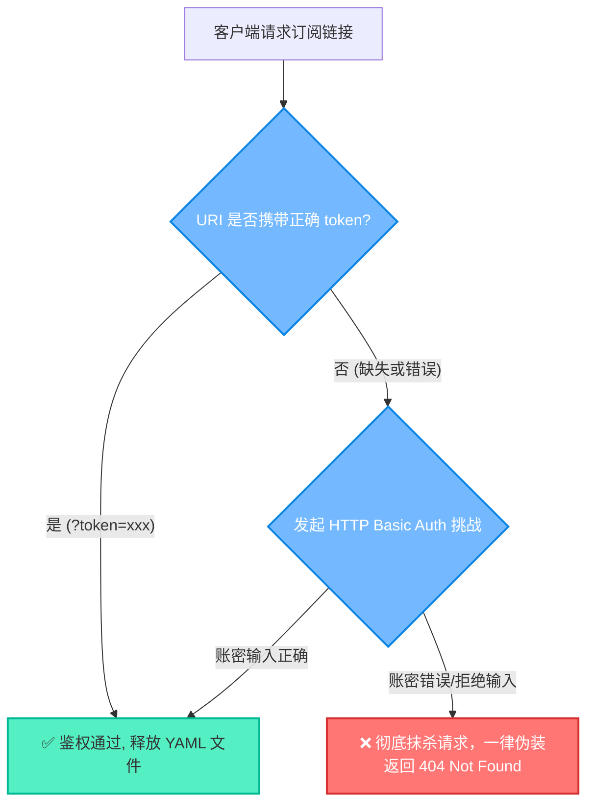

# 04. 综合运维、面板管理与故障排查

任何一个复杂的网络系统在长期运行中都不可避免地会遇到波动。本指南为您梳理了 SB-Xray 的面板矩阵导航、订阅端点的防御哲学，以及一份标准化的实战排障手册。

---

## 1. 🎛️ 系统控制面板导航矩阵

为了实现模块的彻底解耦与极致的隐秘性，所有的可视化控制台与订阅文件入口**一律被强制要求通过您的 CDN 保护域名（即 `CDNDOMAIN`）进行访问**。系统从底层 Nginx 处便阻断了任何针对主机 IP 或裸主域名的面板探测行为。

| 业务微服务 | 安全访问路径 | 默认凭据 / Token | 核心作用说明 |
| :--- | :--- | :--- | :--- |
| **X-UI 管理端** | `https://${CDNDOMAIN}/xui` | 账号:`admin`<br>密码:*(容器日志提取)* | 控制 Xray 内核、管理 Reality 协议及查看底层连接日志。 |
| **S-UI 管理端** | `https://${CDNDOMAIN}/sui` | 账号:`admin`<br>密码:*(容器日志提取)* | 监控 Sing-box 运行状态及 Hysteria2/TUIC 并发数据。 |
| **私有文件网盘** | `https://${CDNDOMAIN}/myfiles` | 账号:`admin`<br>密码:*(同上)* | 由 Dufs 驱动的私密空间，用于配置文件的暂存或安全交换。 |
| **客户端订阅库** | `https://${CDNDOMAIN}/sb-xray/` | `?token=随机防泄漏串` | 各大客户端拉取 YAML 模板与独立代理节点链接的总分发端点。 |

> 🔑 **提取您的超级凭证**：请在容器首次初始化完毕后，立刻通过终端执行以下审计命令获取随机密码与专属 Token：
> ```bash
> docker logs sb-xray | grep -i password
> docker logs sb-xray | grep -i token
> ```

---

## 2. 🛡️ 订阅端点安全防扫描机制

`/sb-xray/` 承载了您所有的私密节点信息，一旦泄露，将面临严重的流量盗刷风险。我们在 Nginx 层面为其加盖了**极其严苛的零信任双重防护罩**。

### 访问鉴权生命周期图



### 核心安全准则：
1. **统一的 404 伪装掩护**：对于任何未经授权的探测（包括输错了密码、Token 错误、甚至请求了系统中不存在的 `.txt` 后缀），系统**绝不**返回 `401 Unauthorized` 或 `403 Forbidden`。所有的拒绝访问全部强制返回 `404 Not Found`。
2. **反嗅探响应头**：严格禁用了所有的目录浏览 (`autoindex off`)，并打上了 `nosniff`, `Cache-Control: no-store` 等强防御 Header。

---

## 3. 🛠️ 故障排查实战手册 (Troubleshooting Tree)

当您在日常运行中配置变更后突然遇到网络异常时，请对照以下标准化排查流进行处理。

### 3.1 进程与状态体检
SB-Xray 容器内是由 `Supervisord` 作为上帝进程来统领所有子模块的。一旦出问题，第一步永远是查看其状态：
```bash
# 检查子系统 (xray, sing-box, nginx) 是否全部为 RUNNING
docker exec sb-xray supervisorctl status
```
*如果某一行显示 `FATAL` 或是 `STOPPED`，则说明该模块的配置文件语法有误，导致程序崩溃了。*

### 3.2 常见故障画像与拆解

#### ❌ 症状 A：访问面板时网页报错 `502 Bad Gateway`
* **根源剖析**：您的 Nginx 正常存活抛出错误，但它背后的 `X-UI` 或 `S-UI` 进程因故障崩溃了。
* **打击方案**：立即执行进程体检，随后查看对应面板的致命崩溃日志：
  `docker exec sb-xray tail -n 50 /var/log/xray/error.log`

#### ❌ 症状 B：客户端订阅链接报错 `404 Not Found`
* **根源剖析**：触发了系统的防扫描机制。
* **打击方案**：检查您的 URL 是否精准携带了 `?token=YOUR_TOKEN`，且等号后面没有任何多余的空格。确保请求后缀是被允许的 `.yaml` 等白名单扩展名。

#### ❌ 症状 C：查看日志时提示 `acme.sh: Error, can not get domain token`
* **根源剖析**：系统在试图为您自动化申请 TLS 证书时遭到了机构的拒绝。常见于网络阻断。
* **打击方案**：
  1. 登录您的域名解析后台，确保主域名和 CDN 域名 A 记录正确。
  2. **绝对关键**：在此阶段，千万不要在 Cloudflare 中开启“小黄云”。因为 ACME 验证需要直接触达服务器的真实 80 端口。
  3. 确认服务器安全组彻底放行了 TCP 的 80 与 443 端口。
