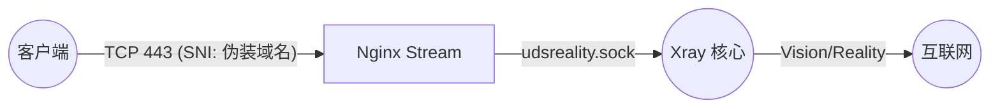
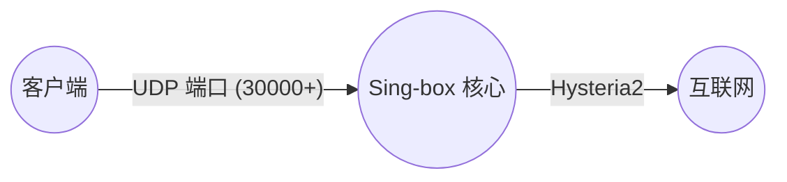
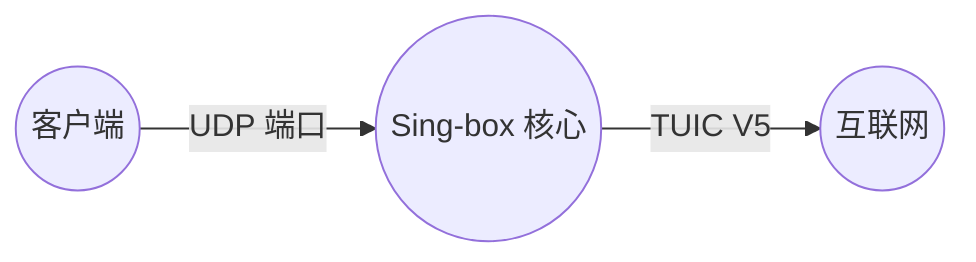
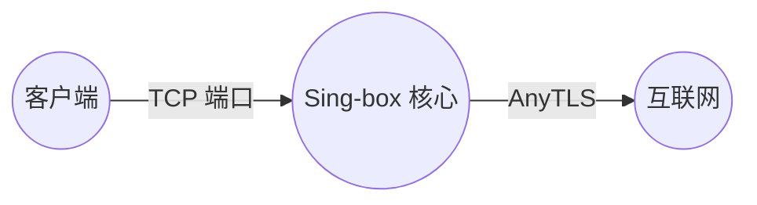
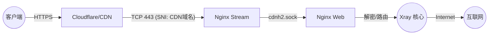

# 协议详细配置手册 (Protocol Details Manual)

本文档补充了架构图解，详细列出了项目中支持的每一个代理协议的客户端配置、服务端入站配置以及内部流量流转细节。

---

## 目录

1.  [VLESS-Vision-Reality (Xray)](#1-vless-vision-reality-xray) - **旗舰推荐**
2.  [Hysteria2 (Sing-box)](#2-hysteria2-sing-box) - **竞速首选**
3.  [TUIC V5 (Sing-box)](#3-tuic-v5-sing-box) - **备用竞速**
4.  [AnyTLS (Sing-box)](#4-anytls-sing-box) - **TCP 伪装**
5.  [VMess-WS-TLS (Xray)](#5-vmess-ws-tls-xray) - **CDN 兼容**
6.  [VLESS-XHTTP-Reality (Xray)](#6-vless-xhttp-reality-xray) - **实验性协议**

---

## 1. VLESS-Vision-Reality (Xray)

项目的主力协议，具有极高的防探测能力和性能（基于 XTLS-Vision 流控）。

*   **定位**: 极速、稳定、抗封锁。
*   **适用客户端**: v2rayN, V2Box, FoXray, Shadowrocket, Sing-box 等支持 Reality 的客户端。

### 流量图解 (Traffic Flow)


### 客户端出站 (Client Outbound)
*   **连接方式**: TCP / 443 端口
*   **URL 示例**:
    ```
    vless://${XRAY_UUID}@${DOMAIN}:${LISTENING_PORT}?encryption=none&flow=xtls-rprx-vision&security=reality&sni=${DEST_HOST}&fp=chrome&pbk=${XRAY_REALITY_PUBLIC_KEY}&sid=${XRAY_REALITY_SHORTID}&type=tcp&headerType=none#${NODE_NAME}|XTLS+Reality
    ```
*   **核心参数**:
    *   `flow`: `xtls-rprx-vision` (必须)
    *   `security`: `reality`
    *   `sni`: **必须是伪装域名**（通常为 `speed.cloudflare.com`），而非你的主域名。
    *   `address` (server): 你的服务器主域名或 IP。

### 服务端入站 (Server Inbound)
*   **配置文件**: `templates/xray/01_reality_inbounds.json`
*   **监听地址**: `unix:/dev/shm/udsreality.sock` (不直接监听公网端口)
*   **内部流转**:
    1.  **入口**: 用户连接公网 443 端口。
    2.  **分流**: Nginx Stream 模块识别 SNI（`${DEST_HOST}` 或 `${DOMAIN}`），将流量转发到 `udsreality.sock`。
    3.  **处理**: Xray 接收流量，验证 UUID 和 Reality 握手。
    4.  **回落**: 验证失败的流量（非白名单 SNI 或浏览器访问）会直接透传给目标网站（如 speed.cloudflare.com），**不再回落给 Nginx**。这意味着直接访问主域名 443 端口可能会失败或看到伪装站。

---

## 2. Hysteria2 (Sing-box)

基于 UDP 的拥塞控制协议，旨在恶劣网络环境下压榨带宽。

*   **定位**: 暴力竞速、降低延迟。
*   **适用客户端**: Sing-box, NekoBox, Shadowrocket, Hysteria2 官方客户端。

### 流量图解 (Traffic Flow)


### 客户端出站 (Client Outbound)
*   **连接方式**: UDP / 独立高位端口 (例如 30000+)
*   **URL 示例**:
    ```
    hysteria2://${SB_UUID}@${DOMAIN}:${PORT_HYSTERIA2}/?alpn=h3&insecure=1#${NODE_NAME}|Hysteria2
    ```
*   **核心参数**:
    *   `insecure`: `1` (或 `true`)，因为我们使用的是自签名/自动管理的证书，且 Hysteria2 此处对证书验证较严格，建议开启跳过验证或正确配置 CA。
    *   `alpn`: `h3`

### 服务端入站 (Server Inbound)
*   **配置文件**: `templates/sing-box/11_hysteria2_inbounds.json`
*   **监听地址**: `::` (All Interfaces)
*   **端口**: `${PORT_HYSTERIA2}`
*   **内部流转**:
    1.  **入口**: 用户直接连接服务器的 UDP 端口。
    2.  **处理**: Sing-box 内核直接响应，进行拥塞控制和数据传输。
    3.  **路径**: **直连** (不经过 Nginx，不经过 Xray)。

---

## 3. TUIC V5 (Sing-box)

另一种基于 QUIC 的高性能协议，与 Hysteria2 类似但机制略有不同。

*   **定位**: 备用的 UDP 竞速协议。
*   **适用客户端**: Sing-box, NekoBox, Shadowrocket。

### 流量图解 (Traffic Flow)


### 客户端出站 (Client Outbound)
*   **连接方式**: UDP / 独立高位端口
*   **URL 示例**:
    ```
    tuic://${SB_UUID}:${SB_UUID}@${DOMAIN}:${PORT_TUIC}?alpn=h3&insecure=1&congestion_control=bbr#${NODE_NAME}|TUIC
    ```
*   **核心参数**:
    *   `congestion_control`: `bbr`
    *   `uuid` & `password`: 通常设置为相同的值。

### 服务端入站 (Server Inbound)
*   **配置文件**: `templates/sing-box/12_tuic_inbounds.json`
*   **监听地址**: `::`
*   **端口**: `${PORT_TUIC}`
*   **内部流转**:
    1.  **入口**: 用户直接连接服务器的 UDP 端口。
    2.  **处理**: Sing-box 内核直接响应。
    3.  **路径**: **直连**。

---

## 4. AnyTLS (Sing-box)

即 "ShadowTLS" 的变种或升级，用于伪装成任意 HTTPS 流量。

*   **定位**: 将代理流量伪装成正常的 TLS 握手，抗干扰。
*   **适用客户端**: Sing-box。

### 流量图解 (Traffic Flow)


### 客户端出站 (Client Outbound)
*   **连接方式**: TCP / 独立高位端口
*   **URL 示例**:
    ```
    anytls://${SB_UUID}@${DOMAIN}:${PORT_ANYTLS}?security=tls&allowInsecure=1&type=tcp#${NODE_NAME}|AnyTLS
    ```

### 服务端入站 (Server Inbound)
*   **配置文件**: `templates/sing-box/13_anytls_inbounds.json`
*   **监听地址**: `::`
*   **端口**: `${PORT_ANYTLS}`
*   **内部流转**:
    1.  **入口**: 用户直接连接服务器的 TCP 端口。
    2.  **处理**: Sing-box 接收并模拟 TLS 握手行为。
    3.  **路径**: **直连**。

---

## 5. VMess-WS-TLS (Xray)

最经典的配置组合，支持 CDN (Cloudflare) 中转。

*   **定位**: 兼容性之王，救火队员（当 IP 被墙时可通过 CDN 访问）。
*   **适用客户端**: 几乎所有支持 V2Ray 的客户端。

### 流量图解 (Traffic Flow)


### 客户端出站 (Client Outbound)
*   **连接方式**: TCP / 443 端口 (或 CDN 边缘节点)
*   **URL 示例** (VMess 链接是以下 JSON 的 Base64 编码):
    ```json
    {
      "v": "2",
      "ps": "${NODE_NAME}|V2ray-TLS-WS",
      "add": "${DOMAIN}",  // 或 CDN 域名/IP
      "port": "${LISTENING_PORT}",
      "id": "${XRAY_UUID}",
      "aid": "0",
      "scy": "auto",
      "net": "ws",
      "type": "none",
      "host": "${DOMAIN}", // 或 CDN 域名
      "path": "/${XRAY_URL_PATH}-vmessws",
      "tls": "tls",
      "sni": "${DOMAIN}",  // 或 CDN 域名
      "alpn": "h2",
      "fp": "chrome"
    }
    ```
    *   **通用链接**: `vmess://eyZnLi4ufQ==` (base64 字符串)
*   **核心参数**:
    *   `net`: `ws` (WebSocket)
    *   `host`: `${DOMAIN}` (或 CDN 域名)
    *   `path`: `/${XRAY_URL_PATH}-vmessws` (必须与服务端一致)
    *   `tls`: `tls`

### 服务端入站 (Server Inbound)
*   **配置文件**: `templates/xray/03_vmess_ws_inbounds.json`
*   **监听地址**: `unix:/dev/shm/udsvmessws.sock`
*   **内部流转**:
    1.  **入口**: 用户连接 443 端口 (SNI 为 `${CDNDOMAIN}`)。
    2.  **分流**: Nginx Stream 识别 SNI，转发给 `cdnh2.sock` (Nginx Web)。
    3.  **解密**: Nginx Web (HTTP 模块) 解密 TLS，解析 HTTP Path。
    4.  **路由**: 匹配 `location /...-vmessws`，通过 `proxy_pass` 转发给 `udsvmessws.sock`。
    5.  **处理**: Xray 接收 WebSocket 流。

---

## 6. VLESS-XHTTP 系列 (Xray)

项目集成了 Xray 最新的 XHTTP 协议，利用其分离信道的特性，提供了 **4 种** 不同的配置模式，以适应极端的网络环境。

> **注意**: XHTTP 系列协议配置较为复杂，建议使用 V2rayN (6.33+) 或 Sing-box 客户端。

### 6.1 XHTTP + Reality 直连 (Direct)
*   **模式**: 双向直连
*   **特点**: 速度最快，延迟最低，类似标准 Reality。
*   **URL 标识**: `Xhttp+Reality直连`
*   **配置示例**:
    ```text
    vless://${XRAY_UUID}@${DOMAIN}:${LISTENING_PORT}?encryption=mlkem768x25519plus.native.0rtt.${XRAY_MLKEM768_CLIENT}&security=reality&sni=${DEST_HOST}&fp=chrome&pbk=${XRAY_REALITY_PUBLIC_KEY}&sid=${XRAY_REALITY_SHORTID}&type=xhttp&path=/${XRAY_URL_PATH}-xhttp&mode=auto#${NODE_NAME}|Xhttp+Reality直连
    ```
*   **流量图解**:
    ```mermaid
    graph LR
        User((客户端)) -- TCP 443 (SNI: 伪装域名) --> NginxStream[Nginx Stream]
        NginxStream -- udsreality.sock --> Xray((Xray 核心))
        Xray -- Internet --> Internet((互联网))
    ```
*   **流向**:
    *   **上行**: 用户 -> 主域名(443) [SNI: speed.cf] -> Nginx Stream -> UDS -> Xray
    *   **下行**: Xray -> UDS -> Nginx Stream -> 用户

### 6.2 XHTTP 上行 CDN + 下行 Reality (Up-CDN / Down-Reality)
*   **模式**: **上行**走 CDN 隐藏请求 IP，**下行**走 Reality 直连通过获取大数据。
*   **特点 (原理深度解析)**:
    *   **隐匿请求 ("借刀杀人")**: 客户端的所有请求（上行流量）都发往 Cloudflare CDN。防火墙只看到你在访问 CDN，无法通过 SNI 或 IP 阻断你连接 VPS。即便 VPS IP 被墙，只要 CDN 的 IP 没被墙，请求就能到达服务器。
    *   **流量"偷窃"**: 服务器收到请求后，不按通过 CDN 原路返回，而是利用 XHTTP 的信道分离能力，直接发起一个 Reality 连接向客户端推送大量数据（下行流量）。
        *   **绕过审查**: 防火墙通常重点审查"出站"请求。对于不明来源的"入站"大流量，审查相对宽松。且由于上行（HTTPS/CDN）和下行（Reality/Direct）物理路径不同，防火墙难以将两者关联阻断。
        *   **节省成本**: 只有微小的请求流量走昂贵的 CDN，海量的下载流量走免费的直连，既省了 CDN 流量费，又利用了直连的高带宽。
*   **URL 标识**: `上行Xhttp+TLS+CDN|下行Xhttp+Reality`
*   **配置示例**:
    ```text
    vless://${XRAY_UUID}@${CDNDOMAIN}:${LISTENING_PORT}?encryption=mlkem768x25519plus.native.0rtt.${XRAY_MLKEM768_CLIENT}&security=tls&sni=${CDNDOMAIN}&alpn=h2&fp=chrome&type=xhttp&host=${CDNDOMAIN}&path=/${XRAY_URL_PATH}-xhttp&mode=auto&extra={"downloadSettings":{"address":"${DOMAIN}","port":${LISTENING_PORT},"network":"xhttp","security":"reality","realitySettings":{"show":false,"serverName":"${DEST_HOST}","fingerprint":"chrome","publicKey":"${XRAY_REALITY_PUBLIC_KEY}","shortId":"${XRAY_REALITY_SHORTID}","spiderX":"/"},"xhttpSettings":{"host":"","path":"/${XRAY_URL_PATH}-xhttp","mode":"auto"}}}#${NODE_NAME}|上行Xhttp+TLS+CDN|下行Xhttp+Reality
    ```
*   **流量图解**:
    ```mermaid
    graph TB
        User((客户端))
        CDN[Cloudflare/CDN]
        NginxStream[Nginx Stream]
        NginxWeb[Nginx Web]
        Xray((Xray 核心))

        User -- 1. 上行 (HTTPS) --> CDN
        CDN -- SNI: CDN域名 --> NginxStream
        NginxStream -- cdnh2.sock --> NginxWeb
        NginxWeb -- udsxhttp.sock --> Xray

        Xray -- 2. 下行 (Reality) --> NginxStream
        NginxStream -- TCP 443 --> User
    ```
*   **流向**:
    *   **上行**: 用户 -> CDN节点 -> Nginx Web (443) -> UDS -> Xray
    *   **下行**: Xray -> 主域名(443) -> 用户

### 6.3 XHTTP 上行 Reality + 下行 CDN (Up-Reality / Down-CDN)
*   **模式**: **上行**直连，**下行**走 CDN。
*   **特点**: 保护服务器 IP 不被大流量长时间占用，或者优化下行链路（如果直连下行丢包高）。
*   **URL 标识**: `上行Xhttp+Reality|下行 Xhttp+TLS+CDN`
*   **配置示例**:
    ```text
    vless://${XRAY_UUID}@${DOMAIN}:${LISTENING_PORT}?encryption=mlkem768x25519plus.native.0rtt.${XRAY_MLKEM768_CLIENT}&security=reality&sni=${DEST_HOST}&fp=chrome&pbk=${XRAY_REALITY_PUBLIC_KEY}&sid=${XRAY_REALITY_SHORTID}&type=xhttp&path=/${XRAY_URL_PATH}-xhttp&mode=auto&extra={"downloadSettings":{"address":"${DOMAIN}","port":${LISTENING_PORT},"network":"xhttp","security":"tls","tlsSettings":{"serverName":"${CDNDOMAIN}","allowInsecure":false,"alpn":["h2"],"fingerprint":"chrome"},"xhttpSettings":{"host":"${CDNDOMAIN}","path":"/${XRAY_URL_PATH}-xhttp","mode":"auto"}}}#${NODE_NAME}|上行Xhttp+Reality|下行Xhttp+TLS+CDN
    ```
*   **流量图解**:
    ```mermaid
    graph TB
        User((客户端))
        NginxStream[Nginx Stream]
        NginxWeb[Nginx Web]
        CDN[Cloudflare/CDN]
        Xray((Xray 核心))

        User -- 1. 上行 (Reality) --> NginxStream
        NginxStream -- udsreality.sock --> Xray

        Xray -- 2. 下行 (XHTTP) --> NginxWeb
        NginxWeb -- HTTPS --> CDN
        CDN --> User
    ```
*   **流向**:
    *   **上行**: 用户 -> 主域名(443) -> Nginx Stream -> UDS -> Xray
    *   **下行**: Xray -> CDN节点 -> 用户

### 6.4 XHTTP 全程 CDN (Full CDN)
*   **模式**: 双向都走 CDN。
*   **特点**: 只有当 IP 彻底被墙，且 Reality 也无法连接时使用。全走 CDN 速度较慢但最稳。
*   **URL 标识**: `Xhttp+TLS+CDN上下行不分离`
*   **配置示例**:
    ```text
    vless://${XRAY_UUID}@${CDNDOMAIN}:${LISTENING_PORT}?encryption=mlkem768x25519plus.native.0rtt.${XRAY_MLKEM768_CLIENT}&security=tls&sni=${CDNDOMAIN}&alpn=h2&fp=chrome&type=xhttp&host=${CDNDOMAIN}&path=/${XRAY_URL_PATH}-xhttp&mode=auto#${NODE_NAME}|Xhttp+TLS+CDN上下行不分离
    ```
*   **流量图解**:
    ```mermaid
    graph TB
        User((客户端))
        CDN[Cloudflare/CDN]
        NginxStream[Nginx Stream]
        NginxWeb[Nginx Web]
        Xray((Xray 核心))

        User -- 1. 上行 --> CDN
        CDN --> NginxStream
        NginxStream --> NginxWeb
        NginxWeb --> Xray

        Xray -- 2. 下行 --> NginxWeb
        NginxWeb --> CDN
        CDN --> User
    ```
*   **流向**:
    *   **上行**: 用户 -> CDN节点 -> Nginx Web (443) -> UDS -> Xray
    *   **下行**: Xray -> UDS -> Nginx Web -> CDN节点 -> 用户

### 6.5 服务端入站机制 (Server Inbound Mechanism)

XHTTP 的服务端配置由三个组件协同工作，以同时支持直连和 CDN 流量。

*   **核心配置文件**: `templates/xray/02_xhttp_inbounds.json`
*   **监听地址**: `unix:/dev/shm/udsxhttp.sock` (不监听公网)
*   **流量汇聚逻辑**:
    1.  **Reality 直连入口**:
        *   流量到达 443 端口，由 **Xray Reality 入站** (`01_reality_inbounds.json`) 接收。
        *   Reality 验证通过并解密 TLS 层后，发现数据包通过 XHTTP 传输，触发 `fallbacks` 机制。
        *   流量被无缝转发至 `udsxhttp.sock`。
        *   **注意**: 非 XHTTP 的 Reality 流量（如普通网页访问）将直接透传给 Reality 目标 (speed.cf)，**不**回落给 Nginx。
    2.  **Nginx/CDN 入口**:
        *   流量到达 443 端口，由 **Nginx Web** 接收并解密 HTTPS。
        *   Nginx 匹配路径 `/${XRAY_URL_PATH}-xhttp`。
        *   通过 `grpc_pass` 将流量转发至 `udsxhttp.sock`。
    3.  **最终处理**:
        *   **XHTTP 入站** (`02_xhttp_inbounds.json`) 收到来自上述任一来源的流量。
        *   进行 **MLKEM** 解密和 **VLESS** 身份验证。
        *   流量被路由到目标网站。

### 6.6 进阶示例：伪装为 speed.cloudflare.com

如果你希望将流量伪装成访问 `speed.cloudflare.com`（常用于测速，流量特征白名单），需要同时修改服务端和客户端配置。

#### 1. 服务端配置 (`templates/xray/01_reality_inbounds.json`)
需要修改 `serverNames`（允许的 SNI）和 `target`（回落目标）。

```json
"realitySettings": {
    "show": false,
    "target": "speed.cloudflare.com:443",  // 将回落流量指向真实的 speed.cloudflare.com
    "xver": 0,                             // 连接外部网站不能发送 verify protocol，改为 0
    "serverNames": [
        "speed.cloudflare.com"             // 建议只保留伪装域名，删除 "${DOMAIN}"
    ],
    ...
}
```

> **问：`${DOMAIN}` 是否完全不需要？**
> **答：是的，建议删除。**
> *   **隐匿性提升**: 如果在 `serverNames` 中删除了 `${DOMAIN}`，那么客户端**必须**使用 `speed.cloudflare.com` 作为 SNI 才能连接成功。
> *   **防探测**: 此时，即便有人知道了你的服务器域名或 IP，尝试用它来进行 Reality 握手也会失败。只有完全模拟成 Cloudflare 测速流量的请求才能“敲开”代理的大门。

#### 2. 客户端配置 (URL 参数)
在生成的链接中，找到 `extra` 参数里的 `downloadSettings` 部分，将 `serverName` 改为目标域名。

*   **修改前**: `"realitySettings":{..., "serverName":"${DOMAIN}", ...}`
*   **修改后**: `"realitySettings":{..., "serverName":"speed.cloudflare.com", ...}`

> **提示**: 这样配置后，如果直接用浏览器访问你的 IP (HTTPS)，将会看到 Cloudflare 的测速页面，完美伪装。

---


## 7. 客户端配置清单汇总

至此，本项目共支持 **9 种** 不同的客户端链接组合：

| 序号 | 协议/模式 | 关键技术 | 适用场景 |
| :--- | :--- | :--- | :--- |
| 1 | **Hysteria2** | UDP, 拥塞控制 | 移动/弱网环境，暴力竞速 |
| 2 | **TUIC V5** | UDP, QUIC | Hysteria2 的备选 |
| 3 | **AnyTLS** | TCP, 指纹伪装 | 企业级防火墙，TCP 伪装 |
| 4 | **VMess-WS-TLS** | WebSocket, CDN | 传统兼容，救火备用 |
| 5 | **VLESS-Vision-Reality** | XTLS, Vision | **日常主力**，极速稳定 |
| 6 | **XHTTP-Reality** | XHTTP, Reality | 探索性主力协议 |
| 7 | **XHTTP (上CDN下直连)** | XHTTP, 混合路由 | 隐藏上行 IP，防止探测 |
| 8 | **XHTTP (上直连下CDN)** | XHTTP, 混合路由 | 优化下行线路 |
| 9 | **XHTTP (全CDN)** | XHTTP, TLS | 最终保底 |
