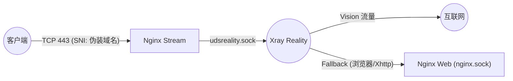
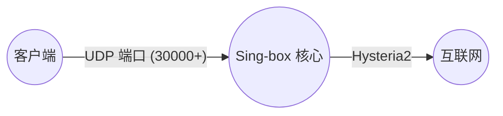
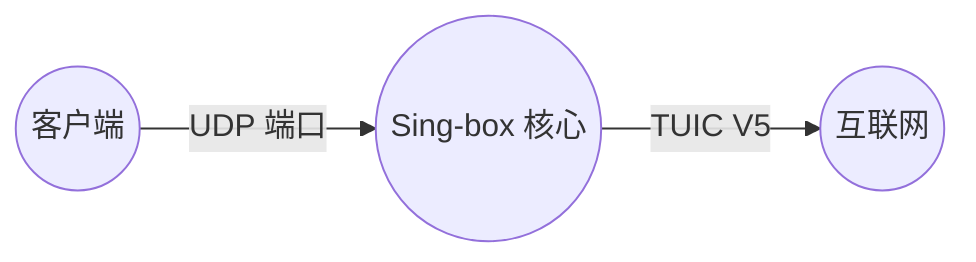
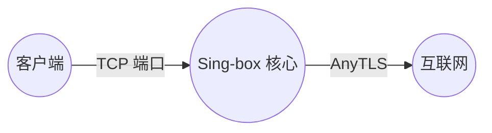
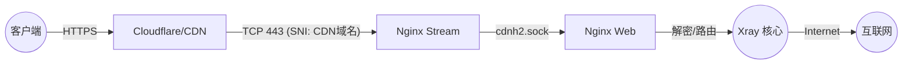

# 协议详细配置手册 (Protocol Details Manual)

本文档补充了架构图解，详细列出了项目中支持的每一个代理协议的客户端配置、服务端入站配置以及内部流量流转细节。

---

## 目录

1.  [VLESS-Vision-Reality (Xray)](#1-vless-vision-reality-xray) - **旗舰推荐**
2.  [Hysteria2 (Sing-box)](#2-hysteria2-sing-box) - **竞速首选**
3.  [TUIC V5 (Sing-box)](#3-tuic-v5-sing-box) - **备用竞速**
4.  [AnyTLS (Sing-box)](#4-anytls-sing-box) - **TCP 伪装**
5.  [VMess-WS-TLS (Xray)](#5-vmess-ws-tls-xray) - **CDN 兼容**
6.  [VLESS-XHTTP-Reality (Xray)](#6-vless-xhttp-reality-xray) - **实验性协议**

---

## 1. VLESS-Vision-Reality (Xray)

项目的主力协议，具有极高的防探测能力和性能（基于 XTLS-Vision 流控）。

*   **定位**: 极速、稳定、抗封锁。
*   **适用客户端**: v2rayN, V2Box, FoXray, Shadowrocket, Sing-box 等支持 Reality 的客户端。

### 流量图解 (Traffic Flow)


### 客户端出站 (Client Outbound)
*   **连接方式**: TCP / 443 端口
*   **URL 示例**:
    ```
    vless://${XRAY_UUID}@${DOMAIN}:${LISTENING_PORT}?encryption=none&flow=xtls-rprx-vision&security=reality&sni=${DEST_HOST}&fp=chrome&pbk=${XRAY_REALITY_PUBLIC_KEY}&sid=${XRAY_REALITY_SHORTID}&type=tcp&headerType=none#${NODE_NAME}✈Reality✈super${NODE_SUFFIX}
    ```
*   **核心参数**:
    *   `flow`: `xtls-rprx-vision` (必须)
    *   `security`: `reality`
    *   `sni`: **必须是伪装域名**（即 `${DEST_HOST}`），而非您的主域名。
    *   `address` (server): 您的服务器主域名或 IP。

### 服务端入站 (Server Inbound)
*   **配置文件**: `templates/xray/01_reality_inbounds.json`
*   **监听地址**: `unix:/dev/shm/udsreality.sock`
*   **内部流转**:
    1.  **入口**: 用户连接公网 443 端口。
    2.  **分流**: Nginx Stream 识别 SNI，将流量原样转发至 `udsreality.sock`。
    3.  **处理**: Xray Reality 进行 TLS 握手。
    4.  **路由**:
        *   **Vision 流量**: 直接由 Xray 代理出站。
        *   **Fallback**: 其他流量（如 Xhttp 或直接浏览器访问）解密后回落给 `nginx.sock` (Nginx Web)。

---

## 2. Hysteria2 (Sing-box)

基于 UDP 的拥塞控制协议，旨在恶劣网络环境下压榨带宽。

*   **定位**: 暴力竞速、降低延迟。
*   **适用客户端**: Sing-box, NekoBox, Shadowrocket, Hysteria2 官方客户端。

### 流量图解 (Traffic Flow)


### 客户端出站 (Client Outbound)
*   **连接方式**: UDP / 独立高位端口 (例如 30000+)
*   **URL 示例**:
    ```
    hysteria2://${SB_UUID}@${DOMAIN}:${PORT_HYSTERIA2}/?alpn=h3&insecure=1#${NODE_NAME}✈Hysteria2✈super${NODE_SUFFIX}
    ```
*   **核心参数**:
    *   `insecure`: `1` (或 `true`)，因为我们使用的是自签名/自动管理的证书，且 Hysteria2 此处对证书验证较严格，建议开启跳过验证或正确配置 CA。
    *   `alpn`: `h3`

### 服务端入站 (Server Inbound)
*   **配置文件**: `templates/sing-box/11_hysteria2_inbounds.json`
*   **监听地址**: `::` (All Interfaces)
*   **端口**: `${PORT_HYSTERIA2}`
*   **内部流转**:
    1.  **入口**: 用户直接连接服务器的 UDP 端口。
    2.  **处理**: Sing-box 内核直接响应，进行拥塞控制和数据传输。
    3.  **路径**: **直连** (不经过 Nginx，不经过 Xray)。

### Xray 客户端配置 (Native Hysteria2)

从 Xray-core v1.8.8+ (及 v24.9.30+) 开始，Xray 原生支持 Hysteria2 出站。这意味着您可以在电脑/软路由上直接使用 Xray 内核连接本项目的 Hysteria2 端口。

*   **Outbound 配置示例**:
    ```json
    {
        "tag": "proxy-hysteria2",
        "protocol": "hysteria2",
        "settings": {
            "address": "${DOMAIN}",
            "port": ${PORT_HYSTERIA2},
            "password": "${SB_UUID}" // Hysteria2 标准密码，无需 users 数组
        },
        "streamSettings": {
            "network": "udp",
            "security": "tls",
            "tlsSettings": {
                "serverName": "${DOMAIN}",
                "allowInsecure": true, // 自签名证书需开启
                "alpn": ["h3"]
            }
        }
    }
    ```

---

## 3. TUIC V5 (Sing-box)

另一种基于 QUIC 的高性能协议，与 Hysteria2 类似但机制略有不同。

*   **定位**: 备用的 UDP 竞速协议。
*   **适用客户端**: Sing-box, NekoBox, Shadowrocket。

### 流量图解 (Traffic Flow)


### 客户端出站 (Client Outbound)
*   **连接方式**: UDP / 独立高位端口
*   **URL 示例**:
    ```
    tuic://${SB_UUID}:${SB_UUID}@${DOMAIN}:${PORT_TUIC}?alpn=h3&insecure=1&congestion_control=bbr#${NODE_NAME}✈TUIC✈good${NODE_SUFFIX}
    ```
*   **核心参数**:
    *   `congestion_control`: `bbr`
    *   `uuid` & `password`: 通常设置为相同的值。

### 服务端入站 (Server Inbound)
*   **配置文件**: `templates/sing-box/12_tuic_inbounds.json`
*   **监听地址**: `::`
*   **端口**: `${PORT_TUIC}`
*   **内部流转**:
    1.  **入口**: 用户直接连接服务器的 UDP 端口。
    2.  **处理**: Sing-box 内核直接响应。
    3.  **路径**: **直连**。

---

## 4. AnyTLS (Sing-box)

即 "ShadowTLS" 的变种或升级，用于伪装成任意 HTTPS 流量。

*   **定位**: 将代理流量伪装成正常的 TLS 握手，抗干扰。
*   **适用客户端**: Sing-box。

### 流量图解 (Traffic Flow)


### 客户端出站 (Client Outbound)
*   **连接方式**: TCP / 独立高位端口
*   **URL 示例**:
    ```
    anytls://${SB_UUID}@${DOMAIN}:${PORT_ANYTLS}?security=tls&allowInsecure=1&type=tcp#${NODE_NAME}✈AnyTLS✈good${NODE_SUFFIX}
    ```

### 服务端入站 (Server Inbound)
*   **配置文件**: `templates/sing-box/13_anytls_inbounds.json`
*   **监听地址**: `::`
*   **端口**: `${PORT_ANYTLS}`
*   **内部流转**:
    1.  **入口**: 用户直接连接服务器的 TCP 端口。
    2.  **处理**: Sing-box 接收并模拟 TLS 握手行为。
    3.  **路径**: **直连**。

---

## 5. VMess-WS-TLS (Xray)

最经典的配置组合，支持 CDN (Cloudflare) 中转。

*   **定位**: 兼容性之王，救火队员（当 IP 被墙时可通过 CDN 访问）。
*   **适用客户端**: 几乎所有支持 V2Ray 的客户端。

### 流量图解 (Traffic Flow)


### 客户端出站 (Client Outbound)
*   **连接方式**: TCP / 443 端口 (或 CDN 边缘节点)
*   **URL 示例** (VMess 链接是以下 JSON 的 Base64 编码):
    ```json
    {
      "v": "2",
      "ps": "${NODE_NAME}✈Vmess✈${NODE_SUFFIX}",
      "add": "${CDNDOMAIN}",  // 必须使用 CDN 域名
      "port": "${LISTENING_PORT}",
      "id": "${XRAY_UUID}",
      "aid": "0",
      "scy": "auto",

      // 关键参数
      "net": "ws",
      "host": "${CDNDOMAIN}", // WS Host, 用于 Nginx 识别 Path
      "path": "/${XRAY_URL_PATH}-vmess",
      "tls": "tls",
      "sni": "${CDNDOMAIN}"   // TLS SNI, 用于 Nginx Stream 分流
    }
    ```

> **[进阶] 为什么有时候不填 `sni` 也能连上？**
> *   **走 CDN 时**: 客户端只连接 Cloudflare 边缘节点。当 Cloudflare 回源连接你的服务器时，**Cloudflare 会自动填充正确的 SNI**（即你的 CDN 域名）。因此 Nginx 收到的请求总是带有正确 SNI 的。
> *   **直连时**: 现代客户端（如 V2RayN）如果发现 `sni` 为空，往往会自动将 `add` (地址) 栏的内容作为 SNI 发送。
> *   **建议**: 为了配置的健壮性（避免直连 IP 失败或客户端行为不一致），请始终显式配置 `sni`。      "net": "ws",
      "type": "none",
      "host": "${CDNDOMAIN}", // 必须使用 CDN 域名
      "path": "/${XRAY_URL_PATH}-vmessws",
      "tls": "tls",
      "sni": "${CDNDOMAIN}",  // 必须使用 CDN 域名
      "alpn": "h2",
      "fp": "chrome"
    }
    ```
    *   **通用链接**: `vmess://eyZnLi4ufQ==` (base64 字符串)
*   **核心参数**:
    *   `net`: `ws` (WebSocket)
    *   `host`: `${CDNDOMAIN}` (必须)
    *   `path`: `/${XRAY_URL_PATH}-vmessws` (必须与服务端一致)
    *   `tls`: `tls`
    *   `sni`: `${CDNDOMAIN}` (必须)

### 服务端入站 (Server Inbound)
*   **配置文件**: `templates/xray/03_vmess_ws_inbounds.json`
*   **监听地址**: `unix:/dev/shm/udsvmessws.sock`
*   **内部流转**:
    1.  **入口**: 用户连接 443 端口 (SNI 为 `${CDNDOMAIN}`)。
    2.  **分流**: Nginx Stream 识别 SNI，转发给 `cdnh2.sock` (Nginx Web)。
    3.  **解密**: Nginx Web (HTTP 模块) 解密 TLS，解析 HTTP Path。
    4.  **路由**: 匹配 `location /...-vmessws`，通过 `proxy_pass` 转发给 `udsvmessws.sock`。
    5.  **处理**: Xray 接收 WebSocket 流。

---

## 6. VLESS-XHTTP 系列 (Xray)

项目集成了 Xray 最新的 XHTTP 协议，利用其分离信道的特性，提供了 **4 种** 不同的配置模式，以适应极端的网络环境。

> **注意**: XHTTP 是实验性协议，本项目启用了 **MLKEM** 抗量子加密。请确保客户端内核版本最新。

### 6.1 XHTTP + Reality 直连 (Direct)
*   **模式**: 双向直连
*   **特点**: 速度最快，延迟最低。通过 Reality 通道传输 XHTTP 数据，隐蔽性极强。
*   **URL 标识**: `Xhttp+Reality直连`
*   **配置示例**:
    ```text
    vless://${XRAY_UUID}@${DOMAIN}:${LISTENING_PORT}?encryption=mlkem768x25519plus.native.600s.${XRAY_MLKEM768_SEED}&security=reality&sni=${DEST_HOST}&fp=chrome&pbk=${XRAY_REALITY_PUBLIC_KEY}&sid=${XRAY_REALITY_SHORTID}&type=xhttp&path=/${XRAY_URL_PATH}-xhttp&mode=auto#${NODE_NAME}✈Xhttp+Reality直连✈super${NODE_SUFFIX}
    ```
*   **流量图解**:
    ```mermaid
    graph LR
        User((客户端)) -- TCP 443 (SNI: 伪装域名) --> NginxStream[Nginx Stream]
        NginxStream -- udsreality.sock --> Reality((Xray Reality))
        Reality -- "Fallback (gRPC)" --> NginxWeb["Nginx Web (nginx.sock)"]
        NginxWeb -- "grpc_pass (H2)" --> Xhttp((Xray Xhttp))
    ```
*   **流向**:
    *   **上行**: 用户 -> Reality (解密) -> Fallback -> Nginx (Plain) -> gRPC -> Xray XHTTP
    *   **下行**: Xray XHTTP -> gRPC -> Nginx -> Reality (加密) -> 用户

### 6.2 XHTTP 上行 CDN + 下行 Reality
*   **模式**: **上行**走 CDN 隐藏请求 IP，**下行**走 Reality 直连。
*   **特点**: “借刀杀人”模式。上行流量小且隐蔽（HTTPS），下行流量大且速度快（Reality），且防火墙难以通过上行特征阻断 VPS。
*   **URL 标识**: `上行Xhttp+TLS+CDN|下行Xhttp+Reality`
*   **配置示例**:
    ```text
    vless://${XRAY_UUID}@${CDNDOMAIN}:${LISTENING_PORT}?encryption=mlkem768x25519plus.native.600s.${XRAY_MLKEM768_SEED}&security=tls&sni=${CDNDOMAIN}&alpn=h2&fp=chrome&type=xhttp&host=${CDNDOMAIN}&path=/${XRAY_URL_PATH}-xhttp&mode=auto&extra={"downloadSettings":{"address":"${DOMAIN}","port":${LISTENING_PORT},"network":"xhttp","security":"reality","realitySettings":{"show":false,"serverName":"${DEST_HOST}","fingerprint":"chrome","publicKey":"${XRAY_REALITY_PUBLIC_KEY}","shortId":"${XRAY_REALITY_SHORTID}","spiderX":"/"},"xhttpSettings":{"host":"","path":"/${XRAY_URL_PATH}-xhttp","mode":"auto"}}}#${NODE_NAME}✈上行Xhttp+TLS+CDN✈下行Xhttp+Reality✈super${NODE_SUFFIX}
    ```
*   **流量图解**:
    ```mermaid
    graph TB
        User((客户端))
        CDN[Cloudflare/CDN]
        NginxStream[Nginx Stream]
        NginxWeb[Nginx Web]
        Xray((Xray 核心))

        User -- 1. 上行 (HTTPS) --> CDN
        CDN -- SNI: CDN域名 --> NginxStream
        NginxStream -- cdnh2.sock --> NginxWeb
        NginxWeb -- "grpc_pass" --> Xray

        Xray -- 2. 下行 (Reality) --> RealityIn((Xray Reality))
        RealityIn -- Direct --> User
    ```

### 6.3 XHTTP 上行 Reality + 下行 CDN
*   **模式**: **上行**直连，**下行**走 CDN。
*   **特点**: 保护服务器出站 IP 不被长时间占用。
*   **URL 标识**: `上行Xhttp+Reality|下行 Xhttp+TLS+CDN`
*   **配置示例**:
    ```text
    vless://${XRAY_UUID}@${DOMAIN}:${LISTENING_PORT}?encryption=mlkem768x25519plus.native.600s.${XRAY_MLKEM768_SEED}&security=reality&sni=${DEST_HOST}&fp=chrome&pbk=${XRAY_REALITY_PUBLIC_KEY}&sid=${XRAY_REALITY_SHORTID}&type=xhttp&path=/${XRAY_URL_PATH}-xhttp&mode=auto&extra={"downloadSettings":{"address":"${DOMAIN}","port":${LISTENING_PORT},"network":"xhttp","security":"tls","tlsSettings":{"serverName":"${CDNDOMAIN}","allowInsecure":false,"alpn":["h2"],"fingerprint":"chrome"},"xhttpSettings":{"host":"${CDNDOMAIN}","path":"/${XRAY_URL_PATH}-xhttp","mode":"auto"}}}#${NODE_NAME}✈上行Xhttp+Reality✈下行Xhttp+TLS+CDN✈super${NODE_SUFFIX}
    ```
*   **流量图解**:
    ```mermaid
    graph TB
        User((客户端)) -- 1. 上行 (Reality) --> RealityIn((Xray Reality))
        RealityIn -- Fallback --> NginxWeb
        NginxWeb -- grpc_pass --> Xray((Xray 核心))

        Xray -- 2. 下行 (XHTTP) --> NginxWeb2[Nginx Web]
        NginxWeb2 -- HTTPS --> CDN
        CDN --> User
    ```

### 6.4 XHTTP 全程 CDN (Full CDN)
*   **模式**: 双向都走 CDN。
*   **特点**: 只有当 IP 彻底被墙时的保底方案。
*   **URL 标识**: `Xhttp+TLS+CDN上下行不分离`
*   **配置示例**:
    ```text
    vless://${XRAY_UUID}@${CDNDOMAIN}:${LISTENING_PORT}?encryption=mlkem768x25519plus.native.600s.${XRAY_MLKEM768_SEED}&security=tls&sni=${CDNDOMAIN}&alpn=h2&fp=chrome&type=xhttp&host=${CDNDOMAIN}&path=/${XRAY_URL_PATH}-xhttp&mode=auto#${NODE_NAME}✈Xhttp+TLS+CDN上下行不分离✈super${NODE_SUFFIX}
    ```
*   **流量图解**:
    ```mermaid
    graph TB
        User((客户端)) -- HTTPS --> CDN
        CDN --> NginxStream
        NginxStream -- cdnh2.sock --> NginxWeb
        NginxWeb -- grpc_pass --> Xray((Xray 核心))
        Xray -- 返回 --> NginxWeb
        NginxWeb --> CDN --> User
    ```

### 6.5 服务端入站机制 (Server Inbound Mechanism)

XHTTP 的服务端配置设计非常精妙，它同时利用了 **Nginx 的双监听架构** 和 **Xray 的 Fallback 机制**。

1.  **Reality 直连通道 (Reality -> Fallback -> Nginx -> Xray)**:
    *   用户连接 443 (Pseudo SNI)。
    *   流量进入 Reality，TLS 解密后发现是 XHTTP 流量，Fallback 到 `nginx.sock`。
    *   Nginx 识别路径 `/${XRAY_URL_PATH}-xhttp`，通过 `grpc_pass` 转发给 `udsxhttp.sock`。
    *   *注: 此过程允许客户端使用 H2C (Cleartext HTTP/2) 与 Nginx 通信。*

2.  **CDN/标准 HTTPS 通道 (Nginx SSL -> Xray)**:
    *   用户连接 443 (CDN SNI)。
    *   流量进入 `cdnh2.sock`，Nginx 解密 SSL。
    *   Nginx 识别路径，通过 `grpc_pass` 转发给 `udsxhttp.sock`。

通过这种设计，同一个 Xray 入站接口 (`udsxhttp.sock`) 可以同时服务于 **直连用户**（经 Reality 解密）和 **CDN 用户**（经 Nginx 解密）。

### 6.6 深度伪装机制 (Deep Masquerading)

本项目默认启用了深度伪装机制，将流量伪装成访问 `speed.cloudflare.com`（或您配置的 `DEST_HOST`）。

#### 1. 服务端配置机制
在 `templates/xray/01_reality_inbounds.json` 中，我们配置了：

```json
"realitySettings": {
    "show": false,
    "target": "${DEST_HOST}:443",  // 默认透传至 speed.cloudflare.com
    "xver": 0,
    "serverNames": [
        "${DEST_HOST}"             // 仅响应伪装域名的 SNI，拒绝主域名 SNI
    ],
    ...
}
```

*   **隐匿性提升**: 因为只允许 `serverNames` 中的伪装域名，所以客户端**必须**使用 `speed.cloudflare.com` (即 `${DEST_HOST}`) 作为 SNI 才能连接成功。
*   **防探测**: 此时，验证失败的流量（如直接访问 IP 或使用主域名 SNI）会被透传给真实的目标网站。浏览器访问会看到真实的 Cloudflare 测速页面，完美伪装。

#### 2. 客户端配置注意
所有生成的 Reality 类型链接（Vision-Reality, XHTTP-Reality）均已自动配置了正确的 SNI。

*   **SNI / ServerName**: 必须为 `${DEST_HOST}` (默认 `speed.cloudflare.com`)。
*   **Address / Server**: 填入您的 VPS IP 或主域名。

---


## 7. 客户端配置清单汇总

至此，本项目共支持 **9 种** 不同的客户端链接组合：

| 序号 | 协议/模式 | 关键技术 | 适用场景 |
| :--- | :--- | :--- | :--- |
| 1 | **Hysteria2 (优)** | UDP, 拥塞控制 | 移动/弱网环境，暴力竞速 |
| 2 | **TUIC V5 (中)** | UDP, QUIC | Hysteria2 的备选 |
| 3 | **AnyTLS (中)** | TCP, 指纹伪装 | 企业级防火墙，TCP 伪装 |
| 4 | **VMess-WS-TLS (备)** | WebSocket, CDN | 传统兼容，救火备用 |
| 5 | **VLESS-Vision-Reality (优)** | XTLS, Vision | **日常主力**，极速稳定 |
| 6 | **XHTTP-Reality (优)** | XHTTP, Reality | 探索性主力协议 |
| 7 | **XHTTP (上CDN下直连) (优)** | XHTTP, 混合路由 | 隐藏上行 IP，防止探测 |
| 8 | **XHTTP (上直连下CDN) (优)** | XHTTP, 混合路由 | 优化下行线路 |
| 9 | **XHTTP (全CDN) (优)** | XHTTP, TLS | 最终保底 |

---

## 8. 关于服务端落地代理 (ISP Proxy / WARP) 的说明

很多用户询问：*如果我在服务端配置了 `ISP_IP` (家宽代理) 或 `WARP`，需要在客户端做什么设置吗？*

**回答：不需要。**

*   **完全透明**: 出站代理是**服务端**的路由策略。客户端只负责连接到您的 VPS。VPS 收到流量后，根据服务器内部的配置（如 `entrypoint.sh` 生成的规则），决定是将流量直接发往互联网，还是转发给 ISP 代理 / WARP。

---

## 9. Xray 客户端进阶：TUN 模式配置 (Transparent Proxy)

Xray 最新版本对 `TUN` 入站进行了大幅优化（混合网络栈），使得在 Linux/macOS 上实现“透明代理”变得非常简单且高性能。这允许 Xray 接管操作系统的所有网络流量（类似 VPN）。

### 9.1 **Inbound 参考配置**
以下配置需添加至客户端的 `config.json` -> `inbounds` 数组中：

```json
{
    "tag": "tun-in",
    "protocol": "tun",
    "settings": {
        "mtu": 9000,                // 巨型帧，提升吞吐量
        "interface": {
            "name": "tun0",         // 网卡名称
            "autoSetIpAddress": true,
            "autoSetIpv6Address": true
        }
    },
    "sniffing": {
        "enabled": true,
        "destOverride": ["http", "tls", "quic"], // 必须开启嗅探，否则无法进行域名分流
        "metadataOnly": false
    }
}
```

### 9.2 **Routing 路由策略**
使用 TUN 模式时，必须配置精确的路由规则以免“回环”或代理了内网流量。

```json
"routing": {
    "domainStrategy": "AsIs", // 推荐 AsIs，依靠 Sniffing 还原域名
    "rules": [
        // 1. 拦截 DNS 流量
        {
            "inboundTag": ["tun-in"],
            "port": 53,
            "outboundTag": "dns-out" // 必须有一个 DNS outbound
        },
        // 2. 直连局域网和私有地址
        {
            "type": "field",
            "ip": ["geoip:private", "geoip:cn"],
            "outboundTag": "direct"
        },
        // 3. 代理其他流量
        {
            "type": "field",
            "network": "tcp,udp",
            "outboundTag": "proxy"
        }
    ]
}
```

### 9.3 **启用方式**
由于 TUN 模式需要创建虚拟网卡，运行 Xray 客户端时通常需要 **Root / Administrator 权限**。
### 9.4 **服务端配置 (Server Side)**
*   **不需要任何修改**。
*   **原理**: TUN 只是客户端用来“抓取”电脑流量的一种方式。流量被 TUN 抓取后，会被 Xray 客户端封装成标准的 VLESS/Hysteria 数据包发送给服务器。服务器看到的只是普通的代理请求，无法感知（也不需要知道）客户端是否使用了 TUN。
