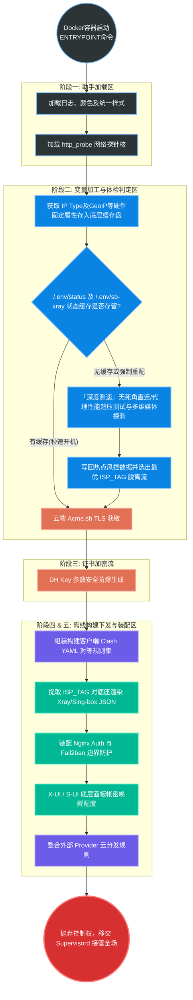
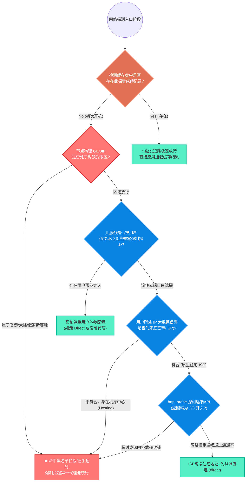

# Entrypoint.sh 核心生命周期与架构解析

> **本文档为 `entrypoint.sh` 守护脚本的技术白皮书，用于彻底阐明系统启动时的五大生命阶段、网络策略分流与变量组装规则。**
> 💡 *【维护原则】后续任何针对 `scripts/entrypoint.sh` 的逻辑增减、状态节点增减，请务必同步更新本文档的流程图及阶段描述！*

---

## 一、 系统架构微内核思想 (Micro-Kernel Architecture)

重构后的 `entrypoint.sh` 完全摒弃了杂乱无章的时序交错编排，采用严格的**“五大生命周期扇区” (Five-Sector Lifecycle)** 结构。这种结构保证了后置步骤绝对能够安全引用前置步骤计算好的结果，不存在竞态崩溃。

整体容器被唤醒后的执行流转图如下：

---

## 二、 阶段核心功能透视解析

### 扇区一：纯净的能力组件层 (Helper layer)

- **定位**：位于文件开头 `1~200` 行，纯粹被动调用的函数合集。
- **代表组件**：
  - `ensure_var`：改良自原版的不稳定 sed，采用先计算后 `unset -> append` 形式完成变量内存读出与物理文件的安全锁定。
  - `http_probe`：**所有流媒体和 AI 探测网关的通用核基建！** 封装了带伪装(UA)、短超时(3s) 和强制断后重试的 `curl` 探测器。代码量巨幅压缩。

### 扇区二：双轨持久化挂载与性能测速造物层 (Variables & Caching Engine)

- **定位**：本模块决定了整个机器的出海方向（主干选路网）以及极致的容器重启效能。
- **执行规则闭环：冷热数据分离挂载架构与智能短路拦截**
  系统启动时将依据重要度分离预存以下两大环境池：
  1. **冷盘持久化 (`/.env/sb-xray`)**：负责管理伴随 VPS 一生的固有硬件信息，比如 `IP_TYPE`（ASN 类型）、`GEOIP_INFO`（物理归属地）、各种私钥凭据（UUID/SECRET 等）。该文件生命周期最长，**只在全新部署时请求探测一次**，往后续秒速取回。
  2. **热盘动态挂载 (`/.env/status`)**：负责管理实时浮动的风控环境，如各类 `ISP_TAG` 优选成绩（网络堵塞情况）、`CHATGPT_OUT` 等流媒体能否直连的探针成果。这部分文件**支持用户主动外置化文件挂载**。
  3. **极致重启短路 (`run_speed_tests_if_needed`)**：一旦代码侦测到挂载的 `status` 文件内已经存留诸如某媒体服务探针或测速最佳节点的优异成绩记录，系统将直接抛出 `continue` 和 `return`！当场省下数十秒原本极其耗时的并发打流跑分和海外 API 回调请求，瞬间通过审查极速部署上线！

### 扇区三：证书加密安全流 (Certificate Flow)

- **定位**：与 Acme CA 层接轨，负责域名申请签注和私钥分发。
- **重要提醒**：在签发前引入了一层 `openssl x509 -checkend 604800`，只针对低于 7 天寿终正寝的证书发起强制轮换流，降低了主 CA 封禁 IP 接口频率的制裁可能。

### 扇区四：纯净结构化组合渲染区 (Config Builders Setup)

- **定位**：系统配置物理下发与外界映射分发的终点站 (基于函数 `build_client_and_server_configs`)。
- **重构高光**：
  - **绝不测速发请求**：该函数只读内存资源集！
  - **客户端配置**：遍历 IP 环境变量拼凑出客户端需要的 YAML 切片 (`clash_proxies`)，供下游订阅。
  - **服务端组配**：针对饱受诟病、极其容易出错的反斜杠拼接 `{\"tag\": \"${tag}\"`，全部应用优雅的 Bash 原生 **`cat <<EOF`** 注入器重写（见 `process_single_isp`）。这里利用在扇区二获取好的冠军 `ISP_TAG` 即抽即走式拉通 Xray 与 S-Box 配置，彻底杜绝后续添加参数发生的语法瘫痪。同时，拉起了 Fail2ban 看门狗与 Nginx htpasswd 鉴权防线。
  - **外显智能标识剥离 (`show-config.sh`协传)**：配置文件构建时绝不将速率特征污染内部拨号名(`dialer`)以保护下游分流解析；而是通过单独收集的 `IS_8K_SMOOTH` 配合 `IP_TYPE` 判定，在外显订阅上动态渲染出用于 Smart 策略匹配的后缀（住宅流畅标 `✈super` 或 代理流畅标 `✈good`）。

---

## 三、 特殊：AI/媒体解锁探测防错决策流

脚本内置了针对 Gemini/ChatGPT/Netflix 等服务的探测逻辑阵列，决策链遵循下列流程树原则：

