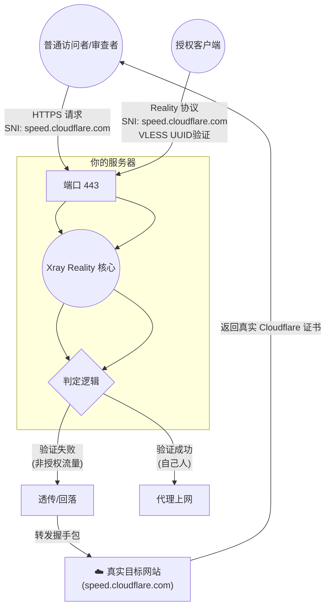

# 深度伪装机制详解 (Deep Masquerading Guide)

本文档详细解析了本项目如何利用 Xray Reality 和 环境变量 `DEST_HOST` 实现对目标网站（以 `speed.cloudflare.com` 为例）的完美伪装。

---

## 1. 核心原理

传统的伪装（如 Nginx 反向代理）存在一个致命弱点：**证书不匹配**。你只能提供自己的域名证书，而不能提供伪装目标（如 Google）的证书。

**Reality 的核心优势**在于“真·透传”：
1.  它不需要你在服务器上安装目标网站的证书。
2.  当它判定流量是“探针”或普通浏览器访问时，它会将 TLS 握手包**原封不动**地转发给目标网站。
3.  用户收到的，是**真实目标网站**签发的有效证书。

---

## 2. 架构与流量流向

我们采用了 **"动态回落 (Dynamic Fallback)"** 架构，通过 `DEST_HOST` 环境变量控制伪装目标。

### 流量流向图解



---

## 3. 配置细节

### 3.1 环境变量配置 (`docker-compose.yml`)
这是控制中枢。我们建议将其设置为流量特征在白名单内的域名。

```yaml
environment:
  - DEST_HOST=speed.cloudflare.com  # 目标域名（不带 www）
```

### 3.2 服务端配置 (`templates/xray/01_reality_inbounds.json`)
我们修改了 Xray 模板，使其动态引用上述环境变量。

*   **target**: `${DEST_HOST}:443` -> 流量直达目标，不再经过 Nginx。
*   **xver**: `0` -> 必须关闭 PROXY protocol，因为目标网站（如 Cloudflare）不认识它。
*   **serverNames**: `["${DEST_HOST}"]` -> **关键！** 我们建议只保留这一个。
    *   **效果**: 你的服务器将**只响应**针对 `speed.cloudflare.com` 的握手请求。
    *   **隐匿**: 如果有人扫描你的 IP 并尝试用你的真实域名握手，Xray 会因为 SNI 不匹配而直接断开连接或拒绝，从而隐藏了服务器的存在。

### 3.3 客户端配置建议
在生成的 VLESS-Reality 链接中，务必将 `sni` (或 json 配置中的 `serverName`) 设置为与 `DEST_HOST` 一致。

*   **SNI**: `speed.cloudflare.com`
*   **验证**: 如果配置正确，你在浏览器中直接访问 `https://你的IP`，应该能看到 Cloudflare 的测速跑分页面，且浏览器地址栏的小锁（HTTPS）显示证书颁发给 Cloudflare。

---

## 4. 为什么不再回落给 Nginx？

在旧版本配置中，回落路径是 `Xray -> Nginx -> 伪装站`。
*   **优点**: 可以展示一个你自己定制的静态伪装页。
*   **缺点**: 只能用你自己的域名证书。如果审查者发现你是一个不知名的小域名，但流量特征却像 youtube，这就很可疑。

**新版本配置** (`Xray -> DEST_HOST`):
*   **优点**: 借用大厂的信誉。你的流量看起来就是去往 `speed.cloudflare.com` 的，证书也是真的，毫无破绽。
*   **Nginx 的角色**: 现在 Nginx 专心处理 CDN 流量 (WebSocket/Grpc) 和后台管理面板，不再参与 Reality 的伪装工作。

---

## 5. 重要变化：如何访问管理面板？

启用深度伪装（Xray 直接回落给外部网站）后，您的**主域名将无法再用于访问服务器上的 Web 服务**（如 X-UI, S-UI 等）。

*   **现象**: 浏览器访问 `https://主域名/3xadmin` -> **失败**（SSL 错误或被重置）。
*   **原因**: Xray 将包含主域名的流量也视为“伪装流量”，透传给了 `speed.cloudflare.com`。Cloudflare 不认识你的域名，拒绝握手。

### ✅ 正确的访问方式
您必须使用 **CDN 域名**（即 `CDNDOMAIN` 环境变量配置的域名）来访问所有后台服务。

因为在我们的架构设计中，CDN 域名流量走的是另一条独立通道：
`Nginx Stream -> cdnh2.sock -> Nginx Web -> 后台服务`

| 目标服务 | ❌ 旧方式 (主域名) | ✅ 新方式 (CDN域名) |
| :--- | :--- | :--- |
| **X-UI 面板** | `https://主域名/3xadmin` | `https://CDN域名/3xadmin` |
| **S-UI 面板** | `https://主域名/s-ui` | `https://CDN域名/s-ui` |
| **文件服务** | `https://主域名/myfiles` | `https://CDN域名/myfiles` |

> **一句话总结**: 主域名献祭给代理（隐匿），CDN 域名留给自己管理（后门）。

---

## 6. 总结

通过将 `DEST_HOST` 配置为 `speed.cloudflare.com` 并配合 Xray 的透传机制，我们将一台普通的 VPS 伪装成了一个 Cloudflare 的测速节点。这是一层极其厚重的保护色。

---

## 7. 故障排查与实现细节 (Troubleshooting)

如果您发现 Reality 节点无法连接，或者生成的订阅链接配置依然使用旧的域名，请检查以下关键点。


### 7.1 代理配置的一致性逻辑
在深度伪装模式下，不同类型的节点必须使用不同的 Server/SNI 配置逻辑，否则会连通性失败。这在 `templates/proxies/*` 中已修复。

| 节点类型 | Server (地址) | ServerName (SNI) | Host Header | 原因 |
| :--- | :--- | :--- | :--- | :--- |
| **VLESS Reality** | `${DOMAIN}` (或 IP) | **`${DEST_HOST}`** | N/A | Reality 必须使用伪装域名作为 SNI 才能通过 443 端口验证 |
| **XHTTP Reality** | `${DOMAIN}` (或 IP) | **`${DEST_HOST}`** | N/A | 同上，Xray 核心只认伪装 SNI |
| **VMess (CDN)** | **`${CDNDOMAIN}`** | **`${CDNDOMAIN}`** | **`${CDNDOMAIN}`** | VMess 走 Nginx 路径，主域名 443 已被占用，必须用 CDN 域名 |
| **Hysteria2/TUIC** | `${DOMAIN}` (或 IP) | `${DOMAIN}` | N/A | 走 UDP 独立端口，不经过 Reality，使用自签名证书，SNI 不受限制 |

> **注意**: 如果您的 VMess 节点不可用，请重点检查是否误用了 `${DOMAIN}` 作为 SNI。在深度伪装模式下，`${DOMAIN}` 的 443 端口是“死”的（只对 Reality 活），Nginx 只能通过 CDN 域名触达。

### 7.2 流量入口陷阱：Nginx Stream Routing
即使客户端和服务端核心 (Xray) 都配置正确，位于最前端的流量守门员——Nginx Stream 模块也可能丢弃流量。
*   **现象**: 所有配置正确的 Reality 节点依然不通 (超时)，但直接 IP 访问可能通。
*   **原因**: Nginx 的 `stream_ssl_preread` 模块通过 SNI 进行分流。如果您的 `tcp.conf` 中只包含了主域名和 CDN 域名，而客户端发来的是 `speed.cloudflare.com`，Nginx 会因为找不到匹配的 upstream 而断开连接。
*   **修复**: 必须在 `templates/nginx/tcp.conf` 的映射表中显式添加伪装域名的转发规则：
    ```nginx
    map $ssl_preread_server_name $tcpsni_name  {
        ${DOMAIN}                           vlessr;
        ${DEST_HOST}                        vlessr;  <-- 必须添加这一行！
        ${CDNDOMAIN}                        cdnh2;
    }
    ```
    这样，带着 Cloudflare 域名的流量才能被 Nginx 正确放行并交给 Xray Reality 处理。

---

## 8. 常见问题解答 (FAQ)

### 8.1 是否需要配置 CDN 优选 IP？

*   **服务端 (本项目)**: **不需要**。
    *   服务端只需要正确响应来自 Cloudflare 任意边缘节点的请求即可。在服务端配置优选 IP 脚本不仅无用，反而可能因 DNS 变动导致连接不稳定。
*   **客户端 (V2RayN / Sing-box)**: **推荐**。
    *   对于 **VMess** 或 **XHTTP (上行 CDN)** 模式，在客户端将地址 (`address`) 修改为您本地网络测试出的 Cloudflare 优选 IP（或优选域名），可以显著提升连接速度和稳定性。

### 8.2 DEST_HOST 的选择会影响速度吗？

*   **速度 (带宽)**: **完全不影响**。
    *   Reality 建立连接后，流量是直连的 (Direct)，不经过 `DEST_HOST`。
*   **延迟 (握手)**: **几乎无影响**。
    *   Xray 只需要转发第一个 Hello 包，大厂域名（如 Cloudflare, Microsoft）全球响应都极快，延迟损耗可忽略不计。
*   **稳定性**: **有影响**。
    *   选择大厂域名（如 `speed.cloudflare.com`, `www.microsoft.com`）可以利用其流量特征白名单，降低被 GFW 阻断的概率。
    *   **建议**: 默认使用 `speed.cloudflare.com` 即可，它是目前最稳健的选择。

    **推荐的 DEST_HOST 列表**:
    *   **Cloudflare 系** (推荐，支持 H2/H3): `speed.cloudflare.com`, `www.cloudflare.com`, `dash.cloudflare.com`
    *   **Microsoft 系**: `www.microsoft.com`, `azure.microsoft.com`
    *   **Apple 系**: `www.apple.com`, `itunes.apple.com`
    *   **Google 系** (需 VPS 能流畅访问 Google): `dl.google.com`, `www.google.com`
    *   **Amazon 系**: `s3.amazonaws.com`, `aws.amazon.com`

### 8.3 Nginx 伪装 (CDN 域名) 可以与 Reality 伪装 (DEST_HOST) 不同吗？

*   **技术层面**: **完全可以**。
    *   `DEST_HOST` 是给 Reality 协议用的（为了隐匿流量）。
    *   `nginx/http.conf` 里的 `proxy_pass` 是给访问 CDN 网站的人用的（为了显示一个正常的网页）。
    *   这两者在物理上是隔离的。你可以让 Reality 伪装成 `microsoft.com`，而让 Nginx 反代一个不知名的博客。
*   **浏览异常 (Feature, not bug)**:
    *   **主域名打不开**: 这是**正常且积极**的。因为 Reality 限制了 SNI 必须为伪装域名，所以直接访问你的主域名会被断开。这有效防止了主动探测。
    *   **CDN 域名渲染异常**: 也是正常的。这通常是因为反代目标（如 Cloudflare 测速页）是一个复杂的动态应用，资源路径不匹配导致。只要 HTTP 200 OK，就能骗过自动化审查。如果您介意，可以将 Nginx 反代目标改为一个简单的静态站点。

### 8.4 VLESS-Vision-Reality vs VMess-WS-TLS: 如何选择？

| 特性 | VLESS + Vision + Reality | VMess + WS + TLS |
| :--- | :--- | :--- |
| **定位** | **主力战车 (推荐)** | **救护车 (备用)** |
| **原理** | 模拟 HTTPS，无状态，直连 | 传统加密隧道，WebSocket，可走 CDN |
| **性能** | ⭐⭐⭐⭐⭐ (极致，无重复加密) | ⭐⭐⭐⭐ (额外加密，损耗微小) |
| **抗封锁** | ⭐⭐⭐⭐⭐ (目前最强，无 SNI 特征) | ⭐⭐⭐⭐ (依赖 TLS 伪装) |
| **CDN支持** | ❌ (只能直连) | ✅ (完美支持 Cloudflare) |
| **适用场景** | 日常使用，追求速度和低延迟 | **当 IP 被墙时**，或者用于某些极其特殊的网络环境 |

**结论**: 请默认使用 **Reality**。只有当你的 Reality 连不上了（或者需要配合 CDN 拯救被墙 IP）的时候，再切换到 **VMess**。
