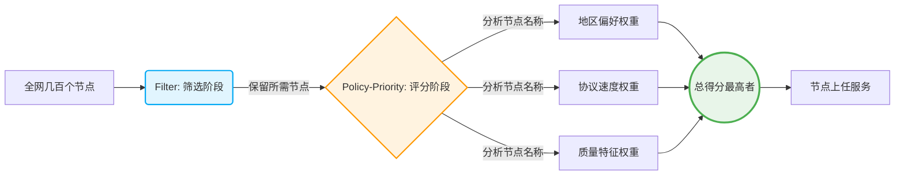
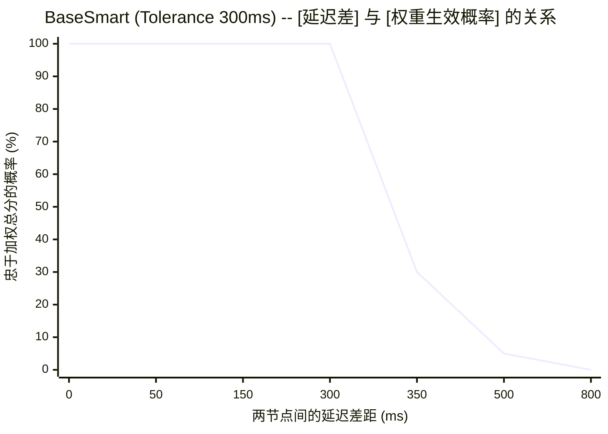

# OpenClash Policy-Priority 智能调度优化指南

本文档深入解析了本方案在 OpenClash（Mihomo 内核）的 Smart 模式下，如何通过精密的 `filter`（筛选）和 `policy-priority`（排序）配合 `tolerance`（容忍度）机制，实现真正的**多场景智能路由**。

---

## 1. 核心设计理念：职责分离

要驾驭成百上千的节点并让它们在不同的需求场景中（如：看流媒体、跑 AI、日常高速冲浪）发挥出最佳实力，必须坚持**职责分离**的配置原则。

> [!IMPORTANT]
> **职责分离原则：筛选与排序各司其职**
> 
> - **Filter (初筛)**：只负责划定候选节点的范围。例如，只进选支持流媒体的，过滤掉香港的。
> - **Policy-Priority (定级)**：只负责给范围内的候选者进行「多维打分」。例如，同等条件下，优质节点加分，Reality协议加分。

通过将这两个步骤隔离，就可以只用简单几组配置模板，派生出强大的智能调度体系。




---

## 2. 节点命名架构与特征提取

节点能够智能化打分的前提是其名字中本身附带了标签属性。
本方案强制要求使用特定语法提取可用信息：

**标准格式**：
```text
[${NODE_NAME}] ${REGION_INFO}|${PROTOCOL}|${SUFFIX}
```

### 2.1 维度解析表

| 维度类别 | 提取示例 | 在系统中的用途解析 |
| :--- | :--- | :--- |
| **地区标识** | `🇭🇰HK`, `🇺🇸US`, `🇯🇵JP` | **定点分流**。例如 AI 节点强行加权美国区。 |
| **特性标签** | `super`, `good`, `高速` | **业务定速**。识别具有极佳体验的专线或高端节点。 |
| **协议类型** | `Reality`, `Hysteria2`, `VMess` | **降延迟与抗封锁**。新一代 UDP 协议天然高分。 |
| **质量后缀** | `优`, `中`, `备` | **机场兜底**。区分节点池里的头等舱和经济舱。 |

---

## 3. 多维度打分与权重叠加法则

所有的评分是**累加**的！OpenClash 将累积节点名上所有匹配到的关键词权重，谁总分高谁当主力。

> [!TIP]
> **叠加公式：节点最终星级 = Σ(关键字命中得分)**

### 3.1 评分标准对照表 (核心配置表)

以下是当前系统内部执行的标准评分数据（详见 `OneSmartPro.yaml` 的模板区域）。

| 考核维度 | 关键字命中匹配 | 权重 (分值) | 机制说明 |
| :--- | :--- | :---: | :--- |
| **体验加分(特性)** | `super` / `高速` / `good` | +20 / +10 / +10 | 直接对节点打上优质标签。 |
| **协议抗性(性能)** | `Reality` / `vless` | +20 / +10 | 第一梯队协议，最高加分。 |
|  | `Hysteria2` (及变体) | +8 | 优秀的 UDP 低阻力协议。 |
|  | `TUIC` / `tuic` | +6 | 第二代 QUIC 协议。 |
|  | `V2ray` / `vmess` | +3 | 常见老牌协议，保底分数。 |
|  | `anytls` | +1 | 传统握手协议，仅留底分。 |
| **特定业务(地区)** | *🇺🇸 美国 US* | +20 (Max) | AI 和家宽业务的首选区域。 |
|  | *🇰🇷 韩国 KR* | +10 | 媒体业务替补与高速泛用。 |
|  | *🇭🇰 香港 HK* | 0 甚至反推 | 严禁 AI 和流媒体命中此区域。 |
| **质量保障(后缀)** | `优` | **+30** | 单项分值最高，强制优选好节点。 |
|  | `中` | +10 | 一般商用负载路线。 |
|  | `备` | +5 | 容灾防线垫底路线。 |

---

## 4. 容忍度 (Tolerance) —— 延迟对抗权重的破局点

除了权重外，智能模式还会引入「**延迟对抗制衡** (Tolerance Mechanism)」。
`tolerance` 是衡量**允许在多少 ms 延迟劣势之内，继续尊重权重得分的“忠诚区间”**。



*图解解析：当节点之间的延迟差距小于设定的 300ms 时，不管低延迟多么快，系统依然绝对服从于高权重分数（100%忠诚）；但一旦悬殊超过 300ms 阈值，权重分数开始迅速崩盘，转而妥协于绝对的低延迟节点。*

### 4.1 本方案预设的三套智选模板

针对不同的容错需求，本配置提供了三种级别的智能策略组（附带最新的 LightGBM AI 模型自动推断，表现更加优异）：

#### ⚖️ `BaseSmart`：速度与规矩并重 (容忍度 300ms)
- **适用场景**：`高速-智选`，各地区普通优选节点。
- **机制机理**：不仅要考虑优秀的协议，速度也至关重要。300ms 足够让优质的专线碾压低配直连，但也防止了你选上一个 400ms 延迟虽权重满分却卡出翔的病入膏肓的节点。

#### 🛡️ `StableSmart`：稳如磐石 (容忍度 800ms)
- **适用场景**：`AI-智选`（比如 ChatGPT、Claude）。
- **机制机理**：AI 对 IP 地理位置的变动极其敏感，动辄换区等于封号。所以设定高达 800ms，哪怕这个美国节点卡到了 750ms，它也要扛着；除非节点直接死活联不上爆了上千的延迟，才会发生越狱。

#### 🎬 `MediaSmart`：极端死忠地区限定 (容忍度 1000ms)
- **适用场景**：`家宽-智选`，`媒体-智选`（Netflix、Disney+ 解锁）。
- **机制机理**：看流媒体或要求家宽（ISP）的场景，IP的纯净度是**唯一的**衡量标准。1000ms 几乎等同于“只看权重，无视延迟”。也就是不管低得分的其它地区有多么迅捷，系统也绝不会串流切过去，这能够 100% 保障不触发风控验证码。

---

## 5. 配置与实战案例推演

我们来看看底层的 YAML 是如何将这些魔法串联的。

```yaml
# 第一步：指定地区权重模板 (此为家宽专用策略)
PolicyISP: "Reality:20;优:30;🇺🇸:20;🇰🇷:10;🇯🇵:6;🇸🇬:4;🇹🇼:2"

# 第二步：挂载到最终业务的路由组 (注意：使用 MediaSmart + FilterISP双剑合璧)
proxy-groups:
  - name: 家宽-智选
    type: smart  # 注意：由于使用了 <<: *MediaSmart，这里实际上继承了 1000ms
    filter: "^(?=.*(?i)(住宅|isp|ISP)).*$"   # 第一期过滤
    policy-priority: *PolicyISP                 # 第二期打分
    # ...
```

### 5.1 【沙盘推演】家宽节点选拔战！

**参赛选手列表**（经过 Filter 之后的产物）：

| 选手 | 节点名称 | 延迟表现 |
| :--- | :--- | :--- |
| **A** | `[Reality] 🇺🇸US|住宅|Reality|vless|优` | **180 ms** |
| **B** | `[Reality] 🇰🇷KR|住宅|Hysteria2|优` | **70 ms** |
| **C** | `[Reality] 🇭🇰HK|住宅|Reality|vless|优` | **30 ms** (极快) |

**打分环节** (基于上面的 `PolicyISP`)：

- **选手A (美国)**：Reality(`20`) + 🇺🇸(`20`) + 优(`30`) = **70 分** 🏆
- **选手B (韩国)**：Hysteria2(`8`) + 🇰🇷(`10`)  + 优(`30`) = **48 分**
- **选手C (香港)**：Reality(`20`) + 🇭🇰(`0`) + 优(`30`) = **50 分**

**结果揭晓**：

1. 虽然**选手A (美国)** 延迟高达 180ms，而 **选手C(香港)** 只有极快的 30ms，延迟差高达 150ms。
2. 但是系统判断家属模板为 `MediaSmart`，容忍度高达惊人的 **1000ms**。
3. 延迟差 150ms 远未击穿 1000ms 防线，机制完全**只看总得分**。
4. **最终，A 选手(70分) 毫无争议地战胜 C(50分)！**

> **推演结论总结**：
> 完美实现了“哪怕美国慢得要命，只要是在可用范围内，绝不用极速香港节点来干扰家宽业务！”

---

## 6. 排障与调优 FAQ

### Q1：为什么我的高分节点总是不被系统选上？
**A**: 极大概率是因为你用了 `BaseSmart` 或者较低的 `tolerance` 导致**该高分节点延迟劣化太严重突破了容忍红线**，被其余原本排在后位但延迟良好的节点夺位。
*应对策略*：检查节点连接状态或直接在底层业务组把策略替换成坚固的 `MediaSmart` 即可。

### Q2: 修改了优先级好像没有生效？
**A**: OpenClash 经常需要你彻底重载环境：
1. 请确认你的关键字拼写了**大小写**。(`reality` 和 `Reality` 是两个词)
2. 操作后请确保重启容器拉取最新配置。

### Q3：想排查到底是哪个权重起了作用，去哪看？
**A**:
在主机里，你可以通过以下命令在容器运行时抓取底层评分快照：
```bash
grep "policy-priority" /tmp/openclash.log
```
日志中会明确打印 `node=xxx score=xxx avg_delay=xxx` 的计算轨迹，非常有助于你追踪节点动态。

---

## 7. 高级模板定义一览库 (备忘录)

下面是全量共享的基础权重表，如果你想扩展新的业务规则，参照这些模板并加上你自己的国家区划代码分数即可：

```yaml
# 纯协议和质量打分基础架构 (无地理偏置)
PolicyDefault:  &PolicyDefault  "高速:10;super:20;good:10;Reality:20;vless:10;Hysteria2:8;hysteria2:8;hy2:8;HY2:8;TUIC:6;tuic:6;V2ray:3;vmess:3;anytls:1;优:30;中:10;备:5"

# 在 Default 基础上追加地缘分化的典型场景：
PolicyISP:      &PolicyISP      "**继承默认权重**;🇺🇸:20;🇰🇷:10;🇯🇵:6;🇸🇬:4;🇹🇼:2"
PolicyMedia:    &PolicyMedia    "**继承默认权重**;🇺🇸:15;🇰🇷:8;🇯🇵:6;🇸🇬:4;🇹🇼:2"
PolicyFast:     &PolicyFast     "**继承默认权重**;🇺🇸:15;🇯🇵:10;🇰🇷:8;🇸🇬:4;🇹🇼:2"
PolicyAI:       &PolicyAI       "**继承默认权重**;🇺🇸:20;🇯🇵:10;🇰🇷:8;🇸🇬:4;🇹🇼:2"
PolicyDialer:   &PolicyDialer   "**继承默认权重**;🇭🇰:20;🇹🇼:15;🇨🇳:15;🇰🇷:10;🇯🇵:6;🇸🇬:4;🇺🇸:2"
```

---

_本文档基于 Mihomo/OpenClash YAML 锚点动态维护，请结合 `client_template/OneSmartPro.yaml` 一并阅读。_
