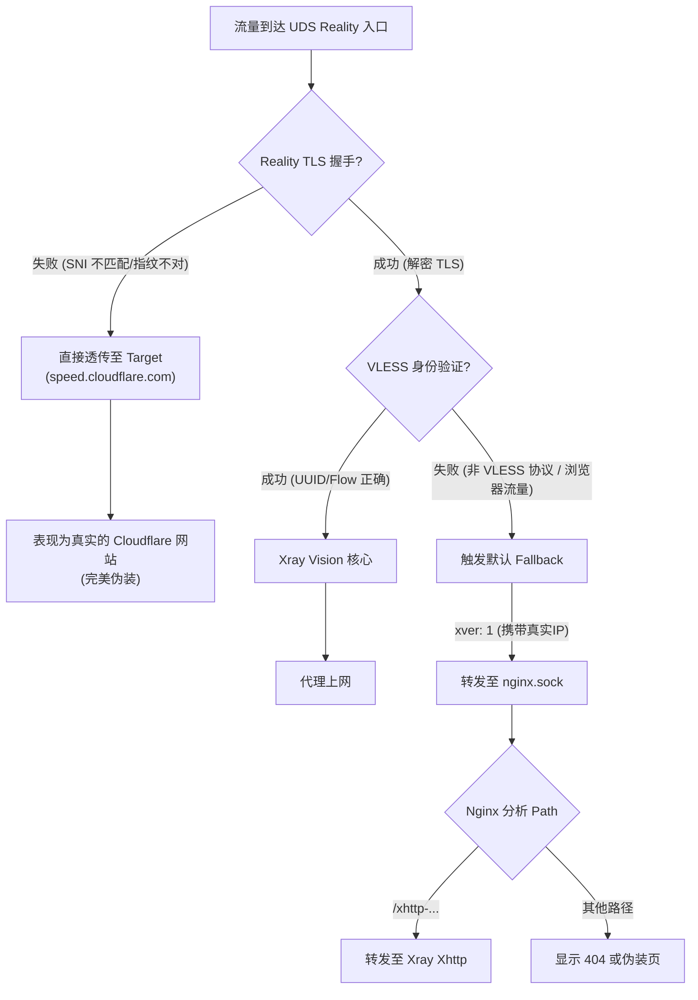

# Reality Fallback 机制详解

本文档深度解析 `templates/xray/01_reality_inbounds.json` 中的回落（Fallback）设计。这是本项目“Xhttp 直连模式”和“隐蔽伪装”的核心机制。

## 1. 核心配置回顾

在 `01_reality_inbounds.json` 中，关键配置如下：

```json
"fallbacks": [
    {
        "dest": "/dev/shm/nginx.sock",
        "xver": 1
    }
],
"realitySettings": {
    "serverNames": ["${DEST_HOST}"], // 仅允许伪装域名 SNI
    "target": "${DEST_HOST}:443",    // 默认透传目标
    ...
}
```

## 2. 流量处理流程图

此架构决定了流量的最终去向：**Xray 代理**、**Nginx 业务** 还是 **被丢弃/透传**。



## 3. 详细机制解读

### 3.1 为什么需要 Fallback？
Reality 协议本质上接管了 TLS 握手。握手成功后，它拥有了解密后的**明文数据**。
此时，如果客户端发送的不是标准的 VLESS 代理指令，而是普通的 HTTP 请求（例如 Xhttp 协议的数据包，或者你用浏览器直接访问），Xray 无法处理这些数据。
**Fallback** 机制允许 Xray“把这部分处理不了的明文数据”甩给后端的 Web 服务器（Nginx）去处理。

### 3.2 关键参数详解
*   **`dest`: `/dev/shm/nginx.sock`**
    *   **含义**: 回落的目标地址。
    *   **重点**: 这里使用的是 **Unix Domain Socket**，而不是 TCP 端口，效率极高。并且，由于流量已经被 Reality 解密，所以发送给 `nginx.sock` 的是**明文** HTTP/H2 数据。这也解释了为什么我们在 Nginx 配置中强调 `nginx.sock` **绝对不能开启 SSL**。

*   **`xver`: 1**
    *   **含义**: 启用 **PROXY Protocol v1** (发送端)。
    *   **作用**: 告诉 Nginx “这个请求是谁发来的”。如果不加这个，Nginx 看到的来源 IP 永远是 `localhost`。加上后，Nginx 日志就能记录用户的真实公网 IP，也可以据此做防暴力破解限制。
    *   **版本区别**:
        *   `0`: 不开启。目标只能看到 Xray 的 IP (localhost)。
        *   `1`: PROXY Protocol v1 (文本格式)。兼容性最好，Nginx 默认支持优秀。
        *   `2`: PROXY Protocol v2 (二进制格式)。性能稍好，但调试查看不直观。
    *   **配套设置**: 因为这里发出了 Proxy Protocol，所以 Nginx 端的监听指令 **必须** 加上 `proxy_protocol` 关键字 (即 `listen ... proxy_protocol;`)，否则 Nginx 会把这些头部信息误当作 HTTP 请求内容解析报错，导致连接立即断开（400 Bad Request 或 Connection Reset）。

### 3.3 安全性设计
*   **白名单 SNI**: 配置中限制了 `serverNames: ["${DEST_HOST}"]`。这意味着如果攻击者尝试用你的主域名 IP 直接扫描，或者用错误的 SNI 连接，Reality 根本不会进行握手，而是直接把流量透传给 `target` (speed.cloudflare.com)。**攻击者看到的永远是 Cloudflare 的正规证书和页面，探测不到你的服务器特征。**

## 4. 总结
这个回落设计实现了“一鱼多吃”：
1.  **VLESS 流量**: 走 Vision 高速通道。
2.  **Xhttp 流量**: 走 Fallback -> Nginx -> gRPC -> Xray 通道。
3.  **探测流量**: 走 Target 透传通道（或者 Fallback -> Nginx -> 404）。

结构精巧，隐蔽性极强。
