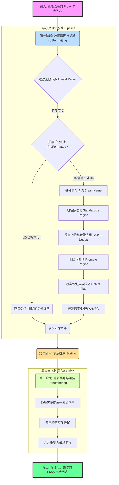

# Sub-Store 节点重命名脚本 (`rename.js`) 深度分析与使用指南

本文档对 `rename.js` 脚本进行了完整的逐行功能梳理，通过图文结合的方式，全面展示其设计逻辑、实现功能以及具体的使用说明。

---

## 🚀 一、 核心功能概览 (Features)

该脚本专为 Sub-Store（或类似节点订阅转换工具）设计，主要为了解决机场节点名称杂乱无章、格式不一的问题，将其统一转换并重组为**视觉舒适、地区清晰、自动编号、带 Emoji 国旗且完美适配各代理客户端分流规则**的标准化格式。

其核心功能包括：
1. **深度格式化**：通过一系列正则清洗乱码碎片（过期提示、套餐信息、剩余流量等），并标准化分隔符。强制在分隔符两侧加入空格防御 Clash Smart 检测造成的串词。
2. **智能重命名**：自动将各类变体的中英文地名统一翻译和标准化（例如将 "Hong Kong", "HK", "深港" 等统一为 "香港"）。
3. **稳健去重**：智能识别并移除重复叠加的地区标签（例如拆分后出现多个 "美国"）。
4. **自动标旗**：根据国家或地区的中英文名称、代码，自动添加匹配的国旗 Emoji (例如 "日本" 自动加上 🇯🇵)。
5. **排序优化**：按地理优先级（默认香港 > 台湾 > 日本...）对节点进行重新排序。
6. **序号生成**：在排序后，对同基准地区的节点进行重新按序编号（如 `香港[1]`, `香港[2]`）。
7. **协议智能精简**：自动移除冗余的协议名称信息（例如名称中已经有 `Reality` 则隐藏底层协议 `vless` 等）。

---

## 🧠 二、 脚本设计逻辑架构 (Architecture)

整个脚本主要分为三大模块：**数据配置区 (Configurations)**、**工具函数集 (Helper Functions)** 以及 **主数据流处理引擎 (Main Pipeline)**。

---

## 📜 三、 核心模块源码逐行解析

### 1. 基础配置与特征数据库 (Line 18 - 423)

这部分定义了脚本进行正则匹配和规则转换的数据基础：

*   **`Constants` 常量表：** 定义了全局分隔符 `SEPARATOR` 为 ` ✈ `（带有空格防御污染），设置了地区优先级的顺序表（香港>台湾>日本...），并提供了极其长串的 `INVALID_REGEX`，用于在第一步直接抛弃掉名字里带有 "套餐"、"过期"、"剩余流量" 这种实际上根本不是代理节点的无用信息条目。
*   **`CleaningRules` 清理规则栈：** 这是一个数组，里面包含了一系列必须**按顺序严格执行**的正则表达式替换规则。
    *   移除旧的 `[1]`, `[2]` 编号。
    *   统一并提取机场常用的倍率表示（如 `x2`, `2倍` 统一转为 `2×`）。
    *   干掉各种花里胡哨的干扰符号、空括号以及孤立的汉字。
    *   **特别强调：** 在此步骤最后，会将各种常见分隔符（`-`, `_`, `|`, ` `, `/`，甚至旧的 `✈`）全部**统一临时降维打击替换为 `-`**，为了后面第三步的字符串 `split` 切割做准备。
*   **`RegionMap` 地区映射引擎：** 巨大无比的正则字典。负责将诸如 `Tokyo`, `Osaka`, `深日` 等各种稀奇古怪的节点命名统一标准化为**`日本`**。
*   **`CountryDB` & `FlagRules` 动态国旗数据库：** 罗列了全世界绝大多数国家/地区的 Emoji 旗帜、二位字母代码和中英文全称。脚本在初始化时会执行一个匿名函数，将这个数据库自动编译为 `FlagRules` 正则匹配数组。脚本会根据名称特征，快速打上正确的 Emoji 旗章。

### 2. 工具函数引擎 `Utils` (Line 430 - 569)

这个模块是对 `1.` 中数据的执行封装，提供具体的文本操作能力：

*   **`cleanName(name)`**：遍历执行 `CleaningRules` 消除噪音。
*   **`standardizeRegion(name)`**：执行 `RegionMap`，统一归置地名为标准中文名。
*   **`splitAndDedup(name)` (极为核心的设计思路)**：
    由于许多机场命名喜欢组合，例如 `美国洛杉矶-流媒体专线` 洗出来后会变成 `美国-流媒体专线`。
    这个函数会按照 `-` 进行彻底分割成数组 `['美国', '流媒体专线']`。
    1.  **初始拆分去重：** 如果前面洗出了两个 `美国` 会在这里被去重过滤。此外，还包含了**防误伤**的高级逻辑：“如果对方不含我，或者长度不如我长，就不算我被重叠了”。
    2.  **深度拆分：** 应对诸如 `日本AI` 这种前缀粘连形式，能够将它硬生生劈开成 `日本` 和 `AI`。
*   **`promoteRegion(parts)`**：将通过前一步切开的字符串数组中，代表关键地区的词汇（如香港、美国），强制拔高移动到数组的最开头下标 `0` 处。
*   **`detectFlag(name)`**：根据重组后的文本，使用国旗库扫描给出 Emoji。

### 3. 主处理流水线 `operator(proxies)` (Line 578 - 782)

这是暴露给 Sub-Store 的执行主入口。接收机场拉取来的全部节点数组。

#### **Phase 1: 清理过滤与结构提取 (`filter` & `map`)**
1.  首先使用 `INVALID_REGEX` 干掉过期、套餐等无效节点。
2.  加入针对新协议兼容的防线（拦截当前内核不一定支持的 `Xhttp` 等，保障不报错）。
3.  **【预检通道】**：通过正则匹配，检查该节点名字是不是已经被格式化过了（以防脚本被错误地重复执行两次或节点本身已经极其规范），如果已经有 `[国旗] [地名] ✈ [后缀]` 的结构，则直接拆解留存特征，不投入后续全套正则引擎暴力清洗。
4.  **【深槽洗礼】**：
    *   按顺序调用 `cleanName` -> `standardizeRegion` -> `splitAndDedup` -> `promoteRegion`。
    *   重组后调用 `detectFlag` 打上旗帜。
    *   进一步处理特殊项：诸如提取 `x2` 这样的费率倍数并暂存；如果在原特征中识别到 IPv6 地址，则独立取出 `IPv6` 的标志放回开头。
    *   清理原有的底层协议名（防止后面添加时重复）。

#### **Phase 2: 节点宏观排序 (`sort`)**
使用预设的 `PRIORITY_REGIONS` 数组优先级。把所有节点按地区权重排序（如香港排第一，台湾第二），同地区的节点再按照名称尾部可能带有的老序号数字进一步微调。

#### **Phase 3: 一统江湖重新上号重组 (`map`)**
这是最后一道工序，也是确保所有节点视觉极度统一的关键。此时，所有节点列表已经是按地区排好序的状态了。

1.  **切割前缀**：利用此前处理预留的第一把 `✈` 刀口，将“纯净地区名”和“剩余后缀修饰语”切开。
2.  **基准组统计**：维护一个字典 `nameCounts`。对于 `香港 IEPL` 和 `香港 宽频` 这两个同前缀基底，都划归入 `香港` 维度。序号累加。
3.  **组装躯干**：按照 `Emoji 旗帜 + [IPv6 可选前缀] + 纯净地名 + [自增新编号 N]` 拼接头部。例如 `🇯🇵 日本[1]`。
4.  **加载翅膀 (后缀组装)**：
    *   如果此前有修饰后缀，用 ` ✈ ` 接上。
    *   如果此前提取了费率倍数（如 `2x`），用 ` ✈ ` 接上。
5.  **智能协议冗余剔除 (Smart Protocol Deduplication)**：
    *   **核心逻辑**：如果该节点名字中（或后缀里）已经人工标注了它是 `Reality`、`XTLS` 等顶层牛逼协议，那么就丢掉内核解析出的基础底层协议名 `vless`。
    *   同理，有了 `WS` 等，就不要在名字后面追加 `vmess` 造成累赘。
    *   把剩余该保留的协议用 ` ✈ ` 拼接到最后。
6.  **最后抹布擦拭**：用正则一扫因为某些标签空缺导致的多个连在一起的 ` ✈  ✈ `。

最终强制只返回 `name`, `type` 以及其底层的实际配置数据包输出。

---

## 📖 四、 使用说明与预期效果 (Usage Guide)

### 1. 适用场景

本脚本旨在插入至 **Sub-Store** 或类似支持 JavaScript 的订阅链接处理平台中。适用于以下用户痛点：

*   机场主起名放飞自我：“🐱香港 01 x1.2倍 | Reality~”、“套餐剩余：100GB” 等严重破坏美感的命名。
*   使用 OpenClash 等工具，因为节点名称千奇百怪，导致基于正则表达式或关键词测速匹配的 Fallback、Smart 规则池经常圈漏节点。

### 2. 部署方式 (以 Sub-Store 为例)

1.  进入您的 Sub-Store 网页端控制台。
2.  在左侧菜单进入 **【订阅】** 或者在具体的某个配置流（组合订阅）中。
3.  找到对应的订阅链接编辑界面，往下滚动找到 **【脚本操作 (Scripting)】**。
4.  点击加入一个类型为 `Operator` 或是处理节点列表 `proxies` 的新脚本块。
5.  将上方整段 `rename.js` 代码粘贴进去。
6.  点击保存，预览节点结果。

### 3. 处理效果对比展示

| 原始混沌命名 (Original Messy Names) | 经过 `rename.js` 洗礼后 (Standardized Result) |
| :--- | :--- |
| `![使用教程与联系客服].txt` | **(被自动剔除，不会输出)** |
| `✨🇭🇰 香港 01 x1.5 \| IPLC -- Reality` | `🇭🇰 香港[1] ✈ IPLC ✈ 1.5× ✈ Reality` |
| `日本东京✈jp✈AnyTLS✈高速✈good` | `🇯🇵 日本[1] ✈ jp ✈ AnyTLS ✈ 高速 ✈ good ✈ unknown` |
| `🇺🇸美国洛杉矶v6 08 🎯udp` | `🇺🇸 IPv6 美国[1] ✈ 洛杉矶 ✈ UDP` |
| `Taiwan-Hsinchu-02-1.0倍` | `🇹🇼 台湾[1] ✈ 新竹 ✈ 1× ✈ unknown` |
| `【过期提醒：2027年包年套餐】` | **(被自动剔除，不会输出)** |
| `🇸🇬 狮城 新加坡03 (2.0x\|vless)` | `🇸🇬 新加坡[1] ✈ 2× ✈ vless` |

### 4. 高级维护建议

如果您后续更换了新机场，遇到脚本遗漏，只需要修改脚本前方的两处：
1.  **新增国家：** 或者机场搞了个新词儿（比如把台湾叫 "福尔摩沙"），请立刻在**`RegionMap`**里对应的正则表达式中补上关键词，比如放入 `"台湾": /...|福尔摩沙/gi`。
2.  **保留特定标签：** 如果有些短小英文缩写您希望保留作为特殊 Tag（例如 `jp`，`vip`），请确保不要把它们写入 `RegionMap` 当中防止被洗掉吞并。
