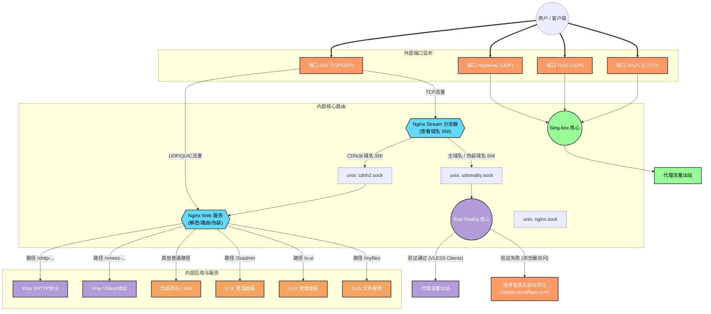
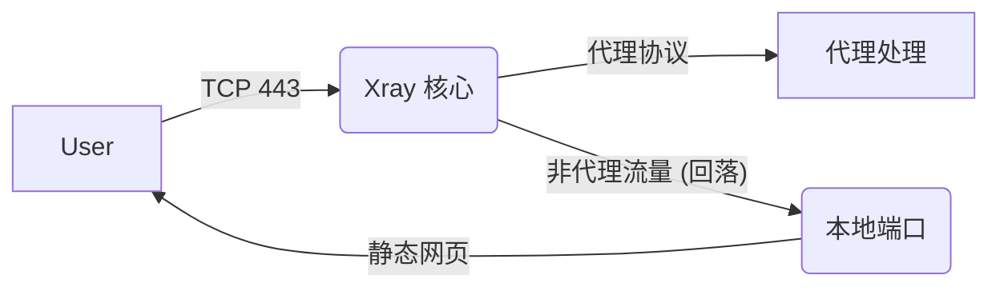
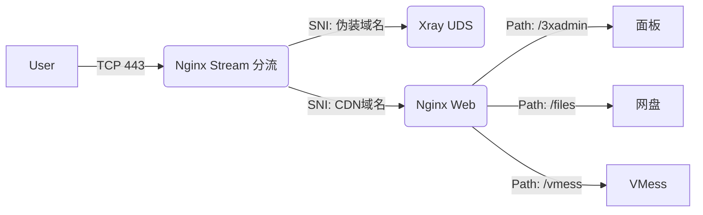

# 项目流量流向与架构详解 (Traffic Flow Analysis)

本文档旨在通过图文并茂的方式，详细解析本项目的网络流量流向。无论您是专业开发者还是普通用户，都能通过此文档理解数据包是如何从您的客户端到达服务器，并最终访问互联网的。

## 1. 核心架构概述

本项目采用 **"双引擎 + 智能分流"** 的架构设计，旨在同时提供极致的性能（Xray Reality）和极佳的兼容性（CDN/WebSocket/Hysteria2）。

*   **前置网关 (Nginx)**: 这里的 Nginx 不仅仅是一个网站服务器，它更像是一个智能传达室大爷。它守在 443 端口，查看每一个到来的访问请求（查看 SNI，即域名前缀），如果是“自己人”（代理流量），就指路给代理核心；如果是“路人”（浏览器访问），就展示伪装网站。
*   **双核引擎**:
    *   **Xray**: 处理主力的 VLESS-Vision-Reality 流量（速度最快，防探测能力最强）以及 VMess/XHTTP 等传统协议。
    *   **Sing-box**: 专注于新一代的 Hysteria2、TUIC 等基于 UDP 的高性能协议，适合网络环境较差的情况。

---

## 2. 流量流向图解 (Traffic Flow Diagram)

以下图表展示了当一个请求到达服务器时，它所经历的完整路径。

---

## 3. 详细流程解析

### 场景一：使用“最强防探测”模式 (Reality 直连)
*   **适用协议**: VLESS + Vision + Reality
*   **客户端行为**: 连接服务器 443 端口，SNI（服务器名称）填写**伪装域名**（如 `speed.cloudflare.com`）。
*   **流转过程**:
    1.  流量到达 **443 端口**。
    2.  **Nginx Stream** 看到 SNI 是**伪装域名**（或主域名），直接把流量（不解密）通过 `udsreality.sock` 管道扔给 **Xray**。
    3.  **Xray Reality** 尝试握手：
        *   **成功**（密码正确，是自己人）：Xray 解密流量，直接代理上网。这是路径最短、延迟最低的方式。
        *   **失败**（比如你用浏览器直接访问 https://你的主域名）：Xray 认为你是来查岗的，于是**透传**给配置好的目标网站（如 Cloudflare 测速页）。显示真实的伪装内容，而不是 Nginx 的静态页。

### 场景二：使用 CDN 或 WebSocket (救火/备用)
*   **适用协议**: VMess-WS, VLESS-XHTTP
*   **客户端行为**: 连接服务器 443 端口 (或通过 Cloudflare CDN)，SNI 填写你的**CDN域名**。
*   **流转过程**:
    1.  流量到达 **443 端口**。
    2.  **Nginx Stream** 看到 SNI 是 CDN 域名，通过 `cdnh2.sock` 管道把流量交给 **Nginx Web 服务**。
    3.  **Nginx Web** 负责解密 HTTPS 流量（TLS Termination）。
    4.  Nginx 查看 URL 路径（Path）：
        *   如果是 `/一串乱码-vmessws`：转发给 **Xray VMess** 模块。
        *   如果是 `/一串乱码-xhttp`：转发给 **Xray XHTTP** 模块。
        *   如果是 `/3xadmin`：显示 X-UI 后台。

### 场景三：暴力竞速模式 (Hysteria2 / TUIC)
*   **适用协议**: Hysteria2, TUIC V5
*   **客户端行为**: 连接服务器的**独立 UDP 端口**（例如 30000-40000 范围内的某个端口）。
*   **流转过程**:
    1.  流量直接到达高位 UDP 端口。
    2.  **Sing-box** 直接监听这些端口，不经过 Nginx，不经过 Xray。
    3.  Sing-box 验证用户信息，直接进行代理。
    *   *注：这种方式损耗最小，无需 Nginx 转发，适合网络拥堵时抢占带宽。*

### 场景四：管理与维护
*   **访问 X-UI / S-UI / 文件服务**:
    *   流量走的是 **场景二** 的路径。
    *   必须通过 **CDN 域名** 访问（因为主域名与伪装域名流量被 Xray Reality 接管并透传）。
    *   例如：访问 `https://cdn.你的域名.com/3xadmin`，Nginx 解密后发现路径匹配，转发给后台面板。

## 4. 这里的 `.sock` 是什么？
在流程图中你可能注意到了 `unix:/dev/shm/*.sock`。
*   **通俗解释**: 它是服务器内部进程通信的“私密通道”。
*   **为什么不用端口？**: 比如通常我们用 `127.0.0.1:8080` 通信，这需要经过网络协议栈，哪怕是本机也有开销。而 `.sock` (Unix Domain Socket) 直接在内存中交换数据，速度极快，且不占用网络端口，更安全。

## 总结
*   **主域名** = 极速、隐蔽 (Xray Reality + 深度伪装)
*   **CDN 域名** = 全能、承载网页服务 (Nginx + WebSocket/Grpc/Web)
*   **独立端口** = 暴力竞速 (Sing-box)

## 5. 架构对比：为何选择 Nginx 前置？

在代理圈中，另一种流行的架构是 **Xray 前置** (即由 Xray 监听 443 端口，通过 `fallbacks` 回落给 Nginx)。本项目坚持使用 **Nginx 前置** 是基于多业务共存的考量。

### 5.1 架构对比图

#### 方案 A: Xray 前置 (常见于纯代理脚本)
*   **特点**: Xray 独占 443，适合纯粹的翻墙 VPS。

#### 方案 B: Nginx 前置 (本项目架构)
*   **特点**: Nginx 独占 443，适合**代理 + 网站 + 面板 + 网盘**的多功能服务器。

### 5.2 深度优劣势分析

| 特性 | Xray 前置 (方案 A) | Nginx 前置 (本项目) | 本项目选择理由 |
| :--- | :--- | :--- | :--- |
| **性能** | ⭐⭐⭐⭐⭐ (极致，少一层转发) | ⭐⭐⭐⭐⭐ (TCP 层分流，损耗忽略不计) | 两者性能差距肉眼不可见。 |
| **Web 能力** | ⭐⭐ (仅能简单回落) | ⭐⭐⭐⭐⭐ (路由、压缩、缓存、重写) | 我们需要运行 X-UI, S-UI, Dufs 等多个 Web 服务。 |
| **CDN 支持** | ⭐⭐⭐ (配置繁琐) | ⭐⭐⭐⭐⭐ (原生支持) | 需要完美处理 CDN 回源 IP 和 Headers。 |
| **隐蔽性** | ⭐⭐⭐⭐⭐ (原生 Reality) | ⭐⭐⭐⭐⭐ (透明分流) | 只要 Nginx Stream 不解密 Reality 流量，隐蔽性等同。 |
| **维护性** | ⭐⭐⭐ (单点故障) | ⭐⭐⭐⭐ (模块解耦) | Nginx 挂了不影响 Sing-box，Xray 挂了 Nginx 还能展示网页。 |

**一句话总结**: 如果你只想翻墙，Xray 前置足够；如果你想要一台**全能的瑞士军刀服务器**，Nginx 前置是唯一的正解。
