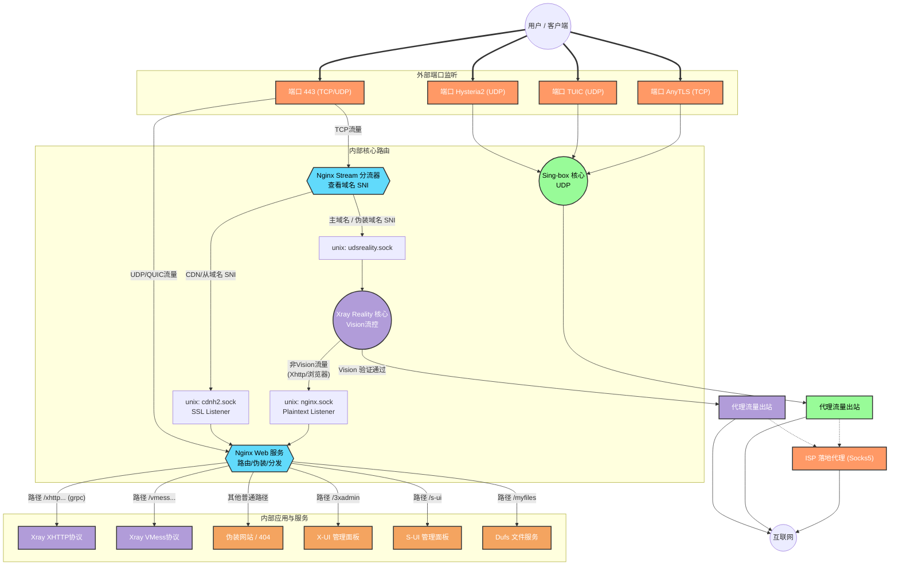
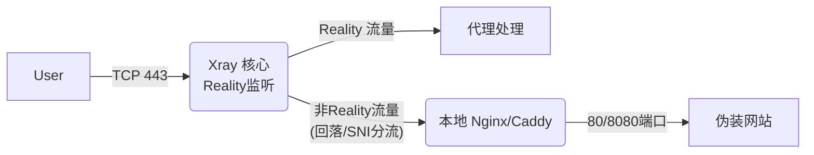
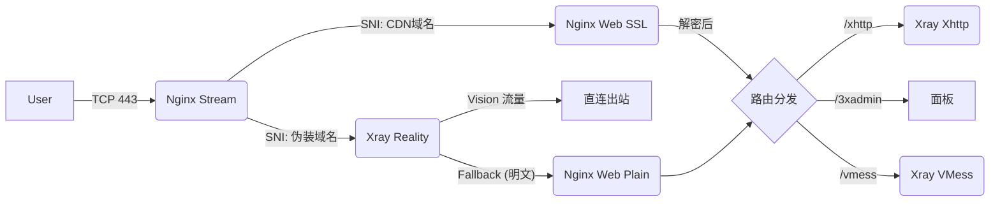

# 项目流量流向与架构详解 (Traffic Flow Analysis)

本文档旨在通过图文并茂的方式，详细解析本项目的网络流量流向。无论您是专业开发者还是普通用户，都能通过此文档理解数据包是如何从您的客户端到达服务器，并最终访问互联网的。

## 1. 核心架构概述

本项目采用 **"双引擎 + 智能分流"** 的架构设计，旨在同时提供极致的性能（Xray Reality）和极佳的兼容性（CDN/WebSocket/Hysteria2）。

*   **前置网关 (Nginx)**: 这里的 Nginx 不仅仅是一个网站服务器，它更像是一个智能传达室大爷。它守在 443 端口，查看每一个到来的访问请求（查看 SNI，即域名前缀），如果是“自己人”（代理流量），就指路给代理核心；如果是“路人”（浏览器访问），就展示伪装网站。
*   **双核引擎与分类策略**:
    *   **Xray 核心**:
        *   **Reality 系列 (优)**: 主力协议，走直连线路，防探测与稳定性最佳。
        *   **VMess / XHTTP (备)**: 走 CDN 线路，作为 IP 被墙时的救火队员。
    *   **Sing-box 核心**:
        *   **Hysteria2 (优)**: UDP 暴力竞速，适合移动网络或恶劣环境。
        *   **TUIC / AnyTLS (中)**: 作为 Hysteria2 的补充或特定混淆场景。

---

## 2. 流量流向图解 (Traffic Flow Diagram)

以下图表展示了当一个请求到达服务器时，它所经历的完整路径。



---

## 3. 详细流程解析

### 场景一：使用“最强防探测”模式 (Reality 直连)
*   **适用协议**: VLESS + Vision + Reality (主力), VLESS + Xhttp + Reality (备选)
*   **客户端行为**: 连接服务器 443 端口，SNI 填写**伪装域名**（如 `speed.cloudflare.com`）。
*   **流转过程**:
    1.  **Nginx Stream**: 识别伪装域名 SNI，将流量通过 `udsreality.sock` 转发给 **Xray Reality**。
    2.  **Xray Reality**: 进行 TLS 握手并解密流量。
    3.  **Vision 分流**:
        *   **VLESS Vision 流量**: 验证通过，直接出站代理 (最短路径)。
        *   **Xhttp 流量 / 浏览器探测**: 识别为普通流量，通过 **Fallback** 机制（以明文形式）转发给 `nginx.sock`。
    4.  **Nginx Web (`nginx.sock`)**: 接收明文请求，根据 Path (`/xhttp...`) 通过 `grpc_pass` 转发给 Xray Xhttp 模块。

### 场景二：使用 CDN 或 WebSocket (救火/备用)
*   **适用协议**: VMess-WS, VLESS-XHTTP (CDN模式)
*   **客户端行为**: 连接 CDN 节点，SNI 填写**CDN域名**，或者直接访问**主域名**。
*   **流转过程**:
    1.  **Nginx Stream**: 识别 CDN/主域名 SNI，转发给 `cdnh2.sock`。
    2.  **Nginx Web (`cdnh2.sock`)**: 此监听器**开启了 SSL**，负责完成 TLS 握手解密。
    3.  **路由分发**: Nginx 根据 Path 转发给 VMess、Xhttp (gRPC)、或管理面板。


### 场景三：独立端口直连模式 (Hysteria2 / TUIC / AnyTLS)
*   **适用协议**: Hysteria2 (UDP), TUIC V5 (UDP), AnyTLS (TCP)
*   **客户端行为**: 连接服务器的**独立高位端口**（例如 30000-40000 范围内的某个端口）。
*   **流转过程**:
    1.  流量直接到达高位端口（UDP 或 TCP）。
    2.  **Sing-box** 直接监听这些端口，不经过 Nginx，不经过 Xray。
    3.  Sing-box 验证用户信息，直接进行代理。
    *   *注：这种方式损耗最小，无需 Nginx 转发。Hysteria2/TUIC 适合网络拥堵时抢占带宽，AnyTLS 适合需要伪装成普通 HTTPS 但又想绕过 Nginx 的场景。*

### 场景四：管理与维护
*   **访问 X-UI / S-UI / 文件服务**:
    *   流量走的是 **场景二** 的路径。
    *   必须通过 **CDN 域名** 访问（因为主域名与伪装域名流量被 Xray Reality 接管并透传）。
    *   例如：访问 `https://cdn.你的域名.com/3xadmin`，Nginx 解密后发现路径匹配，转发给后台面板。
*   **访问订阅配置**:
    *   流量同样走 **场景二** 的路径。
    *   必须通过 **CDN 域名** 访问 `/sb-xray/` 下的配置，且必须携带 `?token=${SUBSCRIBE_TOKEN}` 以通过 Nginx 安全鉴权（或输入基础认证账密），否则将返回 `404 Not Found`。

## 4. 这里的 `.sock` 是什么？ (内部通信链路一览)

在流程图中你可能注意到了 `unix:/dev/shm/*.sock`。
*   **通俗解释**: 它是服务器内部进程通信的“私密通道”。
*   **为什么不用端口？**: 比如通常我们用 `127.0.0.1:8080` 通信，这需要经过网络协议栈，哪怕是本机也有开销。而 `.sock` (Unix Domain Socket) 直接在内存中交换数据，速度极快，且不占用网络端口，更安全。

### 本项目核心 Socket 清单

| Socket 文件名 | 流量方向 | 协议/加密状态 | 作用描述 |
| :--- | :--- | :--- | :--- |
| **`udsreality.sock`** | Nginx Stream -> Xray Reality | TCP / 原样转发 | **直连主通道**。Nginx 识别伪装域名 SNI 后，将包括 TLS 握手包在内的原始流量交给 Reality 处理。 |
| **`cdnh2.sock`** | Nginx Stream -> Nginx Web | TCP / SSL 加密 | **CDN/主站入口**。给 Nginx 内部的 SSL 监听器输送流量，Nginx 在此解密并处理 HTTPS 请求。 |
| **`nginx.sock`** | Reality Fallback -> Nginx Web | HTTP / 明文 (已解密) | **Reality 回落通道**。Reality 解密后，如果发现不是代理流量，就通过此通道把明文请求“退货”给 Nginx 处理。 |
| **`udsxhttp.sock`** | Nginx Web -> Xray Xhttp | HTTP/2 (gRPC) / 明文 | **Xhttp 代理通道**。Nginx 收到 Xhttp 请求后，通过 gRPC 协议转发给 Xray 相应的入站接口。 |
| **`udsvmessws.sock`** | Nginx Web -> Xray VMess | WebSocket / 明文 | **VMess 代理通道**。Nginx 收到 VMess WebSocket 请求后，转发给 Xray VMess 入站接口。 |

---

*   **主域名 (Reality)** = **(优)** 极速、隐蔽，日常主力。
*   **独立端口 (Hysteria2)** = **(优)** 暴力竞速，弱网克星。
*   **CDN 域名 (VMess)** = **(备)** 全能兼容，永不失联。
*   **其他协议 (TUIC/AnyTLS)** = **(中)** 丰富多样的备选方案。

## 5. 架构对比：为何选择 Nginx 前置？

在代理圈中，另一种流行的架构是 **Xray 前置** (即由 Xray 监听 443 端口，通过 `fallbacks` 回落给 Nginx)。本项目坚持使用 **Nginx 前置** 是基于多业务共存的考量。

### 5.1 架构对比图

#### 方案 A: Xray 前置 (XTLS 官方推荐 #4118 模式)
*   **参考**: [XTLS/Xray-core#4118](https://github.com/XTLS/Xray-core/discussions/4118)
*   **特点**: **Xray 独占 443 端口**。这是最极简的配置，Xray 直接处理所有 TLS/Reality 握手。
*   **局限**: 由于 Reality 占用了 443，该端口无法同时作为标准的 HTTPS Web 服务器（除非通过 Xray 回落）。配置 CDN 流量通常需要开启额外端口或复杂的配置。


#### 方案 B: Nginx 前置 (本项目架构)
*   **特点**: Nginx 独占 443，分流精确，支持 **Reality 回落与 CDN 流量共存**，适合多业务服务器。


### 5.2 深度优劣势分析

| 特性 | Xray 前置 (方案 A) | Nginx 前置 (本项目) | 本项目选择理由 |
| :--- | :--- | :--- | :--- |
| **性能** | ⭐⭐⭐⭐⭐ (极致，少一层转发) | ⭐⭐⭐⭐⭐ (TCP 层分流，损耗忽略不计) | 两者性能差距肉眼不可见。 |
| **Web 能力** | ⭐⭐ (仅能简单回落) | ⭐⭐⭐⭐⭐ (路由、压缩、缓存、重写) | 我们需要运行 X-UI, S-UI, Dufs 等多个 Web 服务。 |
| **CDN 支持** | ⭐⭐⭐ (配置繁琐) | ⭐⭐⭐⭐⭐ (原生支持) | 需要完美处理 CDN 回源 IP 和 Headers。 |
| **隐蔽性** | ⭐⭐⭐⭐⭐ (原生 Reality) | ⭐⭐⭐⭐⭐ (透明分流) | 只要 Nginx Stream 不解密 Reality 流量，隐蔽性等同。 |
| **维护性** | ⭐⭐⭐ (单点故障) | ⭐⭐⭐⭐ (模块解耦) | Nginx 挂了不影响 Sing-box，Xray 挂了 Nginx 还能展示网页。 |

**一句话总结**: 如果你只想翻墙，Xray 前置足够；如果你想要一台**全能的瑞士军刀服务器**，Nginx 前置是唯一的正解。

## 6. 出站代理配置 (Outbound Configuration)

Xray 和 Sing-box 的出站策略不仅支持直接访问互联网，还支持链式代理（通过 ISP Socks5 转发），这在 `entrypoint.sh` 脚本动态生成配置文件时完成。

### 核心出站类型

1.  **Direct (Tag: `direct`)**:
    *   **协议**: Freedom
    *   **作用**: 直接连接目标网站，不经过任何中转。这是默认的出站方式。

2.  **Block (Tag: `block`)**:
    *   **协议**: Blackhole
    *   **作用**: 丢弃被屏蔽的流量（如广告域名、恶意 IP）。

3.  **ISP SOCKS5 (Tag: `proxy-*`)**:
    *   **协议**: Socks
    *   **作用**: 将流量转发给指定的落地 Socks5 代理。
    *   **配置方式**: 通过环境变量动态注入。脚本会扫描形如 `*_ISP_IP`, `*_ISP_PORT` 的变量，自动生成出站配置并填入 `${CUSTOM_OUTBOUNDS}` 占位符。
    *   **应用场景**: 所谓“家宽 IP”或“原生 IP”解锁流媒体，通常通过此链式代理实现。

### 配置片段示例 (`xr.json`)

```json
"outbounds": [
    // 动态注入的 ISP 代理 (由脚本生成)
    {
        "tag": "proxy-hk-isp",
        "protocol": "socks",
        "settings": { ... }
    },
    {
        "tag": "block",
        "protocol": "blackhole"
    }
]
```

---

## 7. 关键机制深度解析 (Deep Dive)

### 7.1 Reality 伪装进化：为何不再回落给 Nginx？

在旧有的 Reality 配置习惯中，很多人会将回落目标 (`dest`) 指向自己的 Nginx 伪装站。但在 Deep Masquerading 模式下，Xray 的默认行为变为了 **透传**。

*   **旧模式 (Fallback to Nginx)**:
    *   流程: `Reality (Fail) -> Nginx -> 自建伪装页`
    *   **劣势**: 你只能提供**自己域名**的证书。如果审查者发现流量特征像 Google，但证书却是你不知名的小域名，极易被识别。
*   **新模式 (Forward to Target)**:
    *   流程: `Reality (Fail) -> DEST_HOST (e.g. speed.cloudflare.com)`
    *   **优势 (借刀杀人)**: 攻击者扫描你的端口，收到的响应**真的是**来自 Cloudflare 的正规证书和数据。你只是一个透明管道。
    *   **例外**: 只有通过了 TLS 解密且验证通过的“自己人”流量（如 Xhttp），才会触发 `fallbacks` 回落给 Nginx 处理。
