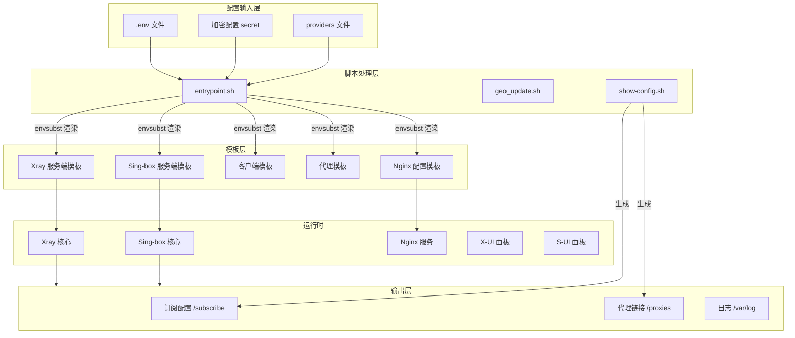
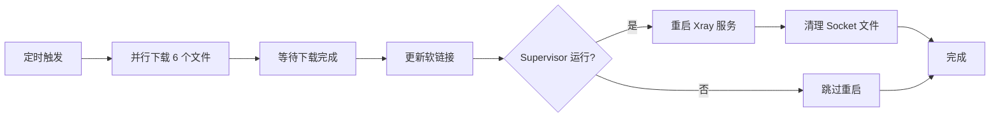

# SB-Xray 容器使用指南

## 1. 项目简介

本容器集成了 **Xray**、**Sing-box**、**X-UI**、**S-UI**、**Sub-Store**、**Dufs**、**Cloudflared** 等多个网络工具，构建了一个全自动化的代理服务平台。

### 核心特性

*   **多协议支持**：VLESS-Reality、Hysteria2、TUIC、VMess-WS、XHTTP 等前沿协议
*   **双核心架构**：Xray + Sing-box 并行运行，各司其职
*   **自动化证书**：集成 `acme.sh`，支持 ZeroSSL/Google CA，自动申请泛域名证书
*   **客户端配置生成**：自动生成 Clash/Mihomo/Stash/Surge 等客户端配置
*   **多 ISP 落地**：支持配置多个 Socks5 代理实现多出口分流
*   **Web 管理面板**：X-UI (Xray) + S-UI (Sing-box) 双面板管理

---

## 2. 配置管理架构

### 2.1 整体流程图



### 2.2 目录结构详解

```text
/sb-xray/
├── scripts/                    # 核心脚本
│   ├── entrypoint.sh          # 容器启动入口（环境变量生成、配置渲染）
│   ├── show-config.sh         # 客户端配置/订阅生成脚本
│   ├── geo_update.sh          # GeoIP/GeoSite 数据更新
│   └── stop-supervisor.sh     # 优雅停止脚本
│
├── templates/                  # 配置模板
│   ├── xray/                  # Xray 服务端入站配置
│   │   ├── 01_reality_inbounds.json    # Reality 入站
│   │   ├── 02_xhttp_inbounds.json      # XHTTP 入站
│   │   ├── 03_vmess_ws_inbounds.json   # VMess-WS 入站
│   │   └── xr.json                     # Xray 主配置
│   │
│   ├── sing-box/              # Sing-box 服务端配置
│   │   ├── 00_log.json        # 日志配置
│   │   ├── 01_outbounds.json  # 出站配置
│   │   ├── 02_endpoints.json  # 端点配置
│   │   ├── 03_route.json      # 路由规则
│   │   ├── 11_hysteria2_inbounds.json  # Hysteria2 入站
│   │   ├── 12_tuic_inbounds.json       # TUIC 入站
│   │   └── 13_anytls_inbounds.json     # AnyTLS 入站
│   │
│   ├── client_template/       # 客户端配置模板
│   │   ├── MihomoPro.yaml     # Mihomo 完整版
│   │   ├── MihomoLite.yaml    # Mihomo 精简版
│   │   ├── OneSmartPro.yaml   # OneSmart 完整版
│   │   ├── OneSmartLite.yaml  # OneSmart 精简版
│   │   ├── phone.yaml         # 移动端优化版
│   │   ├── stash-full.yaml    # Stash 完整版
│   │   ├── stash-lite.yaml    # Stash 精简版
│   │   └── surge.conf         # Surge 配置
│   │
│   ├── proxies/               # 代理链接模板
│   │   ├── all                # 所有协议
│   │   ├── clash              # Clash 格式
│   │   ├── stash              # Stash 格式
│   │   └── surge              # Surge 格式
│   │
│   ├── nginx/                 # Nginx 配置模板
│   │   ├── nginx.conf         # 主配置
│   │   ├── http.conf          # HTTP 虚拟主机
│   │   └── tcp.conf           # Stream 分流
│   │
│   ├── supervisord/           # Supervisor 配置
│   └── dufs/                  # Dufs 文件服务器配置
│
├── /sb-xray/                  # 运行时目录（容器内）
│   ├── xray/                  # Xray 渲染后配置
│   ├── sing-box/              # Sing-box 渲染后配置
│   └── subscribe/             # 客户端订阅文件
│
└── /pki/                      # 证书存储（挂载）
    ├── *.crt                  # 证书文件
    ├── *.key                  # 私钥文件
    └── *-ca.crt               # CA 证书
```

---

## 3. 核心脚本详解

### 3.1 entrypoint.sh - 启动入口

**功能**：容器启动时的主控脚本，负责环境初始化、配置生成和服务启动。

> 💡 **深度解析进阶阅读**
> 关于 `entrypoint.sh` 的详细五大启动扇区（变量加工 -> 证书生成 -> 服务端渲染 -> 客户端组装）、测速跑分逻辑、多节点智能选路系统，请务必参考配套流程图解白皮书：
> 👉 [**《Entrypoint.sh 核心生命周期与架构解析》**](./entrypoint-architecture.md)

**核心粗略流程**：

```mermaid
graph LR
    Start[容器启动] --> Decrypt[解密 Secrets]
    Decrypt --> Cache[检查测速缓存]
    Cache --> SpeedTest[极限跑分或短路截断]
    SpeedTest --> GenEnv[生成变量网]
    GenEnv --> IssueCert[申请/续期证书]
    IssueCert --> Render[纯净渲染提取配置]
    Render --> GenProviders[生成 Providers]
    GenProviders --> RenderTemplates[渲染所有模板]
    RenderTemplates --> InitUI[初始化 X-UI/S-UI]
    InitUI --> StartSupervisor[启动 Supervisor]
```



**关键函数**：

1.  **`generateEnv()`**：自动生成以下环境变量
    *   `XRAY_UUID`、`SB_UUID`：随机 UUID
    *   `XRAY_REALITY_PRIVATE_KEY/PUBLIC_KEY`：Reality 密钥对
    *   `XRAY_MLKEM768_SEED/CLIENT`：抗量子加密密钥
    *   `PORT_HYSTERIA2`、`PORT_TUIC`、`PORT_ANYTLS`：随机端口
    *   `STRATEGY`：IP 策略（IPv4/IPv6）
    *   `CHATGPT_OUT`：ChatGPT 访问检测

2.  **`run_speed_tests_if_needed()`**：测速及优选评估
    *   检查 `/.env/xray` 中是否存在 `ISP_TAG`，**存在即立刻短路跳过测试流程**。
    *   扫描环境变量中的 `*_ISP_IP` 进行满载跑分评估，挑出最优直出或代理通道保存。

3.  **`build_client_and_server_configs()`**：纯净结构组装
    *   基于选出的 `ISP_TAG`，秒速无网构建 Xray/Sing-box 的出站配置。
    *   构建客户端 YAML 的 ISP 代理节点配置段。生成的拨号底层名不会受到任何杂质污染。
    *   结合测算出的 `IS_8K_SMOOTH` 布尔锁与节点属性，交由 `show-config.sh` 在最终呈现的外显订阅链接中附加智能策略后缀（如 `✈super` 代表住宅流畅， `✈good` 代表代理流畅）。

3.  **`generateProxyProvidersConfig()`**：处理 `providers` 文件
    *   解析订阅源配置
    *   生成 `${CLASH_PROXY_PROVIDERS}` 环境变量

4.  **`issueCertificate()`**：证书管理
    *   检查证书有效期（<7天触发续期）
    *   使用 `acme.sh` 申请泛域名证书
    *   支持 ZeroSSL/Google CA/Let's Encrypt
    *   自动配置 EAB 凭据（Google CA）

5.  **`createConfig()`**：模板渲染
    *   使用 `envsubst` 替换所有模板中的 `${变量}`
    *   生成 Xray/Sing-box/Nginx 最终配置

### 3.2 show-config.sh - 配置展示

**功能**：生成客户端订阅链接和代理配置文件。

**输出内容**：

```text
=== 节点信息 ===
节点名称: HK-Premium
地区: 香港 | 电信
IP策略: prefer_ipv4

=== 订阅链接 ===
Mihomo Pro:  https://domain.com/subscribe/MihomoPro.yaml
Clash:       https://domain.com/subscribe/clash.yaml
Stash:       https://domain.com/subscribe/stash.yaml

=== 代理链接 ===
所有协议:    https://domain.com/proxies/all
Clash格式:   https://domain.com/proxies/clash
```

**生成逻辑**：
1.  读取环境变量（`DOMAIN`、`XRAY_UUID`、`PORT_*` 等）
2.  使用 `templates/proxies/*` 模板
3.  通过 `envsubst` 替换变量
4.  输出到 `/sb-xray/subscribe/` 和 `/data/proxies/`

### 3.3 geo_update.sh - 地理数据更新

**功能**：定期更新服务端的 GeoIP 和 GeoSite 数据库，确保路由规则的准确性。

**更新数据**：

| 文件 | 来源 | 用途 |
| :--- | :--- | :--- |
| `geoip.dat` | Loyalsoldier/v2ray-rules-dat | 全球 IP 地址归属数据库 |
| `geosite.dat` | Loyalsoldier/v2ray-rules-dat | 全球域名分类数据库 |
| `geoip_IR.dat` | chocolate4u/Iran-v2ray-rules | 伊朗专用 IP 数据库 |
| `geosite_IR.dat` | chocolate4u/Iran-v2ray-rules | 伊朗专用域名数据库 |
| `geoip_RU.dat` | runetfreedom/russia-v2ray-rules-dat | 俄罗斯专用 IP 数据库 |
| `geosite_RU.dat` | runetfreedom/russia-v2ray-rules-dat | 俄罗斯专用域名数据库 |

**工作流程**：



**核心特性**：

1.  **并行下载**：使用后台任务 (`&`) 同时下载多个文件，提升效率
2.  **失败重试**：`curl --retry 3 --retry-delay 2` 确保网络波动时的可靠性
3.  **优雅重启**：
    *   停止 Xray 服务
    *   清理旧的 Unix Socket 文件（`/dev/shm/uds*`）
    *   重新启动 Xray 和 X-UI
4.  **日志记录**：所有操作记录到 `/var/log/geo_update.log`

**调度配置**：

脚本通过 `entrypoint.sh` 添加到 crontab：

```bash
# 每天凌晨 3 点执行
0 3 * * * /scripts/geo_update.sh >> /var/log/geo_update.log 2>&1
```

**手动执行**：

```bash
# 进入容器
docker exec -it sb-xray bash

# 手动更新
/scripts/geo_update.sh

# 查看日志
tail -f /var/log/geo_update.log
```

**数据用途**：

这些 GeoIP/GeoSite 数据被 Xray 和 Sing-box 用于：
*   **国内直连**：`GEOIP,CN,DIRECT` - 中国 IP 直连
*   **域名分流**：`GEOSITE,CN,DIRECT` - 中国域名直连
*   **广告拦截**：`GEOSITE,category-ads-all,REJECT` - 拦截广告域名
*   **特定地区优化**：伊朗/俄罗斯用户的专用路由规则

---

## 4. 服务端模板详解

### 4.1 Xray 入站配置

#### 01_reality_inbounds.json - Reality 入站

**监听方式**：Unix Domain Socket (`/dev/shm/udsreality.sock`)

**核心参数**：
*   `serverNames`: 仅响应伪装域名（`${DEST_HOST}`）
*   `privateKey`: Reality 私钥
*   `shortIds`: 短 ID 列表
*   `dest`: Fallback 目标（`nginx.sock`）

**Fallback 机制**：
```json
{
  "name": "http-fallback",
  "dest": "unix:/dev/shm/nginx.sock",
  "xver": 1
}
```

#### 02_xhttp_inbounds.json - XHTTP 入站

**监听方式**：Unix Domain Socket (`/dev/shm/udsxhttp.sock`)

**特性**：
*   支持 MLKEM768 抗量子加密
*   通过 gRPC (H2) 接收流量
*   支持 Reality 和 TLS 双通道

#### 03_vmess_ws_inbounds.json - VMess-WS 入站

**监听方式**：Unix Domain Socket (`/dev/shm/udsvmessws.sock`)

**用途**：CDN 友好，支持 Cloudflare 中转

### 4.2 Sing-box 入站配置

#### 11_hysteria2_inbounds.json

**监听方式**：UDP 直接监听（`::`）

**核心参数**：
*   `up_mbps` / `down_mbps`：带宽限制
*   `obfs`: 混淆配置
*   `tls`: 自签名证书

#### 12_tuic_inbounds.json

**监听方式**：UDP 直接监听

**拥塞控制**：BBR / Cubic

#### 13_anytls_inbounds.json

**监听方式**：TCP 直接监听

**伪装**：模拟 TLS 握手

---

## 5. 客户端模板详解

### 5.1 模板类型对比

| 模板 | 定位 | 规则数 | 策略组数 | 适用场景 |
| :--- | :--- | :--- | :--- | :--- |
| **MihomoPro.yaml** | 完整版 | ~15000 | 50+ | 桌面端，追求极致分流 |
| **MihomoLite.yaml** | 精简版 | ~5000 | 20+ | 移动端，节省内存 |
| **OneSmartPro.yaml** | 智能完整版 | ~15000 | 40+ | 自动选择最优节点 |
| **OneSmartLite.yaml** | 智能精简版 | ~5000 | 15+ | 移动端智能分流 |
| **phone.yaml** | 移动优化 | ~3000 | 10+ | 手机专用 |
| **stash-full.yaml** | Stash 完整 | ~12000 | 45+ | iOS Stash 客户端 |
| **surge.conf** | Surge | ~8000 | 30+ | macOS/iOS Surge |

### 5.2 核心变量说明

所有客户端模板都支持以下环境变量替换：

| 变量 | 说明 | 示例值 |
| :--- | :--- | :--- |
| `${DOMAIN}` | 服务器主域名 | `example.com` |
| `${CDNDOMAIN}` | CDN 域名 | `cdn.example.com` |
| `${LISTENING_PORT}` | 监听端口 | `443` |
| `${XRAY_UUID}` | Xray UUID | `xxxx-xxxx-xxxx` |
| `${SB_UUID}` | Sing-box UUID | `yyyy-yyyy-yyyy` |
| `${PORT_HYSTERIA2}` | Hysteria2 端口 | `30001` |
| `${PORT_TUIC}` | TUIC 端口 | `30002` |
| `${XRAY_REALITY_PUBLIC_KEY}` | Reality 公钥 | `abcd1234...` |
| `${XRAY_URL_PATH}` | WebSocket 路径 | `random32chars` |
| `${CLASH_PROXY_PROVIDERS}` | 订阅源配置 | YAML 格式字符串 |
| `${CLASH_ISP_PROXIES}` | ISP 代理配置 | YAML 格式字符串 |

### 5.3 模板结构

以 `MihomoPro.yaml` 为例：

```yaml
# 1. 锚点定义（复用配置）
BaseProvider: &BaseProvider
  type: http
  interval: 86400
  health-check:
    enable: true
    url: https://www.gstatic.com/generate_204

# 2. 代理订阅源（动态注入）
proxy-providers:
  ${CLASH_PROXY_PROVIDERS}  # 由 entrypoint.sh 生成

# 3. 代理节点（动态注入）
proxies:
  ${CLASH_ISP_PROXIES}      # ISP 代理节点

# 4. 策略组
proxy-groups:
  - name: 🚀 节点选择
    type: select
    proxies:
      - ♻️ 自动选择
      - 🔯 故障转移
      - 🔮 负载均衡

# 5. 规则集
rules:
  - GEOIP,CN,DIRECT
  - MATCH,🚀 节点选择
```

---

## 6. 多 ISP 落地配置

### 6.1 配置方法

在环境变量中定义 ISP 信息（支持多个）：

```bash
# ISP 1: 洛杉矶家宽
LA_ISP_IP=1.2.3.4
LA_ISP_PORT=2000
LA_ISP_USER=user1
LA_ISP_SECRET=pass1

# ISP 2: 韩国家宽
KR_ISP_IP=5.6.7.8
KR_ISP_PORT=3000
KR_ISP_USER=user2
KR_ISP_SECRET=pass2

# 默认 ISP（用于模板引用）
DEFAULT_ISP=LA
```

### 6.2 生成结果

**服务端（Xray）**：
```json
{
  "tag": "proxy-la",
  "protocol": "socks",
  "settings": {
    "servers": [{
      "address": "1.2.3.4",
      "port": 2000,
      "users": [{"user": "user1", "pass": "pass1"}]
    }]
  }
}
```

**客户端（Clash）**：
```yaml
proxies:
  - name: LA-dialer
    type: socks5
    server: 1.2.3.4
    port: 2000
    username: user1
    password: pass1
    udp: true
    dialer-proxy: 链式前置
```

---

## 7. 代理订阅源管理

### 7.1 配置文件

在 `providers` 文件中定义订阅源（支持环境变量或文件）：

**方式 1：环境变量**
```bash
PROVIDERS="第一个|https://example.com/sub1|优
第二个|https://example.com/sub2|中"
```

**方式 2：文件**（推荐）
创建 `/sb-xray/providers` 文件：
```text
第一个|https://example.com/sub1|优
第二个|https://example.com/sub2|中
```

### 7.2 生成逻辑

`entrypoint.sh` 会解析格式 `Name|URL|Suffix`，生成：

```yaml
proxy-providers:
  第一个:
    <<: *BaseProvider
    url: "https://example.com/sub1"
    override:
      additional-prefix: "[第一个] "
      additional-suffix: " [优]"
  第二个:
    <<: *BaseProvider
    url: "https://example.com/sub2"
    override:
      additional-prefix: "[第二个] "
      additional-suffix: " [中]"
```

---

## 8. 部署与使用

### 8.1 Docker Compose 配置

```yaml
services:
  sb-xray:
    image: currycan/sb-xray:26.1.31
    container_name: sb-xray
    environment:
      - DOMAIN=example.com
      - CDNDOMAIN=cdn.example.com
      - DECODE=your_decrypt_key
      - ACMESH_SERVER_NAME=zerossl
      - ACMESH_EAB_KID=  # Google CA 可选
      - ACMESH_EAB_HMAC_KEY=
    ports:
      - '443:443/tcp'
      - '443:443/udp'
    volumes:
      - ./pki:/pki
      - ./acmecerts:/acmecerts
      - ./.envs:/.env
      - ./sb-xray:/sb-xray
      - ./data:/data
    restart: always
    network_mode: host
```

### 8.2 首次启动

```bash
# 1. 启动容器
docker compose up -d

# 2. 查看日志
docker logs -f sb-xray

# 3. 查看生成的配置
docker exec sb-xray show

# 4. 访问订阅链接
curl https://example.com/subscribe/MihomoPro.yaml
```

### 8.3 配置更新

```bash
# 修改环境变量后重启
docker compose restart

# 强制重新生成证书
rm -rf ./pki/* ./acmecerts/*
docker compose restart
```

---

## 9. 故障排查

### 9.1 日志位置

```bash
# 容器日志
docker logs sb-xray

# Supervisor 日志
docker exec sb-xray tail -f /var/log/supervisor/supervisord.log

# Xray 日志
docker exec sb-xray tail -f /var/log/xray/access.log

# Nginx 日志
docker exec sb-xray tail -f /var/log/nginx/access.log
```

### 9.2 常见问题

**Q: 证书申请失败？**
A: 检查 DNS 配置，确保 `DOMAIN` 和 `CDNDOMAIN` 都正确解析到服务器。

**Q: 客户端配置为空？**
A: 检查 `CLASH_PROXY_PROVIDERS` 和 `CLASH_ISP_PROXIES` 环境变量是否正确生成。

---

## 10. 进阶配置

### 10.1 自定义客户端模板

1.  复制模板到宿主机：
    ```bash
    docker cp sb-xray:/templates/client_template ./custom_templates
    ```

2.  修改模板（保留关键变量）

3.  挂载自定义模板：
    ```yaml
    volumes:
      - ./custom_templates:/templates/client_template
    ```

### 10.2 自定义服务端配置

修改 `templates/xray/*.json` 或 `templates/sing-box/*.json`，重启容器生效。

### 10.3 证书高级配置

参考 [`docs/certificate-guide.md`](file:///Users/andrew/Documents/GitHub/key/docker/sb-xray/docs/certificate-guide.md) 了解 Google CA、ZeroSSL 的详细配置。
