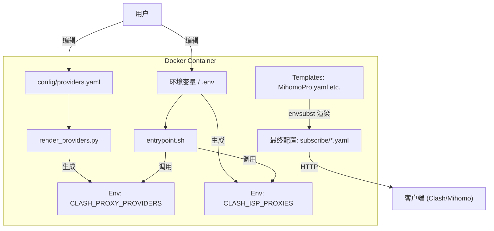

# SB-Xray 容器使用指南

## 1. 项目简介

本容器集成了 **Xray**、**Sing-box**、**Dufs**、**Cloudflared** 等多个网络工具，不仅作为一个强大的后端代理/分流网关，同时还提供自动化的客户端配置生成功能。

### 核心功能

*   **多协议支持**：支持 VLESS (Reality, Hysteria2, Tuic) 等前沿协议。
*   **客户端配置生成**：自动根据服务器配置和环境变量，生成适配 Clash/Mihomo/OneSmart 的客户端配置文件（`.yaml`）。
*   **多 ISP 落地支持**：支持同时配置多个 ISP Socks5 代理，实现多出口分流。
*   **GitOps 配置管理**：通过 YAML 文件管理此项目，简化运维。

### 架构一览



---

## 2. 部署指南

该项目通常通过 Docker Compose 部署。

### 目录结构

建议的宿主机目录结构：

```text
/
├── docker-compose.yml   # 核心编排文件
├── .envs/               # 环境变量文件夹
│   └── xray             # Xray/脚本相关环境变量
├── config/              # 用户自定义配置
│   └── providers.yaml   # 代理订阅源配置 (新增)
├── scripts/             # 自定义脚本 (如果你挂载了)
└── templates/           # 客户端模板 (如果你需要自定义)
```

### Docker Compose 配置示例

```yaml
services:
  sb-xray:
    image: currycan/sb-xray:latest
    container_name: sb-xray
    environment:
      - DOMAIN=example.com        # 你的域名
      - ENABLE_ISP_PROXY=false    # 后端是否启用 ISP 代理
    volumes:
      - ./config:/sb-xray/config  # [重要] 挂载配置目录
      - ./.envs:/.env             # 挂载环境变量
```

---

## 3. 代理提供商管理 (Proxy Providers)

为了方便管理大量的机场订阅源，本项目引入了 **Proxy Provider Management Tool**。您不再需要手动编辑复杂的 `yaml` 模板，只需维护一个简单的 `providers.yaml` 文件。

### 配置文件: `config/providers.yaml`

在挂载的 `config` 目录下创建 `providers.yaml`：

```yaml
providers:
  # 订阅源名称
  第一个:
    # 订阅地址 (支持 <host> 占位符，会自动替换为 DOMAIN)
    url: "<host>/raw/第一个"
    # 覆盖配置 (Override)
    override:
      additional-prefix: "[第一个] "  # 节点前缀
      additional-suffix: " [优]"      # 节点后缀
      skip-cert-verify: false
      udp: true

  # 另一个订阅源
  第二个:
    url: "https://example.com/sub/123" # 支持完整 URL
    override:
      additional-prefix: "[第二个] "
```

### 工作原理

1.  容器启动时，`scripts/render_providers.py` 读取此文件。
2.  脚本将其转换为 Clash/Mihomo 兼容的 YAML 格式字符串。
3.  该字符串被注入到环境变量 `${CLASH_PROXY_PROVIDERS}`。
4.  最终渲染到 `MihomoPro.yaml` 等模板中，替换原有的 `${CLASH_PROXY_PROVIDERS}` 占位符。

---

## 4. 多 ISP 落地支持

如果您的后端服务器连接了多个 Socks5 代理（例如多个不同地区的家庭宽带代理），系统可以自动识别并将它们添加到客户端配置中。

### 配置方法

在环境变量中定义 ISP 信息。支持两种命名格式：

1.  **完整格式**：`Prefix_ISP_IP`, `Prefix_ISP_PORT`... (例如 `LA_ISP_IP`)
2.  **简写引用**：在 `DEFAULT_ISP` 中使用简写。

**环境变量示例：**

```bash
# 1. 洛杉矶 ISP
LA_ISP_IP=1.2.3.4
LA_ISP_PORT=2000
LA_ISP_USER=user1
LA_ISP_PASS=pass1

# 2. 韩国 ISP
KR_ISP_IP=5.6.7.8
KR_ISP_PORT=3000
KR_ISP_USER=user2
KR_ISP_PASS=pass2

# 3. 默认 ISP (用于模板中 ${DEFAULT_ISP}-dialer 的引用)
DEFAULT_ISP=LA  # 系统会自动匹配到 LA_ISP_* 变量
```

### 生成结果

系统会自动生成如下的 Proxy 配置（YAML）：

```yaml
proxies:
  - name: LA_ISP-dialer
    server: 1.2.3.4
    port: 2000
    ...
  - name: KR_ISP-dialer
    server: 5.6.7.8
    port: 3000
    ...
```

这些代理会被注入到环境变量 `${CLASH_ISP_PROXIES}` 中，供模板使用。

---

## 5. 客户端模板渲染

容器启动时会处理 `/templates/client_template/` 下的所有模板文件。

### 核心变量

以下变量会在渲染时被替换：

| 变量名 | 描述 | 来源 |
| :--- | :--- | :--- |
| `${NODE_NAME}` | 节点名称 | 自动生成或环境变量 |
| `${DOMAIN}` | 服务器域名 | 环境变量 |
| `${CLASH_PROXY_PROVIDERS}` | 代理订阅源列表 | 由 `config/providers.yaml` 生成 |
| `${CLASH_ISP_PROXIES}` | ISP 代理列表 | 由 `*_ISP_*` 环境变量生成 |

### 自定义模板

如果您需要修改分流规则或策略组：
1.  修改 `templates/client_template/MihomoPro.yaml` (或其他文件)。
2.  保留关键变量 `${CLASH_PROXY_PROVIDERS}` 和 `${CLASH_ISP_PROXIES}`。
3.  重启容器生效。

---

## 6. 排查指南

如果生成的配置不符合预期，请检查以下几点：

1.  **日志检查**：
    查看容器日志，确认脚本是否报错：
    ```bash
    docker logs sb-xray
    ```
    关注 `Generating Proxy Providers...` 和 `Generating Client Template Config...` 部分的日志。

2.  **验证 providers.yaml**：
    确保 YAML 缩进正确（通常是 2 或 4 个空格）。

3.  **验证 ISP 变量**：
    确保 ISP 变量名以 `_ISP_IP`, `_ISP_PORT` 等结尾，且成组出现。

4.  **调试输出**：
    容器日志中会以 `DEBUG` 级别打印生成的 `${CLASH_ISP_PROXIES}` 内容，可用于核对格式。
