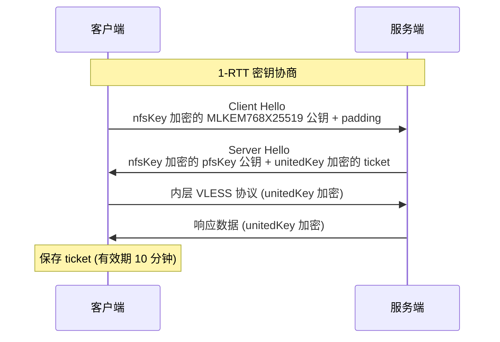
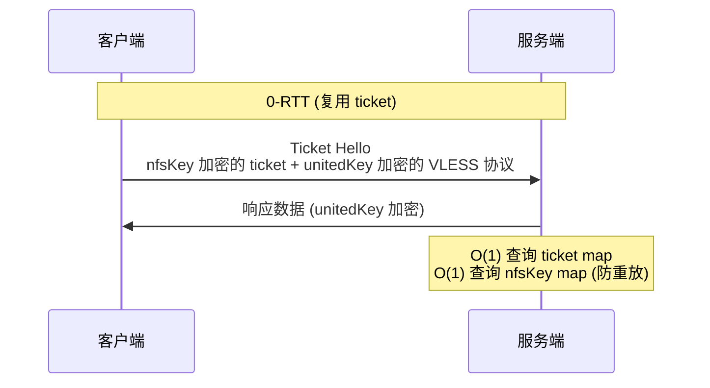
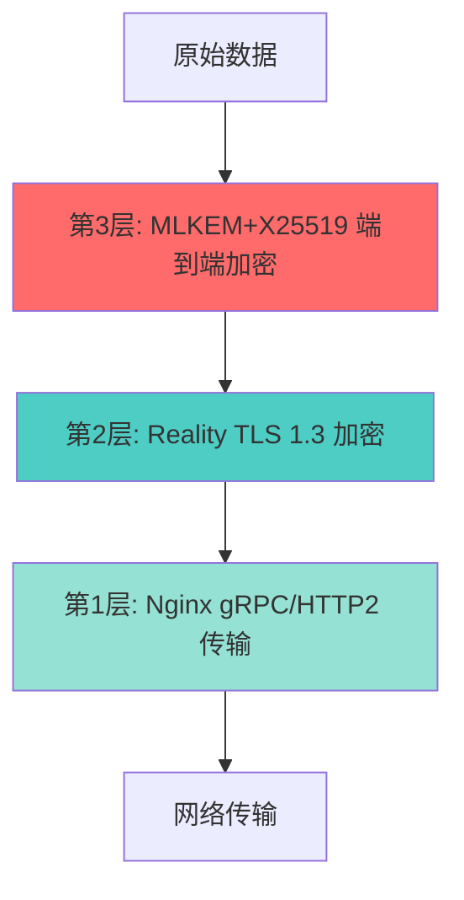

# Xray VLESS Encryption (MLKEM) 加密机制详解

本文档深度解析 Xray VLESS 协议中的 MLKEM 后量子加密配置及其架构设计,适用于所有支持 VLESS Encryption 的传输协议 (Xhttp, Reality, WebSocket 等)。

---

## 1. 配置概览

在本项目中,我们在 Xhttp 入站配置了 VLESS Encryption:

```json
"decryption": "mlkem768x25519plus.native.600s.${XRAY_MLKEM768_SEED}"
```

这是一个**端到端加密层**，独立于外层的 TLS/Reality 加密。

---

## 2. MLKEM 技术背景与 VLESS Encryption 设计理念

### 2.1 什么是 MLKEM？

*   **全称**: Module-Lattice-Based Key Encapsulation Mechanism
*   **类别**: 后量子密码学 (Post-Quantum Cryptography, PQC)
*   **标准化**: NIST 于 2024 年正式发布为 FIPS 203 标准
*   **目的**: 抵御未来量子计算机对传统 RSA/ECC 加密的破解

### 2.2 为什么需要 VLESS Encryption？

> **重要**: VLESS Encryption **不是**让你直接过墙用的。直接过墙应使用 [REALITY](https://github.com/XTLS/Xray-core/pull/4915)、[XHTTP](https://github.com/XTLS/Xray-core/discussions/4113)、[Vision](https://github.com/XTLS/Xray-core/discussions/1295) 等协议。

VLESS Encryption 的设计目标是提供比 Shadowsocks 2022/AEAD、VMess 等协议**更高的安全性**和**更好的性能**,适用于以下场景:

1.  **CDN 场景**: 避免暴露 UUID 及被代理的 SNI
2.  **中转场景**: 禁止 HTTP/TLS 的环境
3.  **non-TLS 场景**: 如伊朗的 HTTP 限制环境
4.  **机场审计绕过**: 把机场线路当中转,转到你的免费 VPS

### 2.3 核心安全概念对比

#### 客户端配置安全 (Client Config Security)

**定义**: 若攻击者拿到了客户端配置,无法解密以前、以后的通信内容,无法对以后的通信进行 MITM。

| 协议 | 客户端配置安全 | 说明 |
|:---|:---:|:---|
| **SS 2022/AEAD** | ❌ | 对称 PSK 设计,拿到配置即可解密所有流量 |
| **VMess** | ❌ | 对称 PSK 设计,拿到配置即可解密所有流量 |
| **VLESS Encryption** | ✅ | 基于公私钥,拿到客户端配置无法解密历史流量 |
| **REALITY** | ✅ | 基于公私钥,拿到客户端配置无法解密历史流量 |

> **为什么重要?** 通过读取剪切板、输入法上传、通讯软件分享、国产反诈手机等方式,攻击者拿到你的客户端配置**几乎没有难度**。

#### 前向安全 (Perfect Forward Secrecy, PFS)

**定义**: 若攻击者拿到了长期密钥(服务端私钥),无法解密**以前**的通信内容。

| 协议 | 前向安全 | 实现方式 | 0-RTT 支持 |
|:---|:---:|:---|:---:|
| **SS 2022/AEAD** | ❌ | 无密钥交换 | ✅ |
| **VMess** | ❌ | 无密钥交换 | ✅ |
| **VLESS Encryption** | ✅ | MLKEM768X25519 临时密钥交换 | ✅ (ticket 复用) |
| **REALITY/TLS** | ✅ | ECDHE 或 MLKEM768X25519 | ❌ (需 1-RTT) |

**VLESS Encryption 的创新**:
*   首次连接: 1-RTT 密钥交换 (类似 TLS)
*   后续连接: 0-RTT (复用 ticket,默认 10 分钟有效期)
*   安全性: 每个 0-RTT 连接使用不同的 `unitedKey` (pfsKey + nfsKey)

> **量子威胁**: SS/VMess 的流量可以被"现在记录、未来破解"。GFW 现在就可以对 SS 中的内层 TLS 进行 MITM 并解密。参考: [net4people/bbs#526](https://github.com/net4people/bbs/issues/526)

### 2.4 抗量子密钥交换

VLESS Encryption 使用 **MLKEM768X25519** 混合模式:

*   **ML-KEM-768**: 后量子安全,抵御量子计算机
*   **X25519**: 传统 ECDH,向后兼容
*   **混合优势**: 必须同时破解两种算法才能解密

**与 REALITY/TLS 的区别**:
*   REALITY/TLS: 明文 X25519 握手 → 可被未来量子计算机破解
*   VLESS Encryption: **加密的** MLKEM768X25519 握手 → 必须先拿到服务端私钥

---

## 3. Xray 实现详解

### 3.1 配置字符串解析

```
mlkem768x25519plus.native.600s.${XRAY_MLKEM768_SEED}
```

| 字段 | 含义 | 说明 |
|:---|:---|:---|
| `mlkem768` | MLKEM 安全级别 | 对应 NIST Level 3 安全强度,相当于 AES-192 |
| `x25519plus` | 混合模式 | 同时使用 MLKEM768 (后量子) + X25519 (传统 ECDH),双重保护 |
| `native` | 外观模式 | 原生外观 (头部有公钥特征,流量为 TLSv1.3 的 `23 3 3 l>>8 l` AEAD 头特征) |
| `600s` | Ticket 有效期 | 每次随机下发 300-600 秒的 ticket 以便 0-RTT 复用 (填 `600s` 相当于 `300-600s`) |
| `${XRAY_MLKEM768_SEED}` | 种子密钥 | 服务端预共享密钥,用于初始化 KEM |

### 外观模式详解

VLESS Encryption 提供三种外观模式,用于控制流量特征:

| 模式 | 流量特征 | 性能 | 适用场景 | 推荐度 |
|:---|:---|:---:|:---|:---:|
| **`native`** | 原生外观 | ⭐⭐⭐⭐⭐ | 默认模式,性能最佳 | ✅ **推荐** |
| **`xorpub`** | XOR 公钥特征 | ⭐⭐⭐⭐⭐ | 隐藏 X25519/ML-KEM-768 公钥特征 | ⚠️ 可选 |
| **`random`** | 全随机数外观 | ⭐⭐⭐⭐ | 对 `23 3 3 l>>8 l` 进行 XOR | ❌ 不推荐 |

#### `native` - 原生模式 (默认)

**流量特征**:
```
握手阶段:
- ivAndRelays: 包含 X25519 公钥 (32 字节) 和 ML-KEM-768 密文 (~1184 字节)
- 公钥特征明显,可被识别为 MLKEM768X25519

数据阶段:
- Header: 23 3 3 l>>8 l (TLSv1.3 格式)
- Body: AEAD 加密数据
```

**优势**:
*   ✅ 性能最佳,无额外 XOR 开销
*   ✅ 实现简单,兼容性好
*   ✅ 流量特征类似 TLSv1.3,不会被特殊对待

**为什么推荐?**
*   GFW 已将全随机数外观列入黑名单
*   类似 TLSv1.3 的流量特征反而更安全 (混入正常流量)

#### `xorpub` - XOR 公钥模式

**流量特征**:
```
握手阶段:
- ivAndRelays: 对公钥进行 XOR 运算
  * X25519 公钥 (32 字节) XOR 随机种子
  * ML-KEM-768 密文 (~1184 字节) XOR 随机种子
- 公钥特征被消除,看起来像随机数据

数据阶段:
- 与 native 相同: 23 3 3 l>>8 l + AEAD
```

**技术细节**:
```
原始公钥: [32 bytes X25519] + [1184 bytes ML-KEM-768]
XOR 种子: 基于 XRAY_MLKEM768_SEED 生成
结果:     [32 bytes random] + [1184 bytes random]
```

**优势**:
*   ✅ 隐藏了握手阶段的公钥特征
*   ✅ 性能影响极小 (XOR 运算非常快)
*   ✅ 数据阶段仍保持 TLSv1.3 特征

**劣势**:
*   ⚠️ 握手数据变成随机数,可能反而引起注意
*   ⚠️ 只影响握手阶段 (~1216 字节),占总流量极少

**适用场景**:
*   担心公钥特征被主动探测
*   需要隐藏使用 MLKEM 的事实

#### `random` - 全随机数模式

**流量特征**:
```
握手阶段:
- 与 xorpub 相同,公钥被 XOR

数据阶段:
- Header: 对 23 3 3 l>>8 l 进行 XOR
- Body: AEAD 加密数据 (不变)
```

**技术细节**:
```
原始 Header: 23 03 03 [length>>8] [length&0xFF]
XOR 后:       [5 bytes random]
成本:         仅占总流量的万分之六
```

**劣势**:
*   ❌ GFW 已将全随机数外观列入黑名单
*   ❌ 失去了 TLSv1.3 的伪装效果
*   ❌ 可能被识别为代理流量

**为什么不推荐?**
*   全随机数在当前环境下反而更危险
*   类似 TLS 的流量更容易混入正常流量

### 配置示例

```json
// 推荐: native 模式 (默认)
"decryption": "mlkem768x25519plus.native.600s.${XRAY_MLKEM768_SEED}"

// 可选: xorpub 模式 (隐藏公钥特征)
"decryption": "mlkem768x25519plus.xorpub.600s.${XRAY_MLKEM768_SEED}"

// 不推荐: random 模式 (全随机数)
"decryption": "mlkem768x25519plus.random.600s.${XRAY_MLKEM768_SEED}"
```

### 性能对比

根据 RPRX 的实测数据:

| 模式 | 相对性能 | XOR 开销 | 说明 |
|:---|:---:|:---|:---|
| `native` | 100% (基准) | 无 | 最快 |
| `xorpub` | ~100% | 可忽略 | XOR 运算极快,影响不到 1% |
| `random` | ~100% | 可忽略 | 5-byte XOR,成本极低 |

**结论**: 三种模式的性能差异可以忽略不计,主要区别在于流量特征。

> **注意**: GFW 已将全随机数外观列入黑名单,因此 `native` 模式已足够。

### 3.2 通信流程详解

#### 1-RTT 握手流程 (首次连接)



**关键点**:
1.  **nfsKey**: 基于配置中的公私钥对生成 (客户端配置安全)
2.  **pfsKey**: 临时密钥交换生成 (前向安全)
3.  **unitedKey**: `pfsKey + nfsKey` 联合 (双重防御)

#### 0-RTT 快速握手 (后续连接)



**性能优势**:
*   无需密钥协商,直接发送数据
*   服务端 O(1) 查询,无需多次尝试解密
*   Ticket 过期后自动回退到 1-RTT

### 3.3 重放防护机制

| 协议 | 防护方式 | 短期重放 | 长期重放 | 需要对时 | 数据缓存 |
|:---|:---|:---:|:---:|:---:|:---|
| **SS AEAD** | Salt map | ⚠️ | ❌ | ❌ | 高 (易出错) |
| **SS 2022** | 时间戳 | ✅ | ⚠️ | ✅ | 中 |
| **VMess** | 时间戳 | ✅ | ⚠️ | ✅ | 中 (需尝试解密) |
| **VLESS Encryption** | nfsKey + Ticket | ✅ | ✅ | ❌ | 低 |

**VLESS Encryption 的完美防护**:
1.  **0-RTT**: O(1) 按 ticket 查 map → O(1) 按 nfsKey 查 map
2.  **短期防护**: nfsKey map 防止 10 分钟内重放
3.  **长期防护**: Ticket 过期后自动失效,天然防御长期重放
4.  **无需对时**: 不依赖时间戳,适用于伊朗等对时困难的环境
5.  **重启安全**: 服务端重启后,旧 ticket 自动失效

> **对比**: SS AEAD 的 salt map 需要持久化,否则重启后可被重放近期消息。VLESS Encryption 无此问题。

### 3.4 性能优化：无需额外 AEAD Length

**传统协议 (SS 2022/AEAD)**:
```
每次加密: AEAD(length, 13 bytes) + AEAD(data, N bytes)
         ↑ 两次完整 AEAD 调用
```

**VLESS Encryption**:
```
native/xorpub 模式: AEAD(data, N bytes)
                   ↑ 只需一次 AEAD 调用,省 13 字节

random 模式: AES-256-CTR XOR(5-byte header) + AEAD(data, N bytes)
            ↑ 省去 MAC,同样省 13 字节
```

**实测性能**:
*   不额外 AEAD length: **快 10%**
*   AES-256-GCM vs AES-128-GCM: 仅快 3% (不值得降低安全性)

**为什么安全?**
*   Header 作为 AEAD 的 AD (Additional Data),类似 TLSv1.3
*   数据不对会解密失败,无需额外 length 验证

---

## 4. 架构中的加密层次

### 4.1 多层加密设计

在本项目的 Xhttp 配置中，数据经历了**三层加密**：



| 加密层 | 协议 | 作用范围 | 密钥持有者 |
|:---|:---|:---|:---|
| **第1层** | HTTP/2 (gRPC) | Nginx ↔ Xray | 无加密（内部通信） |
| **第2层** | Reality TLS | 客户端 ↔ Nginx | Reality 公钥/私钥 |
| **第3层** | MLKEM+X25519 | 客户端 ↔ Xray 核心 | MLKEM Seed + 临时密钥 |

### 4.2 为什么需要第三层加密？

即使有了 Reality 的 TLS 加密，我们仍然添加 MLKEM 层，原因如下：

1.  **零信任架构**: 即使 Nginx 被攻破，攻击者也无法解密 Xray 核心的流量
2.  **深度防御**: Reality 的 TLS 密钥可能被中间人（如 CDN）解密，MLKEM 确保端到端安全
3.  **未来防护**: 提前部署后量子加密，应对"现在窃取，未来解密"攻击

---

## 5. `decryption: none` vs `decryption: mlkem...`

### 5.1 对比表

| 特性 | `none` (网关模式) | `mlkem768x25519plus...` (端到端模式) |
|:---|:---|:---|
| **加密层数** | 2 层 (Reality + HTTP/2) | 3 层 (Reality + HTTP/2 + MLKEM) |
| **性能** | ⭐⭐⭐⭐⭐ (无额外开销) | ⭐⭐⭐⭐ (约 5-10% CPU 开销) |
| **安全性** | ⭐⭐⭐⭐ (依赖 Reality TLS) | ⭐⭐⭐⭐⭐ (后量子安全) |
| **Nginx 可见性** | Nginx 可解密并查看流量内容 | Nginx 只能看到加密的二进制数据 |
| **适用场景** | 完全信任服务器环境 | 不完全信任中间节点（如共享 VPS） |
| **客户端要求** | Xray 1.8.0+ | Xray 1.8.8+ (需支持 MLKEM) |
| **密钥管理** | 无需额外配置 | 需要管理 `XRAY_MLKEM768_SEED` |

### 5.2 流量可见性差异

#### 使用 `none` 时的流量路径：
```
客户端 [加密数据]
  ↓ Reality TLS 解密
Nginx [明文 HTTP/2 数据] ← 可以看到完整请求内容
  ↓ gRPC 转发
Xray [明文数据]
```

#### 使用 `mlkem...` 时的流量路径：
```
客户端 [MLKEM 加密数据]
  ↓ Reality TLS 解密
Nginx [加密的二进制流] ← 只能看到乱码
  ↓ gRPC 转发
Xray [MLKEM 解密] → 明文数据
```

---

## 6. 性能影响分析

### 6.1 基准测试 (理论值)

| 操作 | 耗时 (单核) | 说明 |
|:---|:---|:---|
| MLKEM768 密钥生成 | ~0.05ms | 服务端启动时一次性 |
| MLKEM768 封装 (客户端) | ~0.08ms | 每次连接建立时 |
| MLKEM768 解封装 (服务端) | ~0.10ms | 每次连接建立时 |
| X25519 密钥交换 | ~0.05ms | 与 MLKEM 并行 |
| **总握手开销** | **~0.15ms** | 相比 TLS 握手 (5-50ms) 可忽略 |

### 6.2 实际影响

*   **延迟**: 首次连接增加 < 1ms（密钥协商）
*   **吞吐量**: 对称加密 (AES-GCM) 性能与 TLS 相当
*   **CPU**: 增加约 5-10% 的 CPU 使用率（主要在握手阶段）

**结论**: 对于现代服务器（2+ 核心），性能影响几乎不可察觉。

---

## 7. 安全性深度分析

### 7.1 攻击场景防护

| 攻击类型 | `none` 防护能力 | `mlkem...` 防护能力 |
|:---|:---|:---|
| **被动窃听** | ✅ (Reality TLS) | ✅ (Reality + MLKEM) |
| **中间人攻击** | ✅ (Reality 指纹验证) | ✅ (Reality + MLKEM) |
| **Nginx 被入侵** | ❌ 流量可被解密 | ✅ 流量仍加密 |
| **量子计算机破解** | ❌ (X25519 可被破解) | ✅ (MLKEM 抗量子) |
| **"存储后解密"攻击** | ⚠️ (未来风险) | ✅ (后量子安全) |

### 7.2 密钥轮换机制

配置中的 `600s` 参数确保：
*   每 10 分钟自动重新协商会话密钥
*   即使某个会话密钥泄露，影响范围限制在 10 分钟内
*   符合 PFS (Perfect Forward Secrecy) 原则

---

## 8. 配置建议

### 8.1 何时使用 `mlkem...`？

**推荐使用**：
*   ✅ **CDN 场景**: 避免 CDN 提供商看到你的 UUID 和被代理的 SNI
*   ✅ **中转场景**: 禁止 HTTP/TLS 的环境 (如某些机场)
*   ✅ **机场审计绕过**: 把机场线路当中转,转到你的免费 VPS
*   ✅ **non-TLS 场景**: 伊朗等限速 TLS 但允许 HTTP 的环境
*   ✅ **长期存储的流量记录**: 防止未来解密 (量子计算威胁)

**不推荐使用**：
*   ❌ **直接过墙**: 应使用 REALITY/XHTTP/Vision 等协议
*   ❌ **REALITY 内层**: REALITY 已提供足够安全性,无需再加密

### 8.2 VLESS Encryption 与 REALITY/XTLS 的关系

#### REALITY 场景

> **重要限制**: `"fallbacks"` 不可与 `"decryption"` 一起使用。

**为什么 REALITY 不需要 VLESS Encryption?**

1.  **REALITY 本身已经是公私钥认证**: 提供了客户端配置安全
2.  **REALITY 支持 ECDHE**: 提供了前向安全 (虽然不抗量子)
3.  **直连场景**: Reality-Vision 流量直接出站,无中间节点风险

**什么情况下 REALITY 可以配合 VLESS Encryption?**

*   如果你的 REALITY 目标网站尚未支持 X25519MLKEM768
*   你可以用 VLESS Encryption 加强不抗量子的连接

#### XTLS 性能最大化

**推荐配置**: 开启 XTLS 避免二次加解密

```json
// 客户端和服务端都需要配置
"flow": "xtls-rprx-vision"
```

**XTLS 工作原理**:
*   内层数据直接"拼接"到外层 TLS 流中 (零拷贝)
*   避免了 VLESS Encryption → Reality TLS 的双重加密
*   CPU 开销极低,这是 Vision 性能极致的核心原因

**XTLS + MLKEM 的权衡**:
*   ✅ 获得后量子安全保护
*   ❌ 失去部分 XTLS 零拷贝优势 (性能下降 5-10%)

#### 传输层叠加

VLESS Encryption 可以叠加在 XHTTP、WS 等传输层之上:

```json
// Xhttp + VLESS Encryption (本项目配置)
{
  "protocol": "vless",
  "settings": {
    "decryption": "mlkem768x25519plus.native.600s.${SEED}"
  },
  "streamSettings": {
    "network": "xhttp",
    "xhttpSettings": { ... }
  }
}
```

**为什么这样配置?**
*   Xhttp 流量经过 Nginx 转发 (中间节点风险)
*   MLKEM 确保即使 Nginx 被攻破,数据仍加密
*   这是零信任架构的体现

### 8.3 Reality 入站是否需要启用 MLKEM？

**默认配置**：`01_reality_inbounds.json` 使用 `"decryption": "none"`

**原因分析**：
1.  **性能优先**: Reality-Vision 是主力协议,保持极致性能（XTLS 零拷贝）
2.  **安全已足够**: Reality TLS 直连出站,无中间节点风险
3.  **分层策略**: Xhttp (经过 Nginx) 启用 MLKEM,Reality (直连) 保持高性能
4.  **配置限制**: `fallbacks` 与 `decryption` 不可共存

**如需启用** (极致安全场景)：

修改 `templates/xray/01_reality_inbounds.json` 第 16 行：

```json
// 从
"decryption": "none",

// 改为
"decryption": "mlkem768x25519plus.native.600s.${XRAY_MLKEM768_SEED}",
```

**注意**: 启用后需要**删除 `fallbacks` 配置**,这意味着:
*   ❌ Xhttp 直连模式将不可用 (因为 Xhttp 依赖 fallback 到 Nginx)
*   ✅ Reality-Vision 直连仍可用
*   ⚠️ 失去了流量分流的灵活性

**权衡**：
*   ✅ 获得后量子安全保护
*   ✅ 防止"存储后解密"攻击
*   ❌ 性能下降 5-10%
*   ❌ 失去部分 XTLS 零拷贝优势
*   ❌ 无法使用 Xhttp 直连模式

**推荐策略**：
*   **一般用户**: 保持 Reality 为 `none` + `fallbacks` (性能 + 灵活性)
*   **高安全需求**: Reality 启用 `mlkem` 但删除 `fallbacks` (安全优先)
*   **平衡方案**: Reality 保持 `none`,Xhttp 启用 `mlkem` (默认配置)

### 8.4 最佳实践

```bash
# 生成强随机种子 (推荐)
XRAY_MLKEM768_SEED=$(openssl rand -hex 32)

# Xhttp 配置示例 (默认启用)
"decryption": "mlkem768x25519plus.native.600s.${XRAY_MLKEM768_SEED}"
```

**注意事项**：
*   种子密钥应妥善保管（写入 `.env` 文件）
*   不要在公开的配置文件中硬编码种子
*   定期轮换种子（建议每季度一次）
*   客户端和服务端的种子必须匹配

**生成密钥对** (如需手动配置):

```bash
# 生成 X25519 密钥对
./xray x25519

# 生成 ML-KEM-768 密钥对
./xray mlkem768

# 生成完整配置 (推荐)
./xray vlessenc
```

---

## 9. 故障排查

### 9.1 常见错误

**错误 1**: `failed to create header reader: invalid decryption`
*   **原因**: 客户端和服务端的 MLKEM Seed 不匹配
*   **解决**: 确保客户端配置中的 `encryption` 字段与服务端 `decryption` 一致

**错误 2**: `connection timeout`
*   **原因**: 客户端 Xray 版本过低，不支持 MLKEM
*   **解决**: 升级客户端到 Xray 1.8.8 或更高版本

**错误 3**: `time sync error`
*   **原因**: MLKEM 对时间敏感，服务器/客户端时间差超过 90 秒
*   **解决**: 同步系统时间 (`ntpdate` 或 `chrony`)

---

## 10. 总结

### 10.1 VLESS Encryption 核心优势

相比 Shadowsocks 2022/AEAD 和 VMess,VLESS Encryption 提供了:

| 特性 | SS 2022/AEAD | VMess | VLESS Encryption |
|:---|:---:|:---:|:---:|
| **客户端配置安全** | ❌ | ❌ | ✅ |
| **前向安全 (PFS)** | ❌ | ❌ | ✅ |
| **抗量子加密** | ❌ | ❌ | ✅ |
| **0-RTT 支持** | ✅ | ✅ | ✅ |
| **完美重放防护** | ⚠️ | ⚠️ | ✅ |
| **无需对时** | ✅ | ❌ | ✅ |
| **O(1) 用户查询** | ❌ | ❌ | ✅ |
| **性能优化** | 基准 | 基准 | +10% |

**关键安全差异**:
*   **SS/VMess**: 拿到客户端配置 = 解密所有历史和未来流量
*   **VLESS Encryption**: 拿到客户端配置 ≠ 解密任何流量 (需要服务端私钥)

### 10.2 本项目的配置策略

**默认配置** (推荐):
```json
// Reality (01_reality_inbounds.json)
"decryption": "none",           // 保持 XTLS 零拷贝性能
"fallbacks": [ ... ]            // 支持 Xhttp 回落

// Xhttp (02_xhttp_inbounds.json)
"decryption": "mlkem768x25519plus.native.600s.${SEED}"  // 防护 Nginx 中间节点
```

**设计理念**:
1.  **分层防御**: 不同协议有不同的安全策略
2.  **零信任架构**: 不信任中间节点 (Nginx)
3.  **性能与安全平衡**: 主力协议 (Reality) 保持性能,备用协议 (Xhttp) 强化安全

### 10.3 何时需要调整配置?

**场景 A: 极致安全需求**
*   处理金融、医疗等敏感数据
*   防范国家级对手的"存储后解密"攻击
*   **调整**: Reality 也启用 MLKEM (但需删除 fallbacks)

**场景 B: 极致性能需求**
*   边缘设备或低性能 VPS
*   完全自有物理服务器 (无中间节点)
*   **调整**: Xhttp 也使用 `none` (不推荐,除非确实需要)

**场景 C: CDN/中转场景**
*   使用 Cloudflare 等 CDN
*   通过机场中转到自己的 VPS
*   **保持**: 默认配置已经是最优解

---

## 11. 参考资料

### 11.1 官方文档

*   **VLESS Encryption PR**: [XTLS/Xray-core#5067](https://github.com/XTLS/Xray-core/pull/5067)
    *   RPRX 的官方设计文档,详细解释了设计理念和安全性分析
*   **REALITY 协议**: [XTLS/Xray-core#4915](https://github.com/XTLS/Xray-core/pull/4915)
*   **XHTTP 协议**: [XTLS/Xray-core#4113](https://github.com/XTLS/Xray-core/discussions/4113)
*   **Vision 流控**: [XTLS/Xray-core#1295](https://github.com/XTLS/Xray-core/discussions/1295)

### 11.2 安全研究

*   **GFW 对 SS 的 MITM 攻击**: [net4people/bbs#526](https://github.com/net4people/bbs/issues/526)
*   **Shadowsocks 移花接木攻击**: [shadowsocks/shadowsocks-org#183](https://github.com/shadowsocks/shadowsocks-org/issues/183)
*   **EMP 攻击**: [shadowsocks/shadowsocks-org#184](https://github.com/shadowsocks/shadowsocks-org/issues/184)

### 11.3 标准化文档

*   **NIST FIPS 203**: ML-KEM 官方标准
*   **NIST Post-Quantum Cryptography**: [csrc.nist.gov/projects/post-quantum-cryptography](https://csrc.nist.gov/projects/post-quantum-cryptography)

### 11.4 实现参考

*   **Mihomo (Clash Meta)**: v1.19.13+ 已支持 VLESS Encryption
*   **Xray-core**: v1.8.8+ 原生支持
