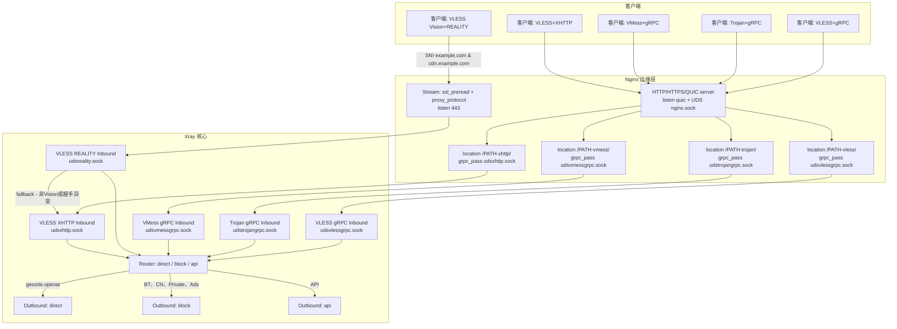

# sb-xray：Xray + Nginx 设计说明与流量工作流

## 概览
- 目标：通过 Nginx 与 Xray 的协同，实现 VLESS Vision+REALITY 以及 VLESS+XHTTP 两套入站链路，适配主域名与 CDN 域名，同时提供管理与文件服务。
- 形态：统一使用 Unix Domain Socket（UDS）在容器内部连接 Nginx 与 Xray，降低内核切换与端口暴露，同时启用 `proxy_protocol` 与 `ssl_preread` 实现 SNI 级分流。
- 管理：由 supervisord 统一拉起与守护各服务，入口脚本动态渲染模板并注入环境变量，确保服务端与客户端配置一致。

## 组件与文件
- Xray 核心配置：`docker/sb-xray/templates/xray/xr.json`
- Xray 入站（REALITY）：`docker/sb-xray/templates/xray/01_reality_inbounds.json`
- Xray 入站（XHTTP）：`docker/sb-xray/templates/xray/02_xhttp_inbounds.json`
- Xray 入站（VLESS gRPC）：`docker/sb-xray/templates/xray/03_vless_grpc_inbounds.json`
- Xray 入站（VMess gRPC）：`docker/sb-xray/templates/xray/04_vmess_grpc_inbounds.json`
- Xray 入站（Trojan gRPC）：`docker/sb-xray/templates/xray/05_trojan_grpc_inbounds.json`
- Sing-box 入站（Shadowsocks）：`docker/sb-xray/templates/sing-box/14_shadowsocks_inbounds.json`
- Sing-box 入站（ShadowTLS→Shadowsocks）：`docker/sb-xray/templates/sing-box/13_ShadowTLS_inbounds.json`
- Nginx 全局/HTTP/Stream：
  - `docker/sb-xray/templates/nginx/nginx.conf`
  - `docker/sb-xray/templates/nginx/http.conf`
  - `docker/sb-xray/templates/nginx/tcp.conf`
  - `docker/sb-xray/templates/nginx/network_internal.conf`
- 进程管理：
  - `docker/sb-xray/templates/supervisord/supervisord.conf`
  - `docker/sb-xray/templates/supervisord/daemon.ini`
- 入口脚本与客户端模板：
  - `docker/sb-xray/scripts/entrypoint.sh`
  - `docker/sb-xray/templates/client_template/*`

## 目录结构总览
- 根目录：`docker/sb-xray/`
  - 核心：`Dockerfile`、`docker-compose.yml`、`readme.md`
  - 静态站点：`3DCEList/`（`index.html`、`js/*.js`）
  - 脚本：`scripts/`（`entrypoint.sh`、`show-config.sh`、`stop-supervisor.sh`、`healthcheck.sh`、`event_handler_script.py`）
  - 模板：`templates/`
    - Xray：`xray/`
      - `xr.json`（基础配置与路由/日志/API）
      - 入站：
        - `01_reality_inbounds.json`（VLESS Vision+REALITY）
        - `02_xhttp_inbounds.json`（VLESS+XHTTP）
        - `03_vless_grpc_inbounds.json`（VLESS TLS gRPC）
        - `04_vmess_grpc_inbounds.json`（VMess TLS gRPC）
        - `05_trojan_grpc_inbounds.json`（Trojan TLS gRPC）
    - Nginx：`nginx/`
      - `nginx.conf`（主配置，包含 `http`/`stream` 引用）
      - `http.conf`（CDN 与主域 server；gRPC 与 XHTTP 路由）
      - `tcp.conf`（443 SNI 分流；Xray UDS 上游）
      - `network_internal.conf`（内网访问控制）
    - Sing-box：`sing-box/`
      - 基础：`00_log.json`、`01_outbounds.json`、`02_endpoints.json`、`03_route.json`、`04_experimental.json`、`05_dns.json`、`06_ntp.json`
      - 入站：`11_hysteria2_inbounds.json`、`12_tuic_inbounds.json`、`13_ShadowTLS_inbounds.json`、`14_shadowsocks_inbounds.json`、`15_anytls_inbounds.json`
    - Supervisord：`supervisord/`（`supervisord.conf`、`daemon.ini`）
    - 客户端模板：`client_template/`
      - 通用：`proxies`
      - Clash：`clash`、`clash.yaml`
      - Stash：`stash`
      - Surge：`surge`、`surge.conf`
    - Dufs：`dufs/conf.yml`

## Xray 配置要点
- 基础配置（`xr.json`）：
  - 日志：`access=${LOGDIR}/xray/access.log`、`error=${LOGDIR}/xray/error.log`、`loglevel=warning`
  - DNS：`https+local://cloudflare-dns.com/dns-query`，回退 `1.1.1.1/1.0.0.1/8.8.8.8/8.8.4.4/localhost`
  - API：`tag=api`，`services=HandlerService, LoggerService, StatsService`
  - Policy：开启系统级入/出站流量统计（`statsUserUplink/Downlink=true`）
  - 路由：
    - `ruleTag=api` → `outbound=api`
    - BitTorrent、`geoip:cn`、`geoip:private`、广告域名 → `block`
    - `geosite:openai` → `direct`
  - Inbounds：`dokodemo-door` 监听 `127.0.0.1:7978`，`tag=api`
  - Outbounds：`direct(freedom)`、`block(blackhole)`
- REALITY 入站（`01_reality_inbounds.json`）：
  - 协议：`vless`，`flow=xtls-rprx-vision`，`tag=VISION+REALITY`
  - 监听：`unix:/dev/shm/udsreality.sock,0666`（接受 `proxy_protocol`）
  - Reality：`target=unix:/dev/shm/nginx.sock`，`serverNames=${DOMAIN}, ${CDNDOMAIN}`，`privateKey=${XRAY_REALITY_PRIVATE_KEY}`，`shortIds=${XRAY_REALITY_SHORTID}`
  - 回落：`fallback=unix:/dev/shm/udsxhttp.sock`
  - 嗅探：`http,tls,quic`，`routeOnly=true`
  - sockopt：`tcpFastOpen=true`、`tcpMptcp=true`、`tcpNoDelay=true`、`tcpcongestion=bbr`
- XHTTP 入站（`02_xhttp_inbounds.json`）：
  - 协议：`vless`，`tag=XHTTP_IN`，`network=xhttp`
  - 监听：`unix:/dev/shm/udsxhttp.sock,0666`
  - 客户端参数：`decryption=mlkem768x25519plus.native.600s.${XRAY_MLKEM768_SEED}`
  - xhttp：`path=/${XRAY_URL_PATH}-xhttp`，`mode=auto`，`extra.xPaddingBytes=100-1000`
  - 嗅探：`http,tls,quic`，`routeOnly=true`
  - sockopt：同上
- VLESS gRPC 入站（`03_vless_grpc_inbounds.json`）：
  - 协议：`vless`，`tag=VLESS_TLS_GRPC_IN`
  - 监听：`unix:/dev/shm/udsvlessgrpc.sock,0666`
  - 传输：`network=grpc`，`grpcSettings.serviceName=${XRAY_URL_PATH}-vless`
- VMess gRPC 入站（`04_vmess_grpc_inbounds.json`）：
  - 协议：`vmess`，`tag=VMESS_WS_IN`
  - 监听：`unix:/dev/shm/udsvmessgrpc.sock,0666`
  - 传输：`network=grpc`，`grpcSettings.serviceName=${XRAY_URL_PATH}-vmess`
- Trojan gRPC 入站（`05_trojan_grpc_inbounds.json`）：
  - 协议：`trojan`，`tag=TROJAN_WS_IN`
  - 监听：`unix:/dev/shm/udstrojangrpc.sock,0666`
  - 传输：`network=grpc`，`grpcSettings.serviceName=${XRAY_URL_PATH}-trojan`

## Nginx 配置要点
- HTTP 重定向：`http.conf` 中 `server` 监听 `80` → `301 https`。
- CDN 伪装站：
  - 监听：`unix:/dev/shm/nginx.sock ssl proxy_protocol`
  - `server_name=${CDNDOMAIN}`，证书位于 `${SSL_PATH}/${CDNDOMAIN}.crt/.key/-ca.crt`
  - 伪装静态页：`location /` 指向 `/home/wwwroot/3DCEList`
  - XHTTP 转发：`location /${XRAY_URL_PATH}-xhttp/` → `grpc_pass unix:/dev/shm/udsxhttp.sock`
  - VLESS gRPC：`location /${XRAY_URL_PATH}-vless/` → `grpc_pass unix:/dev/shm/udsvlessgrpc.sock`
  - VMess gRPC：`location /${XRAY_URL_PATH}-vmess/` → `grpc_pass unix:/dev/shm/udsvmessgrpc.sock`
  - Trojan gRPC：`location /${XRAY_URL_PATH}-trojan/` → `grpc_pass unix:/dev/shm/udstrojangrpc.sock`
- 主域名站点（含 QUIC）：
  - 监听：`${LISTENING_PORT} quic reuseport` 与 `unix:/dev/shm/nginx.sock ssl proxy_protocol`
  - `server_name=${DOMAIN}`，证书位于 `${SSL_PATH}/${DOMAIN}.crt/.key/-ca.crt`
  - XHTTP 转发：同上
  - gRPC 入口可同样启用或由 CDN 站点承载
  - 管理入口：`/supervisor/` → `http://unix:/var/run/supervisor.sock:/`
  - 文件服务：`${DUFS_PATH_PREFIX}/` → `127.0.0.1:${DUFS_PORT}`
  - X-UI：`/${XUI_WEBBASEPATH}/` → `127.0.0.1:${XUI_LOCAL_PORT}`
- Stream/TCP 分流：
  - `tcp.conf` 中启用 `ssl_preread on`（按 SNI 分流）
  - `map $ssl_preread_server_name $tcpsni_name` 将 `${DOMAIN}/${CDNDOMAIN}` 映射到上游 `vless`
  - `upstream vless { server unix:/dev/shm/udsreality.sock; }`
  - `proxy_pass $tcpsni_name` 将入站基于 SNI 转发到 REALITY 入站 UDS
- 内网访问控制：`network_internal.conf` 允许常见内网段，其他 `deny all`

## 端到端工作流

### 说明
- Vision+REALITY：客户端使用 `${DOMAIN}` 或 `${CDNDOMAIN}` 发起 TLS 握手；Nginx `stream` 通过 SNI 预读将 TCP 连接转发至 `udsreality.sock`，由 Xray 完成 REALITY 校验与解密；异常或非 Vision 流量按入站定义回落到 XHTTP。
- XHTTP：HTTP/HTTPS/QUIC 入口命中 `/${XRAY_URL_PATH}-xhttp/`，由 Nginx `grpc_pass` 透传到 `udsxhttp.sock`，Xray 以 VLESS+XHTTP 解析并进入路由阶段。
- VLESS+gRPC：HTTP/HTTPS/QUIC 入口命中 `/${XRAY_URL_PATH}-vless/`，Nginx 使用 `grpc_pass` 透传到 `udsvlessgrpc.sock`，由 Xray VLESS gRPC 入站解析。
- VMess+gRPC：HTTP/HTTPS/QUIC 入口命中 `/${XRAY_URL_PATH}-vmess/`，Nginx 使用 `grpc_pass` 透传到 `udsvmessgrpc.sock`，由 Xray VMess gRPC 入站解析。
- Trojan+gRPC：HTTP/HTTPS/QUIC 入口命中 `/${XRAY_URL_PATH}-trojan/`，Nginx 使用 `grpc_pass` 透传到 `udstrojangrpc.sock`，由 Xray Trojan gRPC 入站解析。
- Shadowsocks：客户端直连 `PORT_SHADOWSOCKS`，由 Sing-box SS 入站解析，不经 Nginx。
- ShadowTLS：如启用 443 复用，则由 Nginx stream 基于 SNI 转发到 ShadowTLS，再解封装至本地 SS 入站解析。
- 路由：根据 `geosite/geoip` 与自定义策略，命中 `direct/block/api` 出站。

## 运行流程图的文件-模块映射表
- 链路 A（Vision+REALITY）：`C1 → E1 → XR1`
  - 模块：Nginx `stream` SNI 分流 → Xray REALITY 入站
  - 模板文件：`docker/sb-xray/templates/nginx/tcp.conf`、`docker/sb-xray/templates/xray/01_reality_inbounds.json`
- 链路 A-回落（REALITY fallback 到 XHTTP）：`XR1 → XR2`
  - 模块：Xray `fallbacks` → XHTTP 入站
  - 模板文件：`docker/sb-xray/templates/xray/01_reality_inbounds.json`、`docker/sb-xray/templates/xray/02_xhttp_inbounds.json`
- 链路 B（VLESS+XHTTP）：`C2 → E2 → E3 → XR2`
  - 模块：Nginx `location /${XRAY_URL_PATH}-xhttp/` gRPC 透传 → Xray XHTTP 入站
  - 模板文件：`docker/sb-xray/templates/nginx/http.conf`、`docker/sb-xray/templates/xray/02_xhttp_inbounds.json`
- 链路 C（VMess+gRPC）：`C3 → E2 → E4 → XR4`
  - 模板文件：`docker/sb-xray/templates/nginx/http.conf`、`docker/sb-xray/templates/xray/04_vmess_grpc_inbounds.json`
- 链路 D（Trojan+gRPC）：`C4 → E2 → E5 → XR5`
  - 模板文件：`docker/sb-xray/templates/nginx/http.conf`、`docker/sb-xray/templates/xray/05_trojan_grpc_inbounds.json`
- 链路 E（VLESS+gRPC）：`C5 → E2 → E6 → XR6`
  - 模板文件：`docker/sb-xray/templates/nginx/http.conf`、`docker/sb-xray/templates/xray/03_vless_grpc_inbounds.json`
- 路由与出站：`XR* → XR3 → XO{1,2,3}`
  - 模块：Xray 路由规则与出站（`direct`/`block`/`api`）
  - 模板文件：`docker/sb-xray/templates/xray/xr.json`
- ShadowTLS：如启用 443 复用
  - 模板文件：`docker/sb-xray/templates/nginx/tcp.conf`、`docker/sb-xray/templates/sing-box/13_ShadowTLS_inbounds.json`、`docker/sb-xray/templates/sing-box/14_shadowsocks_inbounds.json`
- Hysteria2：`Client → Sing-Box Hysteria2`
  - 模板文件：`docker/sb-xray/templates/sing-box/11_hysteria2_inbounds.json`
- TUIC：`Client → Sing-Box TUIC`
  - 模板文件：`docker/sb-xray/templates/sing-box/12_tuic_inbounds.json`
- 订阅与客户端：`Client ← Nginx /sb-xray/${CLIENT}`
  - 模板文件：`docker/sb-xray/templates/nginx/http.conf`、`docker/sb-xray/templates/client_template/clash.yaml`、`docker/sb-xray/templates/client_template/surge.conf`

## 环境变量与对齐
- 核心变量由入口脚本生成并导出（`/.env/xray`）：
  - `XRAY_UUID`
  - `XRAY_REALITY_PRIVATE_KEY`、`XRAY_REALITY_PUBLIC_KEY`、`XRAY_REALITY_SHORTID`
  - `XRAY_URL_PATH`
  - `XRAY_MLKEM768_SEED`、`XRAY_MLKEM768_CLIENT`
  - `DOMAIN`、`CDNDOMAIN`、`LISTENING_PORT`
  - `WORKDIR=/sb-xray`、`LOGDIR=/var/log/`、`SSL_PATH=/pki`
- 同步机制：入口脚本使用模板渲染（envsubst）为 Xray、Nginx、supervisord、客户端模板注入相同变量，确保服务端与客户端参数一致。

## 客户端模板映射
- `templates/client_template/proxies` 与 `clash/stash/surge.conf` 使用占位变量：
  - `uuid=${XRAY_UUID}`
  - `reality-opts.public-key=${XRAY_REALITY_PUBLIC_KEY}`、`short-id=${XRAY_REALITY_SHORTID}`
  - `xhttp-opts.path=/${XRAY_URL_PATH}`
  - `encryption=mlkem768x25519plus.native.0rtt.${XRAY_MLKEM768_CLIENT}`
- `scripts/show-config.sh` 输出标准链接，涵盖 Vision+Reality、XHTTP+Reality、XHTTP+TLS+CDN 场景。

## 客户端示例配置
- VMess+gRPC（示例）：
  - 入口域名：`example.com`（或 `cdn.example.com`）
  - 传输：`grpc`，`serviceName=vmess`，`alpn=h2`，`tls=true`
  - 凭据：`id=${XRAY_UUID}`，`alterId=0`
- Trojan+gRPC（示例）：
  - 入口域名：`example.com`（或 `cdn.example.com`）
  - 传输：`grpc`，`serviceName=trojan`，`alpn=h2`，`tls=true`
  - 凭据：`password=${XRAY_UUID}`
- Shadowsocks（示例）：
  - 服务器：`example.com`
  - 端口：`${PORT_SHADOWSOCKS}`
  - 方法：`${SS_METHOD}`（默认 `2022-blake3-aes-256-gcm`）
  - 密码：`${RANDOM_PASSWORD}`
  - 分享链接：`ss://base64(${SS_METHOD}:${RANDOM_PASSWORD}@example.com:${PORT_SHADOWSOCKS})#shadowsocks`
- Shadowsocks（Xray 示例）：
  - 服务器：`example.com`
  - 端口：`${PORT_SHADOWSOCKS_XRAY}`
  - 方法：`${SS_METHOD}`
  - 密码：`${RANDOM_PASSWORD}`
  - 分享链接：`ss://base64(${SS_METHOD}:${RANDOM_PASSWORD}@example.com:${PORT_SHADOWSOCKS_XRAY})#shadowsocks-xray`

## 运行与监控
- supervisord 拉起：`xray run -confdir ${WORKDIR}/xray/` 与 Nginx/X-UI/DUFS 等，健康检查确保 `xray` 处于 RUNNING。
- 日志与可观测性：
  - Xray：`access/error` 日志，API `StatsService` 提供流量统计（与 `Policy` 对齐）。
  - Nginx：访问日志与错误日志（可按需开启）。
- 证书：入口脚本根据 `DOMAIN/CDNDOMAIN` 申请/安装证书到 `${SSL_PATH}`，供 Nginx 使用。

## 安全与性能
- 安全：REALITY 私钥/短 ID、MLKEM 参数通过环境变量注入，不落盘到版本库；开启 `proxy_protocol` 保留原始地址链路。
- 性能：UDS 连接、`tcpFastOpen/MPTCP/BBR` 优化；`grpc_read/send_timeout` 与缓冲参数提升长连接稳定性。
