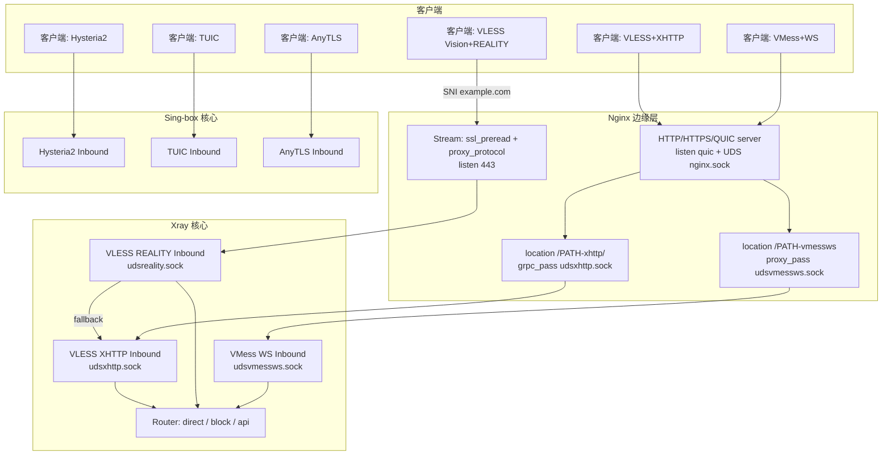

# sb-xray：Xray + Nginx 设计说明与流量工作流

## 概览
- **目标**：通过 Nginx 与 Xray 的协同，实现 VLESS Vision+REALITY、VLESS+XHTTP 以及 VMess+WebSocket 多套入站链路，适配主域名与 CDN 域名。同时集成 Sing-box 提供 Hysteria2、TUIC、AnyTLS 等高性能协议。
- **形态**：统一使用 Unix Domain Socket（UDS）在容器内部连接 Nginx 与 Xray，降低内核切换与端口暴露，同时启用 `proxy_protocol` 与 `ssl_preread` 实现 SNI 级分流。
- **管理**：由 supervisord 统一拉起与守护各服务，入口脚本动态渲染模板并注入环境变量，确保服务端与客户端配置一致。

## 组件与文件
- **Xray 核心配置**：`docker/sb-xray/templates/xray/xr.json`
- **Xray 入站（REALITY）**：`docker/sb-xray/templates/xray/01_reality_inbounds.json`
- **Xray 入站（XHTTP）**：`docker/sb-xray/templates/xray/02_xhttp_inbounds.json`
- **Xray 入站（VMess WS）**：`docker/sb-xray/templates/xray/03_vmess_ws_inbounds.json`
- **Sing-box 入站**：
  - Hysteria2：`docker/sb-xray/templates/sing-box/11_hysteria2_inbounds.json`
  - TUIC：`docker/sb-xray/templates/sing-box/12_tuic_inbounds.json`
  - AnyTLS：`docker/sb-xray/templates/sing-box/13_anytls_inbounds.json`
- **Nginx 全局/HTTP/Stream**：
  - `docker/sb-xray/templates/nginx/nginx.conf`
  - `docker/sb-xray/templates/nginx/http.conf`
  - `docker/sb-xray/templates/nginx/tcp.conf`
  - `docker/sb-xray/templates/nginx/network_internal.conf`
- **进程管理**：
  - `docker/sb-xray/templates/supervisord/supervisord.conf`
  - `docker/sb-xray/templates/supervisord/daemon.ini`
- **入口脚本**：
  - `docker/sb-xray/scripts/entrypoint.sh`

## 目录结构总览
- 根目录：`docker/sb-xray/`
  - 核心：`Dockerfile`、`docker-compose.yml`、`readme.md`
  - 脚本：`scripts/`（`entrypoint.sh`、`show-config.sh` 等）
  - 模板：`templates/`
    - Xray：`xray/`
      - `xr.json`（基础配置）
      - `01_reality_inbounds.json`（Vision+REALITY）
      - `02_xhttp_inbounds.json`（VLESS+XHTTP）
      - `03_vmess_ws_inbounds.json`（VMess+WebSocket）
    - Nginx：`nginx/`
      - `nginx.conf`
      - `http.conf`（CDN 与主域 server；XHTTP/VMessWS 路由）
      - `tcp.conf`（443 SNI 分流）
      - `network_internal.conf`（内网控制）
    - Sing-box：`sing-box/`
      - 基础：`00_log.json` 等
      - 入站：`11_hysteria2`、`12_tuic`、`13_anytls`
    - Supervisord：`supervisord/`
    - Dufs：`dufs/conf.yml`

## Xray 配置要点
- **基础配置（`xr.json`）**：
  - 日志、DNS、API、Policy、路由（api/block/direct）配置。
- **REALITY 入站（`01_reality_inbounds.json`）**：
  - 协议：`vless`，`flow=xtls-rprx-vision`
  - 监听：`unix:/dev/shm/udsreality.sock`（proxy_protocol）
  - 回落：`fallback=unix:/dev/shm/udsxhttp.sock`
- **XHTTP 入站（`02_xhttp_inbounds.json`）**：
  - 协议：`vless`，`network=xhttp`
  - 监听：`unix:/dev/shm/udsxhttp.sock`
- **VMess WS 入站（`03_vmess_ws_inbounds.json`）**：
  - 协议：`vmess`
  - 监听：`unix:/dev/shm/udsvmessws.sock`
  - 传输：`network=ws`，`path=/${XRAY_URL_PATH}-vmessws`

## Nginx 配置要点
- **HTTP 重定向**：`80` → `301 https`。
- **CDN 伪装站（`unix:/dev/shm/cdnh2.sock`）**：
  - 监听：`ssl proxy_protocol`
  - XHTTP 转发：`location /${XRAY_URL_PATH}-xhttp/` → `grpc_pass udsxhttp.sock`
  - VMess WS 转发：`location /${XRAY_URL_PATH}-vmessws` → `proxy_pass udsvmessws.sock`
- **主域名站点（`listen ${LISTENING_PORT} quic` & `unix:/dev/shm/nginx.sock`）**：
  - 监听：QUIC + UDS (ssl proxy_protocol)
  - XHTTP 转发：同上
  - VMess WS 转发：同上
  - 管理服务：
    - `/supervisor/` → `unix:/var/run/supervisor.sock`
    - `${DUFS_PATH_PREFIX}/` → `127.0.0.1:${DUFS_PORT}`
    - `/${XUI_WEBBASEPATH}/` → `127.0.0.1:${XUI_LOCAL_PORT}`
    - `/${SUI_WEBBASEPATH}/` → `127.0.0.1:${SUI_PORT}`
    - `/${SUB_STORE_WEBBASEPATH}/` → `127.0.0.1:${SUB_STORE_BACKEND_API_PORT}`
    - `/sb-xray/` → `alias ${WORKDIR}/subscribe/`（无认证，直接访问）
- **Stream/TCP 分流（`tcp.conf`）**：
  - `ssl_preread on`：基于 SNI 分流
  - `${DOMAIN}/${CDNDOMAIN}` → `upstream vless` (`udsreality.sock`)
  - 其他 → `upstream nginx` (`nginx.sock`)

## 端到端工作流

## 环境变量与对齐
- 核心变量由 `entrypoint.sh` 生成并导出（`/.env/xray`）。
- `XUI_ACCOUNT` / `PASSWORD` 用于生成 Nginx `.htpasswd`（可选，当前配置未启用认证）。
- 证书通过 `acme.sh` 自动申请并挂载到 Nginx。

## 运行与监控
- **Supervisord**：管理 Xray, Nginx, Sing-box, X-UI, S-UI, Sub-Store, Dufs, Fail2ban。
- **Fail2ban**：监控 SSH 与 Nginx 登录失败。
- **Show Config**：`show` 命令输出当前配置链接。
